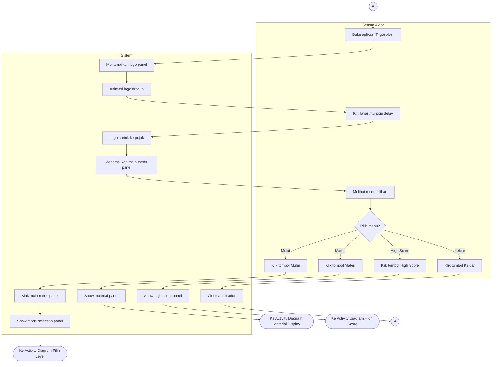
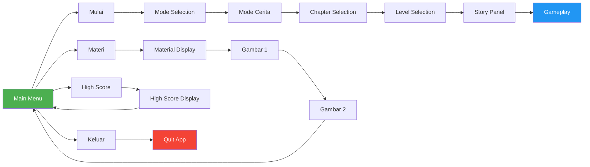

# Activity Diagram 1 - Main Menu

## Main Menu Navigation Flow



---

## Material Display Flow

```mermaid
flowchart TD
    subgraph Actor["Semua Aktor"]
        A1[Klik tombol Materi]
        A2[Melihat gambar materi 1]
        A3[Klik layar / tekan Space]
        A4[Melihat gambar materi 2]
        A5[Klik layar / tekan Space]
        A6[Kembali ke main menu]
    end
    
    subgraph System["Sistem"]
        S1[Sink main menu panel]
        S2[Show material panel]
        S3[Tampilkan gambar 1]
        S4[Fade in + Scale animation]
        S5[Transisi: Gambar 1 fade out]
        S6[Tampilkan gambar 2]
        S7[Fade in + Scale animation]
        S8[Close material panel]
        S9[Fade out + Scale down]
        S10[Show main menu panel]
        S11[Drop in animation]
    end
    
    Start([●]) --> A1
    A1 --> S1
    S1 --> S2
    S2 --> S3
    S3 --> S4
    S4 --> A2
    A2 --> A3
    A3 --> S5
    S5 --> S6
    S6 --> S7
    S7 --> A4
    A4 --> A5
    A5 --> S8
    S8 --> S9
    S9 --> S10
    S10 --> S11
    S11 --> A6
    A6 --> End([●])
    
    style Start fill:#000
    style End fill:#000
```



---

## High Score Display Flow

```mermaid
flowchart TD
    subgraph Actor["Semua Aktor"]
        A1[Klik tombol High Score]
        A2[Melihat high score:<br/>- Level 1<br/>- Level 2<br/>- Total]
        A3[Klik tombol Kembali]
        A4[Kembali ke main menu]
    end
    
    subgraph System["Sistem"]
        S1[Sink main menu panel]
        S2[Show high score panel]
        S3[Drop in animation]
        S4[Load scores dari PlayerPrefs]
        S5[Refresh score display]
        S6[Animate scores in<br/>fade/scale]
        S7[Sink high score panel]
        S8[Show main menu panel]
        S9[Drop in animation]
    end
    
    Start([●]) --> A1
    A1 --> S1
    S1 --> S2
    S2 --> S3
    S3 --> S4
    S4 --> S5
    S5 --> S6
    S6 --> A2
    A2 --> A3
    A3 --> S7
    S7 --> S8
    S8 --> S9
    S9 --> A4
    A4 --> End([●])
    
    style Start fill:#000
    style End fill:#000
```



---

## Story Panel Flow

```mermaid
flowchart TD
    subgraph Actor["Semua Aktor"]
        A1[Masuk ke level]
        A2[Membaca narasi story]
        A3[Klik untuk lanjutkan]
    end
    
    subgraph System["Sistem"]
        S1[Load scene Chapter 1]
        S2[Initialize GameManager]
        S3[Show story panel]
        S4[Play story panel BGM]
        S5[Typewriter animation text]
        S6[Hide story panel]
        S7[Show gameplay UI]
        S8[Play gameplay BGM<br/>crossfade transition]
    end
    
    Start([●]) --> A1
    A1 --> S1
    S1 --> S2
    S2 --> S3
    S3 --> S4
    S4 --> S5
    S5 --> A2
    A2 --> A3
    A3 --> S6
    S6 --> S7
    S7 --> S8
    S8 --> End([Ke Activity Diagram Generate Soal])
    
    style Start fill:#000
```



---

## Navigation Summary



---

## State Transitions

| From State | Action | To State |
|------------|--------|----------|
| Logo | Click / Auto | Main Menu |
| Main Menu | Klik "Mulai" | Mode Selection |
| Main Menu | Klik "Materi" | Material Display |
| Main Menu | Klik "High Score" | High Score Display |
| Main Menu | Klik "Keluar" | Exit |
| Material Display | Klik (Next) | Material 2 |
| Material 2 | Klik (Close) | Main Menu |
| High Score Display | Back | Main Menu |
| Mode Selection | Pilih Mode Cerita | Chapter Selection |
| Chapter Selection | Pilih Chapter 1 | Level Selection |
| Level Selection | Pilih Level | Story Panel |
| Story Panel | Continue | Gameplay |

---

## Animation Details

### Logo Transition:
- **Duration:** 2s total
- **Phase 1:** Drop in with bounce (1s)
- **Phase 2:** Shrink to corner (1s)
- **Ease:** OutBack for drop, InBack for shrink

### Panel Transitions:
- **Sink Out:** 0.5s, slides down, InBack ease
- **Drop In:** 0.8s, slides down, OutBack ease
- **Position:** From Y=800 (off-screen top) to Y=0 (center)

### Material Images:
- **Fade In:** 0.3s, alpha 0→1
- **Scale In:** 0.3s, scale 0→1, OutBack ease
- **Fade Out:** 0.3s, alpha 1→0
- **Scale Out:** 0.3s, scale 1→0.8, InBack ease

### High Score Scores:
- **Stagger Delay:** 0.2s per score
- **Animation:** Fade + Scale (0.5s each)
- **Ease:** OutBack for scale

---

## Audio Integration

### BGM Tracks:
1. **Main Menu BGM** - Plays on main menu panel
2. **Story Panel BGM** - Plays during story narration
3. **Gameplay BGM** - Plays during game questions

### Transitions:
- Logo → Main Menu: Start Main Menu BGM
- Main Menu → Story: Crossfade to Story Panel BGM (1s)
- Story → Gameplay: Crossfade to Gameplay BGM (1s)

### SFX:
- Button Click: All menu buttons
- Transition: Panel slide sounds (optional)

---

## Error Handling

### Missing References:
```
IF panel reference == null:
    Log error
    Stay in current state
    Show error message to user
```

### Animation Interruption:
```
IF new transition requested:
    Kill current animations
    Start new transition
    Update state
```

### Audio Manager Missing:
```
IF GlobalAudioManager == null:
    Log warning
    Continue without BGM
    SFX disabled
```

---

## Testing Checklist

**Main Menu:**
- [ ] Logo animates correctly
- [ ] Main menu appears after logo
- [ ] All buttons visible and clickable
- [ ] Button click SFX works

**Material Display:**
- [ ] Gambar 1 appears with animation
- [ ] Click anywhere advances to Gambar 2
- [ ] Gambar 2 appears with animation
- [ ] Click anywhere returns to main menu
- [ ] Keyboard (Space/ESC) works

**High Score:**
- [ ] Panel appears with animation
- [ ] Scores load from PlayerPrefs
- [ ] All scores display correctly
- [ ] Back button returns to main menu
- [ ] Score animations stagger correctly

**Story Panel:**
- [ ] Panel appears on level start
- [ ] Typewriter animation works
- [ ] Story text readable
- [ ] Click advances to gameplay
- [ ] BGM transitions correctly

---

## Notes

- Logo remains visible (small in corner) after initial transition
- All panel transitions use consistent animation style
- State management prevents invalid transitions
- Material display supports both click and keyboard navigation
- High score updates automatically when new scores saved
- Story panel appears once per level (not on retry)
