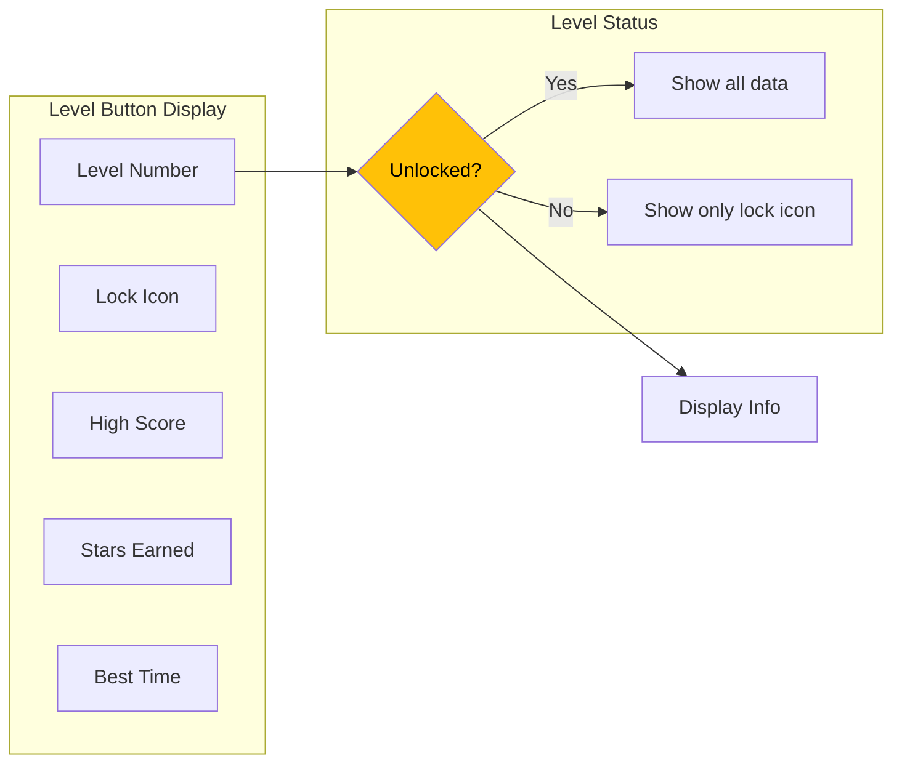
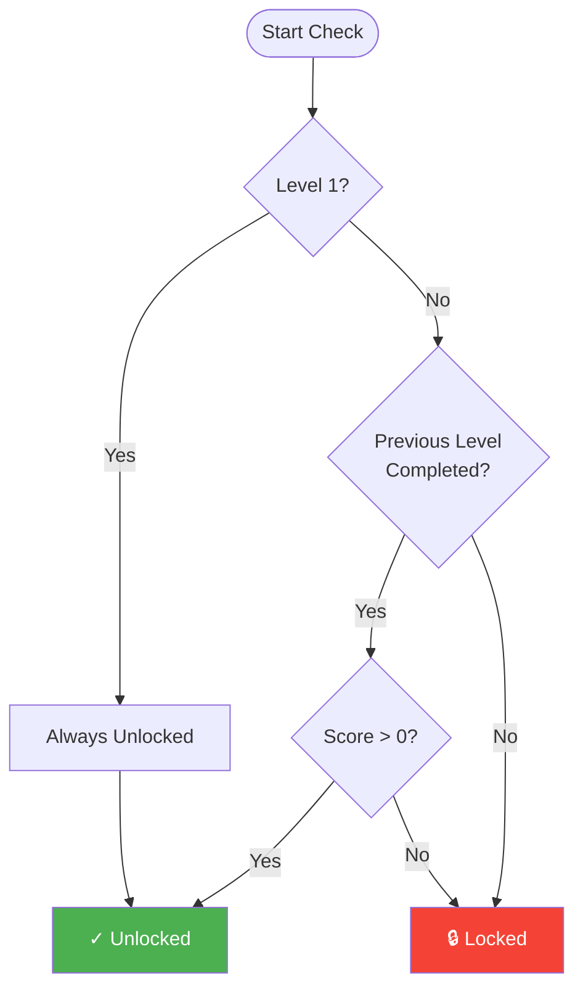
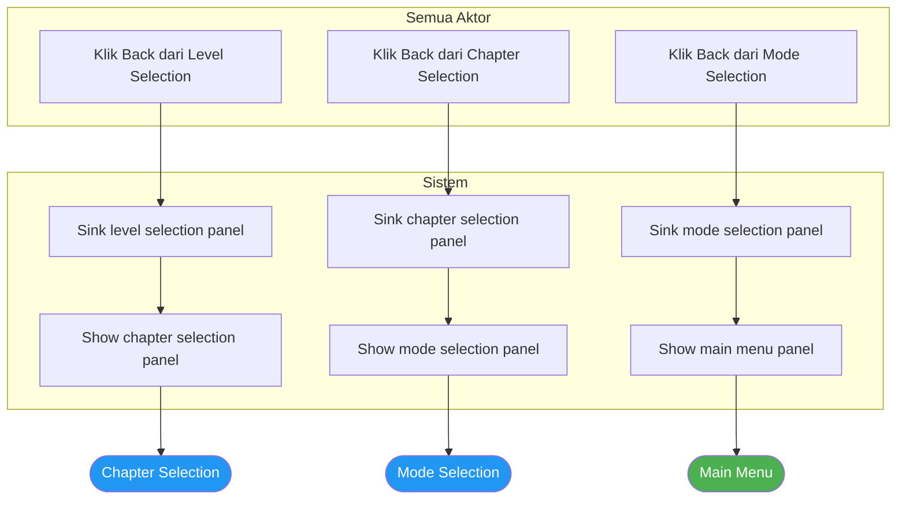
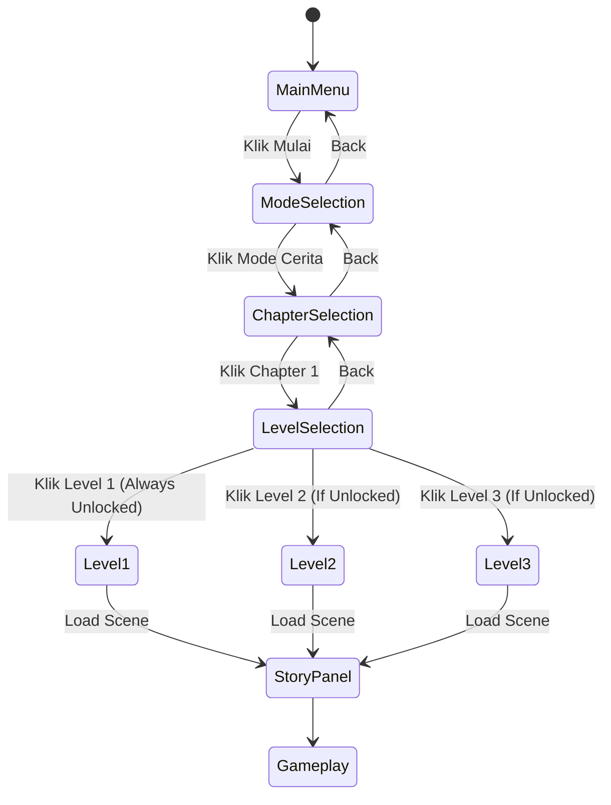
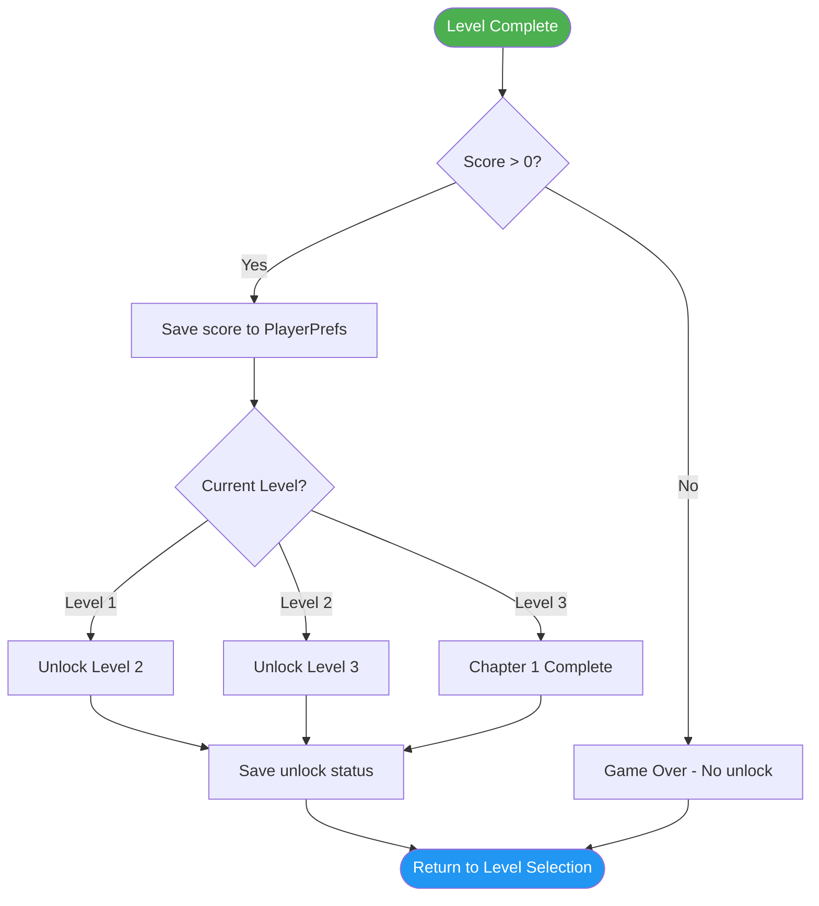

# Activity Diagram 2 - Pilih Level

## Level Selection Flow

```mermaid
flowchart TD
    subgraph Actor["Semua Aktor"]
        A1[Klik tombol Mulai]
        A2[Melihat pilihan mode]
        A3[Klik Mode Cerita]
        A4[Melihat pilihan chapter]
        A5[Klik Chapter 1]
        A6[Melihat pilihan level:<br/>- Level 1<br/>- Level 2<br/>- Level 3]
        A7{Pilih level?}
        A8[Klik Level 1]
        A9[Klik Level 2]
        A10[Klik Level 3]
        A11[Klik tombol Back]
    end
    
    subgraph System["Sistem"]
        S1[Sink main menu panel]
        S2[Show mode selection panel]
        S3[Drop in animation]
        S4[Sink mode selection]
        S5[Show chapter selection panel]
        S6[Drop in animation]
        S7[Sink chapter selection]
        S8[Show level selection panel]
        S9[Drop in animation]
        S10[Load level data:<br/>- Status locked/unlocked<br/>- High score<br/>- Stars earned]
        S11[Update UI display]
        S12[Store selected level]
        S13[Load Chapter 1 Level 1]
        S14[Load Chapter 1 Level 2]
        S15[Load Chapter 1 Level 3]
        S16[Sink level selection]
        S17[Show previous panel]
    end
    
    Start([●]) --> A1
    A1 --> S1
    S1 --> S2
    S2 --> S3
    S3 --> A2
    A2 --> A3
    A3 --> S4
    S4 --> S5
    S5 --> S6
    S6 --> A4
    A4 --> A5
    A5 --> S7
    S7 --> S8
    S8 --> S9
    S9 --> S10
    S10 --> S11
    S11 --> A6
    A6 --> A7
    
    A7 -->|Level 1| A8
    A7 -->|Level 2| A9
    A7 -->|Level 3| A10
    A7 -->|Back| A11
    
    A8 --> S12
    S12 --> S13
    S13 --> End1([Ke Activity Diagram Story Panel])
    
    A9 --> S12
    S12 --> S14
    S14 --> End2([Ke Activity Diagram Story Panel])
    
    A10 --> S12
    S12 --> S15
    S15 --> End3([Ke Activity Diagram Story Panel])
    
    A11 --> S16
    S16 --> S17
    S17 --> End4([Kembali ke Chapter Selection])
    
    style Start fill:#000
```



---

## Level Lock Logic Flow

```mermaid
flowchart TD
    subgraph Actor["Semua Aktor"]
        A1[Melihat level selection UI]
        A2{Coba klik level?}
        A3[Klik level yang unlocked]
        A4[Klik level yang locked]
        A5[Melihat pesan error]
    end
    
    subgraph System["Sistem"]
        S1[Check level status]
        S2{Level unlocked?}
        S3[Allow selection]
        S4[Load level scene]
        S5[Show locked message:<br/>'Selesaikan level sebelumnya']
        S6[Play error SFX]
        S7[Highlight previous level]
    end
    
    Start([●]) --> A1
    A1 --> A2
    
    A2 -->|Unlocked| A3
    A2 -->|Locked| A4
    
    A3 --> S1
    S1 --> S2
    
    S2 -->|Yes| S3
    S3 --> S4
    S4 --> End1([Load Scene])
    
    S2 -->|No| S5
    A4 --> S5
    S5 --> S6
    S6 --> S7
    S7 --> A5
    A5 --> End2([Stay in Level Selection])
    
    style Start fill:#000
```



---

## Level Data Display



---

## Level Unlock Conditions



---

## Back Navigation Flow



---

## Level Selection State Diagram



---

## Level Button UI States

### State 1: Locked
```
┌─────────────────┐
│   🔒 Level 2    │
│                 │
│   Terkunci      │
│                 │
│ Selesaikan L1   │
└─────────────────┘
- Gray/desaturated colors
- Lock icon visible
- Not clickable (or shows error)
- No score/stars shown
```

### State 2: Unlocked (Not Played)
```
┌─────────────────┐
│    Level 1      │
│                 │
│   High Score:   │
│       ---       │
│   ☆ ☆ ☆        │
└─────────────────┘
- Full colors
- Clickable
- No high score yet
- Empty stars
```

### State 3: Completed
```
┌─────────────────┐
│    Level 1      │
│                 │
│   High Score:   │
│      150        │
│   ★ ★ ☆        │
└─────────────────┘
- Full colors
- Clickable (replay)
- Shows high score
- Stars based on score
```

---

## Level Progression Logic



---

## PlayerPrefs Keys

| Key | Description | Type | Example |
|-----|-------------|------|---------|
| `Chapter1_Level1_Unlocked` | Level 1 unlock status | bool | true |
| `Chapter1_Level2_Unlocked` | Level 2 unlock status | bool | false |
| `Chapter1_Level3_Unlocked` | Level 3 unlock status | bool | false |
| `Chapter1_Level1_HighScore` | Level 1 high score | int | 150 |
| `Chapter1_Level2_HighScore` | Level 2 high score | int | 0 |
| `Chapter1_Level3_HighScore` | Level 3 high score | int | 0 |
| `Chapter1_Total_HighScore` | Total chapter score | int | 150 |

---

## Testing Checklist

**Mode Selection:**
- [ ] Panel appears with animation
- [ ] "Mode Cerita" button visible
- [ ] "Mode Bebas" button visible (if implemented)
- [ ] Back button works

**Chapter Selection:**
- [ ] Panel appears with animation
- [ ] Chapter 1 button visible
- [ ] Future chapters shown as locked
- [ ] Back button works

**Level Selection:**
- [ ] Panel appears with animation
- [ ] Level 1 always unlocked
- [ ] Level 2/3 locked initially
- [ ] High scores display correctly
- [ ] Stars display correctly
- [ ] Locked levels show lock icon
- [ ] Clicking locked level shows message
- [ ] Back button works

**Navigation:**
- [ ] Forward navigation smooth
- [ ] Back navigation works at each step
- [ ] Animations don't overlap
- [ ] State persists correctly

**Data Persistence:**
- [ ] Unlock status saved
- [ ] High scores saved
- [ ] Data loads on scene reload
- [ ] No data loss on app restart

---

## UI Layout Example

```
┌────────────────────────────────────────────┐
│              Level Selection               │
│                                            │
│  ┌──────┐    ┌──────┐    ┌──────┐        │
│  │ ★★★  │    │      │    │ 🔒   │        │
│  │Level1│    │Level2│    │Level3│        │
│  │ 150  │    │ ---  │    │Lock  │        │
│  └──────┘    └──────┘    └──────┘        │
│                                            │
│            [< Back]                        │
└────────────────────────────────────────────┘

Legend:
★ = Earned star
☆ = Unearned star
🔒 = Locked level
--- = No score yet
150 = High score
```

---

## Animation Timing

| Transition | Duration | Ease | Description |
|------------|----------|------|-------------|
| Panel Sink Out | 0.5s | InBack | Slides down |
| Panel Drop In | 0.8s | OutBack | Drops with bounce |
| Level Button Hover | 0.2s | OutQuad | Scale 1.0 → 1.1 |
| Lock Shake | 0.3s | Elastic | Shake when clicked |
| Unlock Animation | 0.5s | OutBack | Scale + Fade |
| Star Fill | 0.3s | OutBack | Per star, staggered |

---

## Error Messages

**Locked Level Click:**
```
┌────────────────────────────────┐
│      Level Terkunci!           │
│                                │
│  Selesaikan level sebelumnya   │
│  untuk membuka level ini       │
│                                │
│         [OK]                   │
└────────────────────────────────┘
```

**No Save Data:**
```
IF no PlayerPrefs data found:
    Level 1: Unlocked (default)
    Level 2: Locked
    Level 3: Locked
    All High Scores: 0
```

---

## Notes

- Level 1 is always unlocked by default
- Levels unlock sequentially (must complete L1 to unlock L2)
- High scores persist across app sessions
- Stars calculation based on score thresholds
- Replay available for completed levels
- Back navigation preserves panel state
- Animations provide visual feedback
- Lock status checked on every panel open
