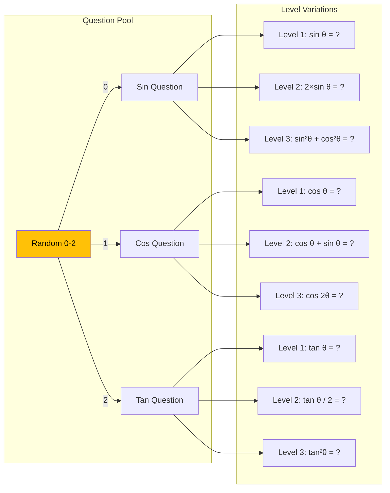
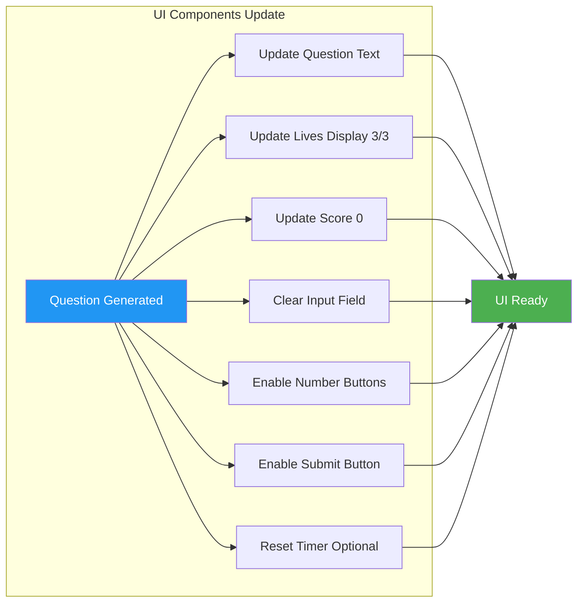
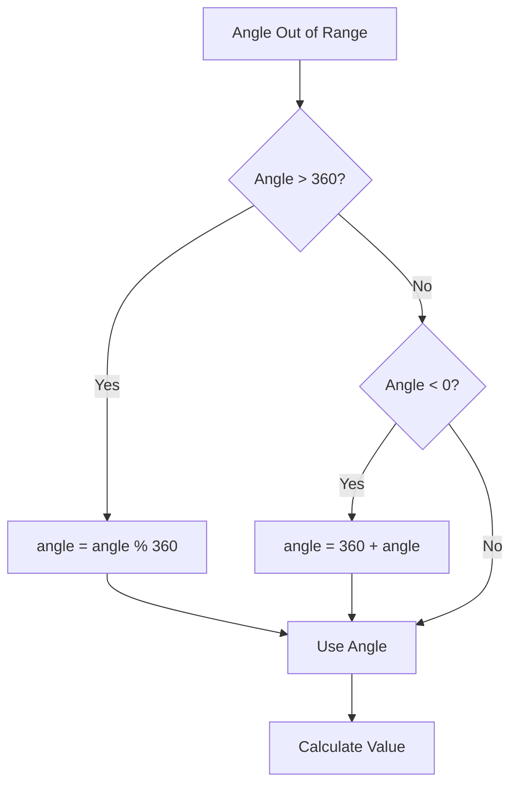
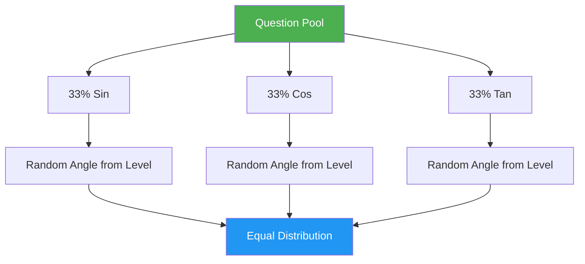

# Activity Diagram 3 - Generate Soal

## Question Generation Flow

```mermaid
flowchart TD
    subgraph Actor["Semua Aktor"]
        A1[Mulai level]
        A2[Melihat soal pertanyaan]
    end
    
    subgraph System["Sistem"]
        S1[Initialize CalculationManager]
        S2[Set parameters:<br/>- currentLevel<br/>- currentQuestionIndex = 0<br/>- lives = 3<br/>- score = 0]
        S3[Load level configuration]
        S4{Load config<br/>berhasil?}
        S5[Use default config:<br/>- totalQuestions = 10<br/>- difficulty = currentLevel]
        S6[Start GenerateQuestion]
        S7{Question type?}
        S8[Generate Sin question]
        S9[Generate Cos question]
        S10[Generate Tan question]
        S11[Random angle selection]
        S12[Calculate correct answer]
        S13[Format question text]
        S14[Update UI display:<br/>- Question text<br/>- Lives display<br/>- Score display]
        S15[Clear input field]
        S16[Enable input buttons]
        S17[Start timer optional]
        S18[Log error]
        S19[Use fallback question]
    end
    
    Start([●]) --> A1
    A1 --> S1
    S1 --> S2
    S2 --> S3
    S3 --> S4
    
    S4 -->|Yes| S6
    S4 -->|No| S5
    S5 --> S6
    
    S6 --> S7
    
    S7 -->|Sin| S8
    S7 -->|Cos| S9
    S7 -->|Tan| S10
    
    S8 --> S11
    S9 --> S11
    S10 --> S11
    
    S11 --> S12
    S12 --> S13
    S13 --> S14
    S14 --> S15
    S15 --> S16
    S16 --> S17
    S17 --> A2
    A2 --> End([Ke Activity Diagram Menjawab Soal])
    
    S12 -->|Error| S18
    S18 --> S19
    S19 --> S13
    
    style Start fill:#000
```



---

## Angle Selection Logic

```mermaid
flowchart TD
    subgraph System["Sistem"]
        S1{Current Level?}
        S2[Level 1 Angles:<br/>0°, 30°, 45°, 60°, 90°]
        S3[Level 2 Angles:<br/>0°, 30°, 45°, 60°, 90°<br/>120°, 135°, 150°, 180°]
        S4[Level 3 Angles:<br/>All special angles<br/>+ 210°, 225°, 240°<br/>270°, 300°, 315°, 330°]
        S5[Random.Range 0 to angles.Length]
        S6[Select angle from array]
        S7[Return selected angle]
    end
    
    Start([●]) --> S1
    
    S1 -->|Level 1| S2
    S1 -->|Level 2| S3
    S1 -->|Level 3| S4
    
    S2 --> S5
    S3 --> S5
    S4 --> S5
    
    S5 --> S6
    S6 --> S7
    S7 --> End([Return Angle])
    
    style Start fill:#000
```



---

## Question Type Distribution



---

## Answer Calculation Flow

```mermaid
flowchart TD
    subgraph System["Sistem"]
        S1[Angle selected θ]
        S2[Operation selected op]
        S3{Operation?}
        S4[Calculate sin θ]
        S5[Calculate cos θ]
        S6[Calculate tan θ]
        S7[Mathf.Sin θ * Mathf.Deg2Rad]
        S8[Mathf.Cos θ * Mathf.Deg2Rad]
        S9[Mathf.Tan θ * Mathf.Deg2Rad]
        S10[Round to 2 decimals]
        S11{Special case?}
        S12[Return exact value:<br/>0, 0.5, 1, √2/2, √3/2]
        S13[Return rounded value]
        S14[Store as correctAnswer]
    end
    
    Start([●]) --> S1
    S1 --> S2
    S2 --> S3
    
    S3 -->|Sin| S4
    S3 -->|Cos| S5
    S3 -->|Tan| S6
    
    S4 --> S7
    S5 --> S8
    S6 --> S9
    
    S7 --> S10
    S8 --> S10
    S9 --> S10
    
    S10 --> S11
    
    S11 -->|Yes| S12
    S11 -->|No| S13
    
    S12 --> S14
    S13 --> S14
    S14 --> End([Answer Ready])
    
    style Start fill:#000
```



---

## Question Format Examples

### Level 1 (Basic):
```
Berapa nilai sin(30°)?
Berapa nilai cos(45°)?
Berapa nilai tan(60°)?
```

### Level 2 (Intermediate):
```
Hitung: 2 × sin(45°)
Jika cos(60°) = x, maka x = ?
Berapa hasil dari tan(30°) + sin(30°)?
```

### Level 3 (Advanced):
```
Jika sin(θ) = 0.5, maka θ = ?
Hitung: sin²(45°) + cos²(45°)
Berapa nilai dari 2 × cos(30°) × sin(60°)?
```

---

## Question Validation

```mermaid
flowchart TD
    subgraph System["Sistem"]
        S1[Generated question]
        S2{Question valid?}
        S3{Answer valid?}
        S4{Duplicate question?}
        S5[Mark as valid]
        S6[Add to used questions list]
        S7[Regenerate question]
        S8[Log warning]
    end
    
    Start([●]) --> S1
    S1 --> S2
    
    S2 -->|Yes| S3
    S2 -->|No| S7
    
    S3 -->|Yes| S4
    S3 -->|No| S7
    
    S4 -->|Not duplicate| S5
    S4 -->|Duplicate| S7
    
    S5 --> S6
    S6 --> End([Valid Question])
    
    S7 --> S8
    S8 --> S1
    
    style Start fill:#000
    style End fill:#4CAF50,color:#fff
```



---

## Special Values Lookup Table

| Angle | sin | cos | tan |
|-------|-----|-----|-----|
| 0° | 0 | 1 | 0 |
| 30° | 0.5 | 0.866 | 0.577 |
| 45° | 0.707 | 0.707 | 1 |
| 60° | 0.866 | 0.5 | 1.732 |
| 90° | 1 | 0 | ∞ |
| 120° | 0.866 | -0.5 | -1.732 |
| 135° | 0.707 | -0.707 | -1 |
| 150° | 0.5 | -0.866 | -0.577 |
| 180° | 0 | -1 | 0 |

---

## UI Display Update



---

## Question Progress Tracking

```mermaid
flowchart TD
    Start([●]) --> A[currentQuestionIndex = 0]
    A --> B{Generate Question}
    B --> C[Display Question]
    C --> D[Wait for Answer]
    D --> E{Answer Submitted?}
    
    E -->|Yes| F[currentQuestionIndex++]
    F --> G{Index < totalQuestions?}
    
    G -->|Yes| B
    G -->|No| H[Level Complete]
    
    E -->|No| D
    
    H --> End([Show Complete Panel])
    
    style Start fill:#000
    style End fill:#4CAF50,color:#fff
```



---

## Error Handling

### Invalid Angle:


### Division by Zero (tan 90°):
```
IF angle == 90 || angle == 270:
    IF operation == TAN:
        Skip this angle
        Regenerate question
```

### NaN/Infinity Results:
```
IF result == NaN || result == Infinity:
    Log error
    Use fallback value: 0
    OR Regenerate question
```

---

## Configuration Class Structure

```csharp
[System.Serializable]
public class LevelConfig
{
    public int levelNumber;
    public int totalQuestions = 10;
    public float timeLimit = 0; // 0 = no limit
    public int[] allowedAngles;
    public QuestionType[] allowedTypes;
    public DifficultyModifier modifier;
}

public enum QuestionType
{
    Sin,
    Cos,
    Tan,
    Mixed
}

public enum DifficultyModifier
{
    None,
    Multiplication,
    Addition,
    Complex
}
```

---

## Testing Checklist

**Question Generation:**
- [ ] Questions generate without errors
- [ ] All question types work (sin, cos, tan)
- [ ] Angles appropriate for level
- [ ] Correct answers calculated accurately
- [ ] No duplicate questions in sequence

**Display:**
- [ ] Question text formats correctly
- [ ] Special characters display (°, θ, ×)
- [ ] Numbers display with correct decimals
- [ ] UI updates immediately

**Validation:**
- [ ] Invalid angles handled
- [ ] Division by zero prevented
- [ ] NaN/Infinity caught
- [ ] Fallback questions work

**Progress:**
- [ ] Question index increments
- [ ] Progress bar updates (if present)
- [ ] Level completes at correct count

**Performance:**
- [ ] Generation time < 50ms
- [ ] No memory leaks
- [ ] Random distribution fair

---

## Performance Optimization

### Question Pooling:
```
Pre-generate questions at level start
Store in array/queue
Pop questions as needed
Reduces runtime calculation
```

### Caching:
```
Cache trigonometric values for special angles
Lookup table faster than Mathf calculations
Use Dictionary<angle, value>
```

### Validation:
```
Validate once at generation
Don't re-validate on display
Store validation flag
```

---

## Random Distribution



---

## Notes

- Questions are generated dynamically per level
- No hardcoded question lists
- Random but fair distribution
- Special angles use exact values
- Other angles use 2-decimal approximations
- Validation prevents impossible questions
- Progress tracked per question
- Performance optimized for smooth gameplay
- Error handling ensures game never breaks
- Configuration allows easy difficulty tuning
