# Activity Diagram 4 - Menjawab Soal

## Answer Input and Validation Flow

```mermaid
flowchart TD
    subgraph Actor["Semua Aktor"]
        A1[Melihat soal]
        A2[Klik tombol angka]
        A3[Input jawaban]
        A4[Klik tombol Submit]
        A5[Melihat feedback]
        A6[Lanjut ke soal berikutnya]
        A7[Melihat Game Over]
    end
    
    subgraph System["Sistem"]
        S1[Display question]
        S2[Wait for input]
        S3[Append digit to inputField]
        S4[Update inputField text]
        S5[Enable/disable buttons]
        S6{Submit clicked?}
        S7[Get user answer from inputField]
        S8[Parse answer to float]
        S9{Parsing success?}
        S10[Compare with correctAnswer]
        S11{Answer correct?}
        S12[Increment score]
        S13[Play correct SFX]
        S14[Trigger correct animation]
        S15[Show success message]
        S16[Decrement lives]
        S17[Play wrong SFX]
        S18[Trigger wrong animation]
        S19[Show error message]
        S20{Lives > 0?}
        S21[Increment questionIndex]
        S22{questionIndex < total?}
        S23[Generate next question]
        S24[Trigger game over]
        S25[Play game over SFX]
        S26[Stop BGM]
        S27[Show game over animation]
        S28[Show game over panel]
        S29[Show invalid input message]
        S30[Clear input field]
    end
    
    Start([●]) --> S1
    S1 --> A1
    A1 --> S2
    S2 --> A2
    A2 --> S3
    S3 --> S4
    S4 --> S5
    S5 --> A3
    A3 --> S2
    
    S2 --> S6
    S6 -->|No| S2
    S6 -->|Yes| A4
    A4 --> S7
    S7 --> S8
    S8 --> S9
    
    S9 -->|No| S29
    S29 --> S30
    S30 --> S2
    
    S9 -->|Yes| S10
    S10 --> S11
    
    S11 -->|Yes| S12
    S12 --> S13
    S13 --> S14
    S14 --> S15
    S15 --> A5
    A5 --> S21
    
    S11 -->|No| S16
    S16 --> S17
    S17 --> S18
    S18 --> S19
    S19 --> A5
    A5 --> S20
    
    S20 -->|Yes| S21
    S21 --> S22
    
    S22 -->|Yes| S23
    S23 --> S1
    
    S22 -->|No| End1([Ke Activity Diagram Level Complete])
    
    S20 -->|No| S24
    S24 --> S25
    S25 --> S26
    S26 --> S27
    S27 --> S28
    S28 --> A7
    A7 --> End2([Ke Activity Diagram Game Over])
    
    style Start fill:#000
```

---

## Input Field State Management

```mermaid
flowchart TD
    subgraph System["Sistem"]
        S1[InputField Empty]
        S2{Button Pressed?}
        S3[Append to inputField.text]
        S4{Input length valid?}
        S5[Enable Submit]
        S6[Disable Submit]
        S7{Decimal point?}
        S8[Allow only one decimal]
        S9{Clear/Delete?}
        S10[Remove last character]
        S11{Input length > maxLength?}
        S12[Ignore input]
    end
    
    Start([●]) --> S1
    S1 --> S2
    
    S2 -->|Number 0-9| S3
    S2 -->|Decimal .| S7
    S2 -->|Clear/Delete| S9
    
    S7 -->|First decimal| S3
    S7 -->|Already has decimal| S12
    
    S9 -->|Yes| S10
    S10 --> S4
    
    S3 --> S11
    
    S11 -->|Yes| S12
    S11 -->|No| S4
    
    S4 -->|Length > 0| S5
    S4 -->|Length = 0| S6
    
    S5 --> S2
    S6 --> S2
    S12 --> S2
    
    style Start fill:#000
```

---

## Number Button Layout

```
┌─────────────────────────────┐
│   Input Field: [____.__]    │
└─────────────────────────────┘

┌───┬───┬───┐
│ 7 │ 8 │ 9 │  Number Buttons
├───┼───┼───┤
│ 4 │ 5 │ 6 │
├───┼───┼───┤
│ 1 │ 2 │ 3 │
├───┼───┼───┤
│ . │ 0 │DEL│  Special Buttons
└───┴───┴───┘

┌───────────────┐
│    SUBMIT     │  Submit Button
└───────────────┘
```

---

## Answer Validation Logic

```mermaid
flowchart TD
    subgraph System["Sistem"]
        S1[User Answer Input]
        S2[float.TryParse userAnswer]
        S3{Parsing OK?}
        S4[Show Invalid Input]
        S5[Calculate tolerance = 0.01]
        S6[difference = Mathf.Abs correctAnswer - userAnswer]
        S7{difference < tolerance?}
        S8[Answer Correct]
        S9[Answer Wrong]
        S10[Log: User= userAnswer, Correct= correctAnswer, Diff= difference]
    end
    
    Start([●]) --> S1
    S1 --> S2
    S2 --> S3
    
    S3 -->|No| S4
    S4 --> End1([Return to Input])
    
    S3 -->|Yes| S5
    S5 --> S6
    S6 --> S7
    S7 --> S10
    
    S7 -->|Yes| S8
    S7 -->|No| S9
    
    S8 --> End2([Correct Flow])
    S9 --> End3([Wrong Flow])
    
    style Start fill:#000
    style End2 fill:#4CAF50,color:#fff
    style End3 fill:#F44336,color:#fff
```

---

## Score Calculation

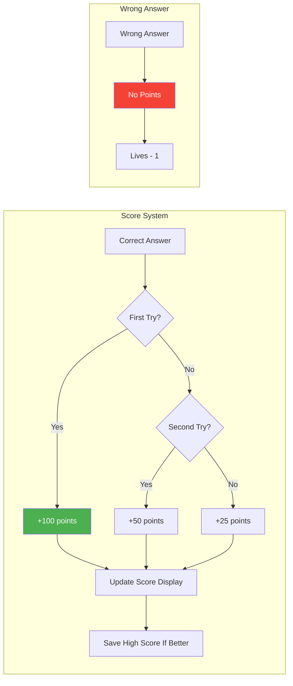

---

## Lives System

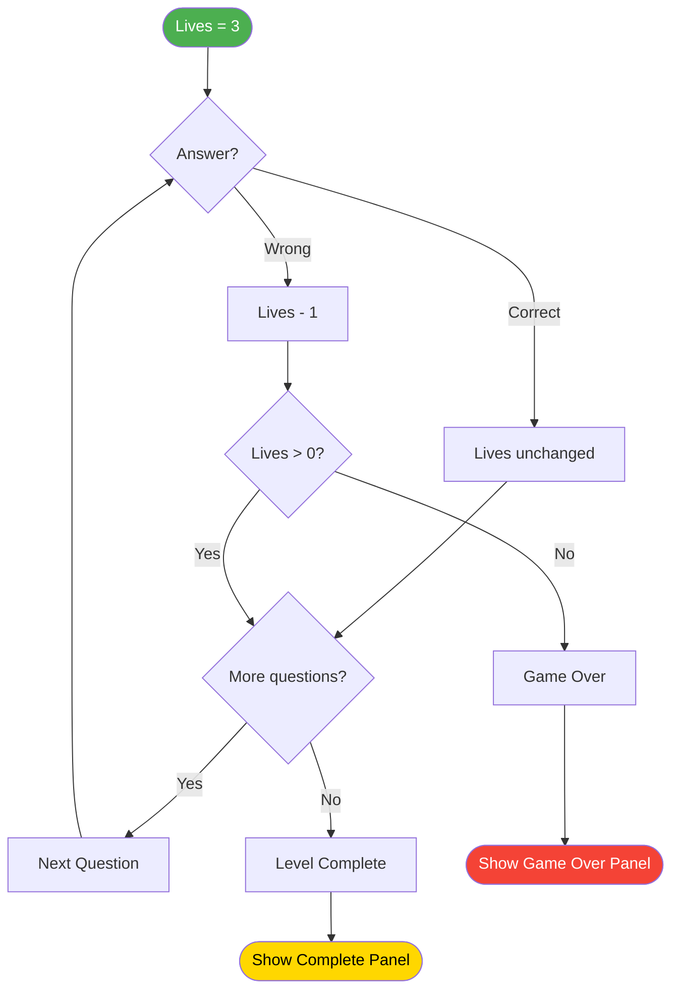

---

## Feedback Animation Sequence

### Correct Answer:
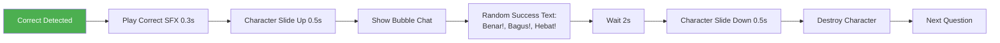

### Wrong Answer:
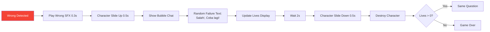

---

## Input Validation Rules

### Valid Inputs:
- Digits: 0-9
- Decimal point: . (only one allowed)
- Maximum length: 10 characters
- Minimum length: 1 character
- Format: `[0-9]+(\.[0-9]+)?`

### Invalid Inputs:
- Multiple decimal points: `1..5` ❌
- Letters: `abc` ❌
- Special characters: `@#$%` ❌
- Leading zeros: `00.5` (allowed but normalized to `0.5`)
- Empty input: `` ❌

### Edge Cases:
```
Input: "0.70" → Parsed as: 0.7
Input: "1." → Parsed as: 1.0
Input: ".5" → Parsed as: 0.5
Input: "1.0000" → Parsed as: 1.0
```

---

## Button State Management

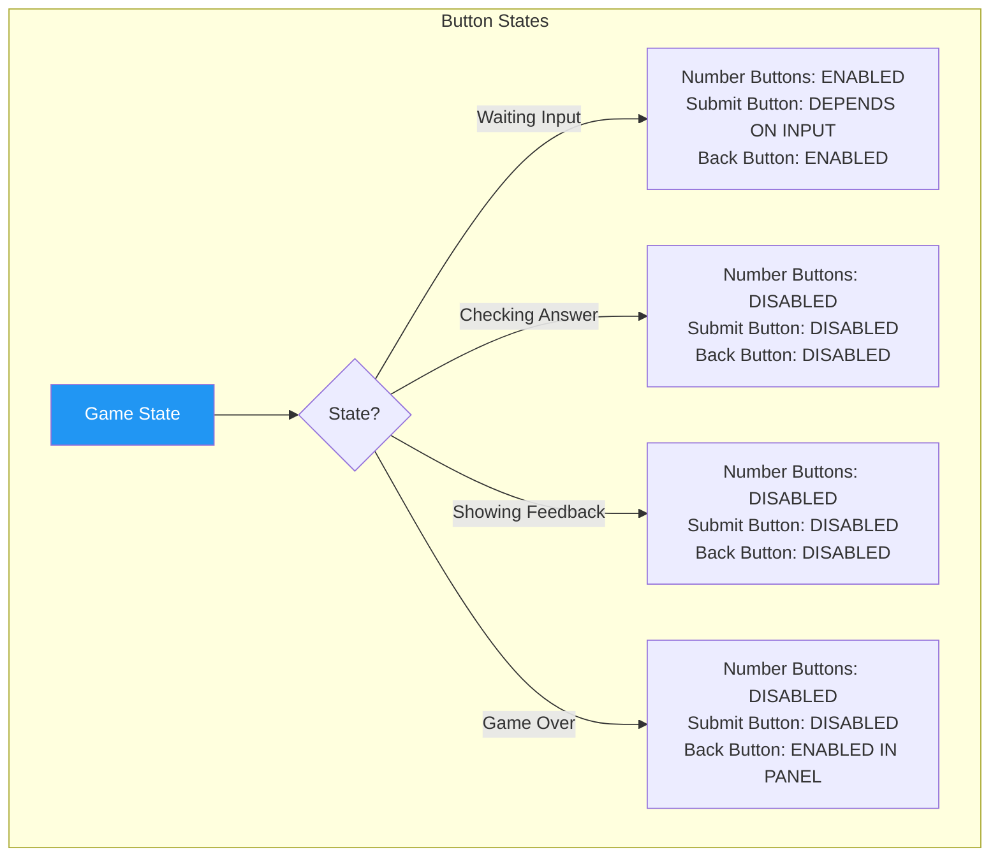

---

## Tolerance Calculation

### Why Tolerance?
Floating-point arithmetic can introduce small errors:
```
Expected: 0.866 (√3/2)
User Input: 0.87
Difference: 0.004
Tolerance: 0.01
Result: CORRECT ✓
```

### Tolerance Values:
```csharp
private const float ANSWER_TOLERANCE = 0.01f;

// Example validations:
correctAnswer = 0.5f;
userAnswer = 0.51f; // ✓ Within tolerance
userAnswer = 0.52f; // ✗ Outside tolerance

correctAnswer = 0.866f;
userAnswer = 0.87f; // ✓ Within tolerance
userAnswer = 0.88f; // ✗ Outside tolerance
```

---

## Answer Comparison Flow

```mermaid
flowchart TD
    subgraph System["Sistem"]
        S1[correctAnswer = 0.707]
        S2[userAnswer = 0.71]
        S3[difference = Mathf.Abs 0.707 - 0.71]
        S4[difference = 0.003]
        S5{0.003 < 0.01?}
        S6[CORRECT]
        S7[tolerance = 0.01]
    end
    
    Start([●]) --> S1
    S1 --> S2
    S2 --> S7
    S7 --> S3
    S3 --> S4
    S4 --> S5
    S5 -->|Yes| S6
    S6 --> End([Success Flow])
    
    style Start fill:#000
    style End fill:#4CAF50,color:#fff
```

---

## Multiple Choice Alternative (Future Enhancement)

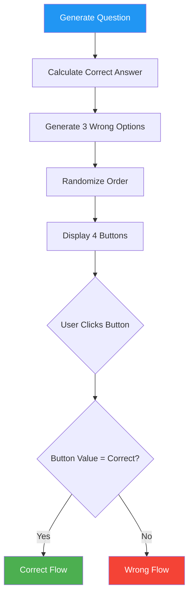

---

## Progress Display

```
┌──────────────────────────────┐
│ Lives: ❤️❤️❤️               │
│ Score: 250                   │
│ Question: 5/10               │
└──────────────────────────────┘

Lives Update:
❤️❤️❤️ → ❤️❤️🖤 → ❤️🖤🖤 → 🖤🖤🖤 (Game Over)

Score Update:
0 → 100 → 200 → 300 (increment per correct answer)

Question Progress:
1/10 → 2/10 → 3/10 → ... → 10/10
```

---

## Retry Logic

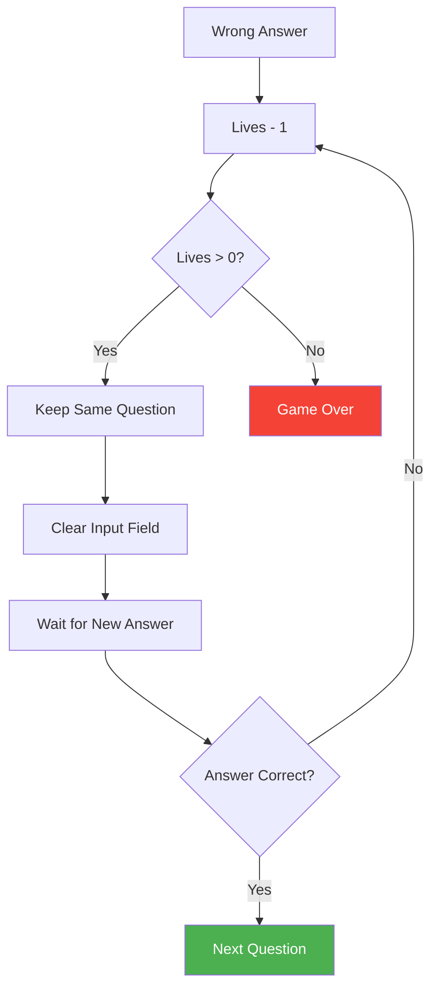

---

## Audio Feedback Timing

```
Correct Answer Sequence:
[0.0s] User clicks Submit
[0.1s] Play Correct SFX (ding!)
[0.1s] Character starts sliding up
[0.6s] Character at center, bubble appears
[0.7s] Text appears in bubble
[2.7s] Character starts sliding down
[3.2s] Character destroyed
[3.3s] Next question generated

Wrong Answer Sequence:
[0.0s] User clicks Submit
[0.1s] Play Wrong SFX (buzz)
[0.1s] Character starts sliding up
[0.6s] Character at center, bubble appears
[0.7s] Text appears in bubble
[0.8s] Lives UI updates (heart fades)
[2.8s] Character starts sliding down
[3.3s] Character destroyed
[3.4s] IF lives > 0: Clear input, wait for retry
[3.4s] IF lives = 0: Game Over sequence starts
```

---

## Character Bubble Messages

### Success Messages (Random):
```
"Benar! Kamu hebat!"
"Bagus! Lanjutkan!"
"Sempurna! Nilai: A+"
"Mantap! Kamu pintar!"
"Excellent! Keep it up!"
"Wow! Jawaban yang tepat!"
"Bravo! Luar biasa!"
"Oke! Kamu benar!"
```

### Failure Messages (Random):
```
"Salah! Coba lagi ya!"
"Kurang tepat, semangat!"
"Waduh! Cek lagi hitungannya!"
"Ups! Hampir benar!"
"Yuk coba sekali lagi!"
"Hmm... belum tepat nih!"
"Ayo, kamu pasti bisa!"
"Jangan menyerah!"
```

---

## Clear Input Button

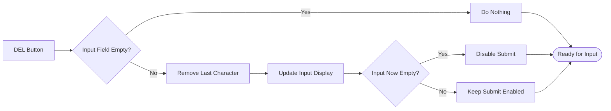

---

## Testing Checklist

**Input Field:**
- [ ] Number buttons (0-9) work
- [ ] Decimal point adds only once
- [ ] DEL removes last character
- [ ] Max length enforced
- [ ] Submit enabled/disabled correctly
- [ ] Input clears after answer

**Validation:**
- [ ] Correct answers detected within tolerance
- [ ] Wrong answers detected correctly
- [ ] Invalid input shows error message
- [ ] Empty input prevented from submit

**Scoring:**
- [ ] Score increments on correct answer
- [ ] Lives decrement on wrong answer
- [ ] High score saves correctly
- [ ] UI updates immediately

**Feedback:**
- [ ] Correct SFX plays
- [ ] Wrong SFX plays
- [ ] Character animation smooth
- [ ] Bubble text randomizes
- [ ] Timing feels natural

**Lives:**
- [ ] Lives display updates
- [ ] Hearts fade on loss
- [ ] Game over triggers at 0 lives
- [ ] Retry works with remaining lives

**Progress:**
- [ ] Question counter increments
- [ ] Progress bar updates (if present)
- [ ] Level completes at final question
- [ ] Score carried to complete panel

---

## Performance Considerations

### Input Debouncing:
```csharp
// Prevent multiple rapid clicks
private float lastInputTime = 0f;
private const float INPUT_COOLDOWN = 0.1f;

void OnButtonClick(string digit)
{
    if (Time.time - lastInputTime < INPUT_COOLDOWN)
        return;
        
    lastInputTime = Time.time;
    AppendDigit(digit);
}
```

### Answer Checking Optimization:
```csharp
// Cache parsed value to avoid re-parsing
private float cachedUserAnswer = 0f;
private bool answerCached = false;

void OnInputChanged(string input)
{
    answerCached = float.TryParse(input, out cachedUserAnswer);
    submitButton.interactable = answerCached && input.Length > 0;
}
```

---

## Error Messages

### Invalid Input:
```
"Input tidak valid! Gunakan angka saja."
"Mohon masukkan angka yang benar."
```

### Empty Input:
```
"Silakan masukkan jawaban terlebih dahulu."
```

### Out of Range:
```
"Jawaban terlalu besar! (max: 9.99)"
"Jawaban harus berupa angka positif."
```

---

## Notes

- Input field supports decimals for precision
- Tolerance of 0.01 allows for rounding errors
- Character animation provides engaging feedback
- Lives system adds challenge
- Score encourages multiple attempts
- Retry mechanic allows learning from mistakes
- Audio timing synchronized with animations
- UI state management prevents input during feedback
- Validation catches edge cases
- Performance optimized for smooth gameplay
