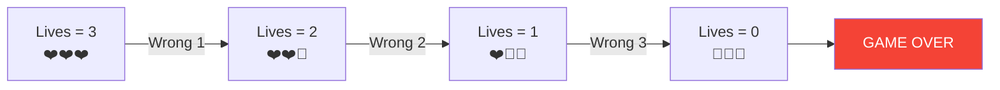
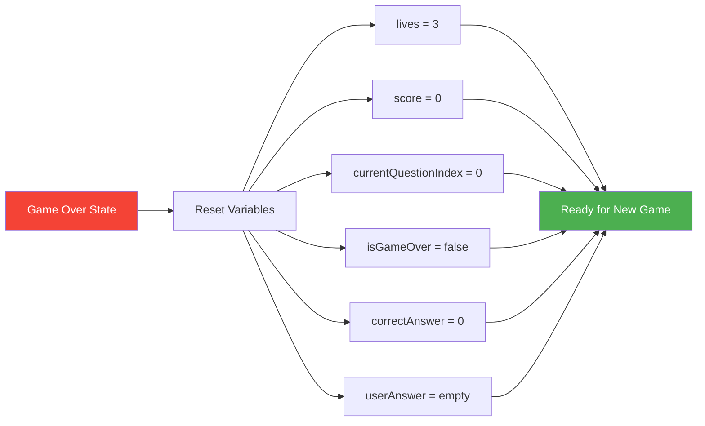
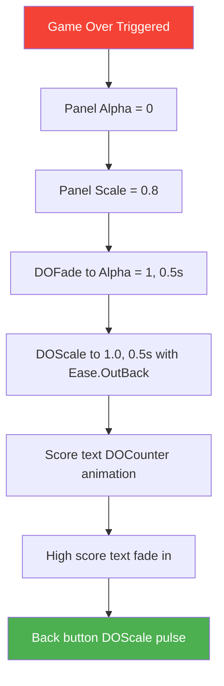

# Activity Diagram 5 - Game Over

## Game Over Trigger and Display Flow

```mermaid
flowchart TD
    subgraph Actor["Semua Aktor"]
        A1[Menjawab soal salah]
        A2[Melihat lives habis]
        A3[Melihat animasi marah]
        A4[Mendengar Game Over SFX]
        A5[Melihat Game Over Panel]
        A6[Klik tombol Back]
        A7[Kembali ke Level Selection]
    end
    
    subgraph System["Sistem"]
        S1[Validate answer]
        S2{Answer correct?}
        S3[Lives - 1]
        S4{Lives = 0?}
        S5[Continue gameplay]
        S6[Trigger Game Over]
        S7[Play Game Over SFX]
        S8[Stop Chapter1 BGM]
        S9[Create character instance]
        S10[Play angry animation loop]
        S11[Show Game Over Panel]
        S12[Display final score]
        S13[Compare with high score]
        S14{New high score?}
        S15[Save new high score]
        S16[Show high score message]
        S17[Enable Back button]
        S18[Wait for Back click]
        S19[Hide character animation]
        S20[Destroy character instance]
        S21[Resume Chapter1 BGM]
        S22[Play button click SFX]
        S23[Load Level Selection scene]
        S24[Clear game state]
    end
    
    Start([●]) --> S1
    S1 --> A1
    A1 --> S2
    
    S2 -->|Yes| End1([Continue to Next Question])
    S2 -->|No| S3
    
    S3 --> A2
    A2 --> S4
    
    S4 -->|No| S5
    S4 -->|Yes| S6
    
    S5 --> End1
    
    S6 --> S7
    S7 --> A4
    A4 --> S8
    S8 --> S9
    S9 --> S10
    S10 --> A3
    A3 --> S11
    S11 --> S12
    S12 --> S13
    S13 --> S14
    
    S14 -->|Yes| S15
    S15 --> S16
    S16 --> S17
    
    S14 -->|No| S17
    
    S17 --> S18
    S18 --> A5
    A5 --> A6
    A6 --> S19
    S19 --> S20
    S20 --> S21
    S21 --> S22
    S22 --> S23
    S23 --> S24
    S24 --> A7
    A7 --> End2([Level Selection Scene])
    
    style Start fill:#000
    style End1 fill:#4CAF50,color:#fff
    style End2 fill:#2196F3,color:#fff
```



---

## Lives Depletion Flow



---

## Character Angry Animation Loop

```mermaid
flowchart TD
    subgraph System["Sistem"]
        S1[Instantiate character]
        S2[Set position: Bottom Off-screen]
        S3[Slide Up to Center 0.5s]
        S4[Start animation loop]
        S5[Frame 1: Angry Sprite 1]
        S6[Wait 0.2s]
        S7[Frame 2: Angry Sprite 2]
        S8[Wait 0.2s]
        S9[Frame 3: Angry Sprite 3]
        S10[Wait 0.2s]
        S11[Frame 4: Angry Sprite 4]
        S12[Wait 0.2s]
        S13[Frame 5: Angry Sprite 5]
        S14[Wait 0.2s]
        S15{Back button<br/>clicked?}
        S16[Stop loop]
        S17[Slide Down 0.5s]
        S18[Destroy instance]
    end
    
    Start([●]) --> S1
    S1 --> S2
    S2 --> S3
    S3 --> S4
    S4 --> S5
    S5 --> S6
    S6 --> S7
    S7 --> S8
    S8 --> S9
    S9 --> S10
    S10 --> S11
    S11 --> S12
    S12 --> S13
    S13 --> S14
    S14 --> S15
    
    S15 -->|No| S5
    S15 -->|Yes| S16
    
    S16 --> S17
    S17 --> S18
    S18 --> End([Character Hidden])
    
    style Start fill:#000
    style End fill:#4CAF50,color:#fff
```



---

## Game Over Panel Display

```
┌─────────────────────────────┐
│                             │
│      GAME OVER!             │
│                             │
│   Final Score: 250          │
│   High Score:  400          │
│                             │
│   ┌───────────────────┐     │
│   │   BACK TO MENU    │     │
│   └───────────────────┘     │
│                             │
└─────────────────────────────┘

Character Animation:
     ↓ Appears from bottom
     ↓ Stays at center
     ↓ Loops angry animation
     ↓ Disappears when Back clicked
```

---

## Audio State Management

```mermaid
flowchart TD
    subgraph "Audio Flow"
        A[Game Over Triggered] --> B[Play Game Over SFX]
        B --> C[Chapter1AudioManager.<br/>StopBGMForGameOver]
        C --> D[GlobalAudioManager.<br/>FadeOutBGM 1.0s]
        D --> E[BGM Stopped]
        
        E --> F[Wait for Back Button]
        F --> G[Back Button Clicked]
        G --> H[Chapter1AudioManager.<br/>ResumeBGMAfterGameOver]
        H --> I[GlobalAudioManager.<br/>PlayGameplayChapter1BGM]
        I --> J[BGM Crossfade 1.0s]
        J --> K[BGM Playing Again]
    end
    
    style A fill:#F44336,color:#fff
    style K fill:#4CAF50,color:#fff
```



---

## High Score Comparison Logic

```mermaid
flowchart TD
    subgraph System["Sistem"]
        S1[finalScore = currentScore]
        S2[Load high score from PlayerPrefs]
        S3[key = highScore_chapter_level]
        S4{finalScore ><br/>highScore?}
        S5[Save new high score]
        S6[PlayerPrefs.SetInt key, finalScore]
        S7[PlayerPrefs.Save]
        S8[Show NEW HIGH SCORE! message]
        S9[Show normal score message]
        S10[Display both scores in panel]
    end
    
    Start([●]) --> S1
    S1 --> S2
    S2 --> S3
    S3 --> S4
    
    S4 -->|Yes| S5
    S4 -->|No| S9
    
    S5 --> S6
    S6 --> S7
    S7 --> S8
    S8 --> S10
    S9 --> S10
    S10 --> End([Display Complete])
    
    style Start fill:#000
    style S8 fill:#FFD700,color:#000
```



---

## Back Button Flow

```mermaid
flowchart TD
    subgraph Actor["Semua Aktor"]
        A1[Klik Back Button]
    end
    
    subgraph System["Sistem"]
        S1[Button Click Handler]
        S2[Play button click SFX]
        S3[characterController.<br/>HideCharacter]
        S4[Stop angry animation loop]
        S5[Slide character down 0.5s]
        S6[Destroy character instance]
        S7[Resume BGM]
        S8[Wait 0.5s for animation]
        S9[SceneManager.LoadScene<br/>LevelSelection]
        S10[Clear currentLevel data]
        S11[Reset lives to 3]
        S12[Reset score to 0]
    end
    
    Start([●]) --> A1
    A1 --> S1
    S1 --> S2
    S2 --> S3
    S3 --> S4
    S4 --> S5
    S5 --> S6
    S6 --> S7
    S7 --> S8
    S8 --> S9
    S9 --> S10
    S10 --> S11
    S11 --> S12
    S12 --> End([Level Selection Scene])
    
    style Start fill:#000
    style End fill:#2196F3,color:#fff
```



---

## Character Hide Implementation

```csharp
public void HideCharacter()
{
    // Always hide regardless of animation state
    if (characterImage != null)
    {
        StopAllCoroutines(); // Stop animation loop
        isAnimating = false;
        
        // Slide down animation
        characterImage.rectTransform
            .DOAnchorPosY(-200f, 0.5f)
            .SetEase(Ease.InBack)
            .OnComplete(() => 
            {
                if (characterImage != null)
                {
                    Destroy(characterImage.gameObject);
                    characterImage = null;
                }
            });
    }
}
```

---

## Game State Reset



---

## Persistent Animation Behavior

### Before Fix (Bug):
```
Game Over → Angry Animation Starts
↓
User Clicks Back Immediately
↓
HideCharacter() called
↓
Check: if (!isAnimating) return; // ❌ BLOCKED
↓
Character DOESN'T hide → BUG!
```

### After Fix (Correct):
```
Game Over → Angry Animation Starts
↓
User Clicks Back Immediately
↓
HideCharacter() called
↓
StopAllCoroutines() → Stop animation
↓
DOTween slide down → Character hides ✓
```

---

## Timing Diagram

```
Time (seconds):
0.0s: Wrong answer detected, Lives = 0
0.1s: Trigger Game Over
0.2s: Play Game Over SFX
0.3s: Stop BGM (fade out starts)
1.3s: BGM fully stopped
1.4s: Character instantiated off-screen
1.5s: Character slides up (0.5s animation)
2.0s: Character at center, angry animation loop starts
2.0s: Game Over Panel fades in
2.5s: Panel fully visible, scores displayed
2.5s: Back button enabled

[User can click Back anytime after 2.5s]

User clicks Back at time X:
X + 0.0s: Button click SFX
X + 0.1s: Stop animation loop
X + 0.1s: Character slides down (0.5s)
X + 0.6s: Character destroyed
X + 0.1s: Resume BGM (crossfade 1.0s)
X + 0.7s: Load Level Selection scene
X + 1.7s: BGM fully playing in Level Selection
```

---

## Error Handling

### Character Instance Missing:
```csharp
if (characterImage == null)
{
    Debug.LogWarning("Character already destroyed");
    return;
}
```

### Audio Manager Missing:
```csharp
if (audioManager == null)
{
    Debug.LogError("Chapter1AudioManager not assigned!");
    return;
}
```

### High Score Save Failed:
```csharp
try
{
    PlayerPrefs.SetInt(key, score);
    PlayerPrefs.Save();
}
catch (Exception e)
{
    Debug.LogError($"Failed to save high score: {e.Message}");
}
```

---

## UI Animation Sequence



---

## Score Display Animation

```csharp
// Animate score counting up
scoreText.text = "0";
DOTween.To(
    () => 0, 
    x => scoreText.text = x.ToString(), 
    finalScore, 
    1.0f
).SetEase(Ease.OutQuad);

// High score comparison message
if (isNewHighScore)
{
    highScoreLabel.text = "NEW HIGH SCORE!";
    highScoreLabel.color = Color.yellow;
    highScoreLabel.DOFade(1, 0.5f).From(0);
}
else
{
    highScoreLabel.text = $"High Score: {highScore}";
    highScoreLabel.color = Color.white;
}
```

---

## Testing Checklist

**Game Over Trigger:**
- [ ] Triggers when lives = 0
- [ ] Doesn't trigger when lives > 0
- [ ] Only triggers once per game
- [ ] State properly set

**Audio:**
- [ ] Game Over SFX plays
- [ ] BGM fades out smoothly
- [ ] BGM resumes after Back click
- [ ] Button click SFX on Back
- [ ] No audio overlap/glitches

**Character Animation:**
- [ ] Character slides up smoothly
- [ ] Angry animation loops correctly
- [ ] Animation stops on Back click
- [ ] Character slides down and destroys
- [ ] No null reference errors

**Panel Display:**
- [ ] Panel appears with animation
- [ ] Final score displays correctly
- [ ] High score displays correctly
- [ ] New high score message shows
- [ ] Back button is clickable

**Back Navigation:**
- [ ] Returns to Level Selection
- [ ] BGM transitions correctly
- [ ] Game state resets
- [ ] Character properly destroyed
- [ ] No memory leaks

**Edge Cases:**
- [ ] Rapid Back button clicks handled
- [ ] Character hides even during animation
- [ ] Missing references logged
- [ ] Scene transition smooth
- [ ] PlayerPrefs save works

---

## Performance Considerations

### Animation Cleanup:
```csharp
void OnDestroy()
{
    // Kill all DOTween animations on this object
    DOTween.Kill(gameObject);
    
    // Stop coroutines
    StopAllCoroutines();
    
    // Destroy character if exists
    if (characterImage != null)
        Destroy(characterImage.gameObject);
}
```

### Memory Management:
```csharp
// Clear references after scene load
void OnLevelSelectionLoaded(Scene scene, LoadSceneMode mode)
{
    characterImage = null;
    audioManager = null;
    gameOverPanel = null;
}
```

---

## Integration Points

### From CalculationManager:
```csharp
void OnWrongAnswer()
{
    lives--;
    
    if (lives <= 0)
    {
        TriggerGameOver();
    }
    else
    {
        // Show wrong feedback
        PlayWrongAnimation();
    }
}
```

### To Level Selection:
```csharp
void ReturnToLevelSelection()
{
    // Resume audio
    audioManager.ResumeBGMAfterGameOver();
    
    // Wait for slide animation
    StartCoroutine(LoadLevelSelectionAfterDelay(0.5f));
}

IEnumerator LoadLevelSelectionAfterDelay(float delay)
{
    yield return new WaitForSeconds(delay);
    SceneManager.LoadScene("LevelSelection");
}
```

---

## PlayerPrefs Keys Used

```
High Score Key Format:
"highScore_chapter{chapterNumber}_level{levelNumber}"

Examples:
- "highScore_chapter1_level1"
- "highScore_chapter1_level2"
- "highScore_chapter1_level3"

Retrieval:
int highScore = PlayerPrefs.GetInt(key, 0); // Default 0

Save:
PlayerPrefs.SetInt(key, newHighScore);
PlayerPrefs.Save();
```

---

## Visual States

### Initial State (Playing):
```
Lives: ❤️❤️❤️
Score: 150
[Question displayed]
[Input field active]
```

### Game Over State:
```
Lives: 🖤🖤🖤
Score: 150 (frozen)
[Character angry animation looping]
[Game Over Panel visible]
[Input disabled]
```

### Transition State (Back clicked):
```
[Character sliding down]
[Panel fading out]
[BGM crossfading]
[Scene loading]
```

---

## Common Issues & Solutions

**Issue:** Character doesn't hide when Back clicked
**Solution:** Remove `isAnimating` check, always allow hide

**Issue:** Animation jitters when hiding
**Solution:** Use `StopAllCoroutines()` before DOTween animation

**Issue:** BGM doesn't resume
**Solution:** Ensure `ResumeBGMAfterGameOver()` is called

**Issue:** High score doesn't save
**Solution:** Call `PlayerPrefs.Save()` after `SetInt()`

**Issue:** Rapid Back clicks cause errors
**Solution:** Disable button during transition, check null references

---

## Debug Logging

```csharp
Debug.Log($"Game Over triggered. Final Score: {score}");
Debug.Log($"High Score loaded: {highScore}");
Debug.Log($"Is New High Score: {isNewHighScore}");
Debug.Log($"Stopping BGM for Game Over");
Debug.Log($"Playing Game Over SFX");
Debug.Log($"Creating angry character animation");
Debug.Log($"Back button clicked, hiding character");
Debug.Log($"Resuming BGM after Game Over");
Debug.Log($"Loading Level Selection scene");
```

---

## Notes

- Game Over triggers only when lives = 0
- Character animation loops indefinitely until Back clicked
- Character always hides when Back clicked (no state check)
- BGM stops during Game Over, resumes after Back
- High score saved to PlayerPrefs with chapter/level key
- Panel animates in with DOTween for polish
- Back button waits for slide-down animation before scene load
- All coroutines and animations cleaned up on destroy
- Error handling prevents null reference crashes
- Debug logging helps troubleshoot issues
