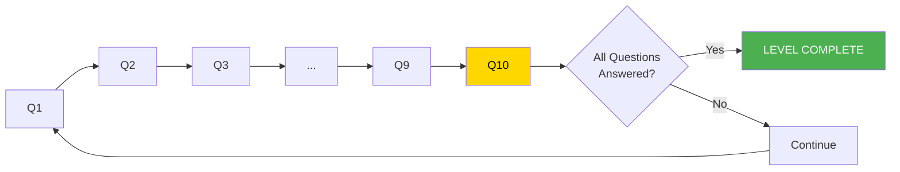
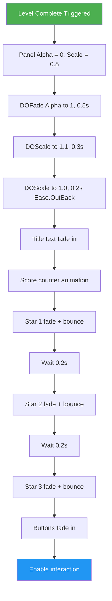
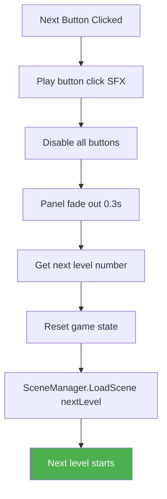
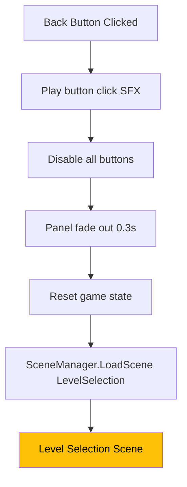
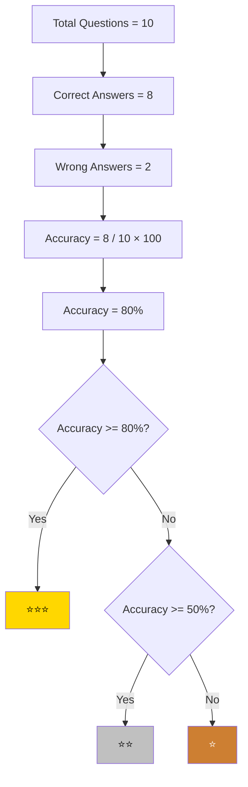

# Activity Diagram 6 - Level Complete

## Level Completion Flow

```mermaid
flowchart TD
    subgraph Actor["Semua Aktor"]
        A1[Menjawab soal terakhir benar]
        A2[Melihat animasi benar terakhir]
        A3[Melihat Level Complete Panel]
        A4[Melihat final score]
        A5[Melihat bintang 3 stars]
        A6[Klik Next Level / Back]
        A7[Lanjut ke level berikutnya]
        A8[Kembali ke Level Selection]
    end
    
    subgraph System["Sistem"]
        S1[Validate last answer]
        S2{Answer correct?}
        S3[Increment score]
        S4[Play correct SFX]
        S5[Show correct animation]
        S6[Increment questionIndex]
        S7{questionIndex >= totalQuestions?}
        S8[Continue to next question]
        S9[Trigger Level Complete]
        S10[Calculate final score]
        S11[Calculate star rating]
        S12{score >= 80%?}
        S13[Award 3 stars ⭐⭐⭐]
        S14{score >= 50%?}
        S15[Award 2 stars ⭐⭐]
        S16[Award 1 star ⭐]
        S17[Save high score]
        S18[Unlock next level]
        S19{Next level exists?}
        S20[Enable Next button]
        S21[Disable Next button]
        S22[Show Level Complete Panel]
        S23[Play complete SFX]
        S24[Display score animation]
        S25[Display star animation]
        S26[Wait for button click]
        S27{Next clicked?}
        S28[Load next level scene]
        S29[Load Level Selection]
        S30[Reset game state]
    end
    
    Start([●]) --> S1
    S1 --> A1
    A1 --> S2
    
    S2 -->|No| End1([Game Continues])
    S2 -->|Yes| S3
    
    S3 --> S4
    S4 --> S5
    S5 --> A2
    A2 --> S6
    S6 --> S7
    
    S7 -->|No| S8
    S8 --> End1
    
    S7 -->|Yes| S9
    S9 --> S10
    S10 --> S11
    S11 --> S12
    
    S12 -->|Yes| S13
    S13 --> S17
    
    S12 -->|No| S14
    S14 -->|Yes| S15
    S15 --> S17
    
    S14 -->|No| S16
    S16 --> S17
    
    S17 --> S18
    S18 --> S19
    
    S19 -->|Yes| S20
    S19 -->|No| S21
    
    S20 --> S22
    S21 --> S22
    
    S22 --> S23
    S23 --> S24
    S24 --> S25
    S25 --> A3
    A3 --> A4
    A4 --> A5
    A5 --> S26
    S26 --> A6
    A6 --> S27
    
    S27 -->|Yes| S28
    S28 --> S30
    S30 --> A7
    A7 --> End2([Next Level Scene])
    
    S27 -->|No| S29
    S29 --> S30
    S30 --> A8
    A8 --> End3([Level Selection Scene])
    
    style Start fill:#000
    style End1 fill:#2196F3,color:#fff
    style End2 fill:#4CAF50,color:#fff
    style End3 fill:#FFC107,color:#000
```



---

## Question Progress Completion



---

## Star Rating Calculation

```mermaid
flowchart TD
    subgraph System["Sistem"]
        S1[Final Score = totalScore]
        S2[Max Score = totalQuestions × 100]
        S3[Percentage = finalScore / maxScore × 100]
        S4{Percentage?}
        S5[⭐⭐⭐ 3 Stars<br/>EXCELLENT!]
        S6[⭐⭐ 2 Stars<br/>GOOD!]
        S7[⭐ 1 Star<br/>COMPLETE!]
        S8[Save star rating]
    end
    
    Start([●]) --> S1
    S1 --> S2
    S2 --> S3
    S3 --> S4
    
    S4 -->|>= 80%| S5
    S4 -->|>= 50% AND < 80%| S6
    S4 -->|< 50%| S7
    
    S5 --> S8
    S6 --> S8
    S7 --> S8
    S8 --> End([Rating Saved])
    
    style Start fill:#000
    style S5 fill:#FFD700,color:#000
    style S6 fill:#C0C0C0,color:#000
    style S7 fill:#CD7F32,color:#fff
```



---

## Level Complete Panel Layout

```
┌─────────────────────────────────┐
│                                 │
│      🎉 LEVEL COMPLETE! 🎉      │
│                                 │
│         ⭐ ⭐ ⭐                  │
│                                 │
│      Final Score: 850           │
│      High Score:  900           │
│      Accuracy: 85%              │
│                                 │
│   ┌──────────┐  ┌──────────┐   │
│   │   NEXT   │  │   BACK   │   │
│   └──────────┘  └──────────┘   │
│                                 │
└─────────────────────────────────┘

Star Animation:
    ⭐ (fade in + scale bounce)
        delay 0.2s
    ⭐ (fade in + scale bounce)
        delay 0.2s
    ⭐ (fade in + scale bounce)
```

---

## Star Rating Examples

### Example 1: Perfect Score
```
Total Questions: 10
Correct Answers: 10
Final Score: 1000
Max Score: 1000
Percentage: 100%
Result: ⭐⭐⭐ (3 Stars)
```

### Example 2: Good Score
```
Total Questions: 10
Correct Answers: 7
Final Score: 700
Max Score: 1000
Percentage: 70%
Result: ⭐⭐ (2 Stars)
```

### Example 3: Minimum Pass
```
Total Questions: 10
Correct Answers: 4
Final Score: 400
Max Score: 1000
Percentage: 40%
Result: ⭐ (1 Star)
```

---

## Next Level Unlock Logic

```mermaid
flowchart TD
    subgraph System["Sistem"]
        S1[Level Completed]
        S2[Current Level Number]
        S3[Calculate next level = current + 1]
        S4{Next level exists<br/>in build?}
        S5[Set unlock flag for next level]
        S6[key = levelUnlocked_chapter_nextLevel]
        S7[PlayerPrefs.SetInt key, 1]
        S8[PlayerPrefs.Save]
        S9[Enable Next button]
        S10[Disable Next button]
        S11[Show message:<br/>This is the last level!]
    end
    
    Start([●]) --> S1
    S1 --> S2
    S2 --> S3
    S3 --> S4
    
    S4 -->|Yes| S5
    S5 --> S6
    S6 --> S7
    S7 --> S8
    S8 --> S9
    S9 --> End1([Next Available])
    
    S4 -->|No| S10
    S10 --> S11
    S11 --> End2([Back Only])
    
    style Start fill:#000
    style End1 fill:#4CAF50,color:#fff
    style End2 fill:#FF9800,color:#fff
```



---

## High Score Save Logic

```mermaid
flowchart TD
    subgraph System["Sistem"]
        S1[Final Score = currentScore]
        S2[key = highScore_chapter_level]
        S3[Load existing high score]
        S4[existingHighScore = PlayerPrefs.GetInt key, 0]
        S5{finalScore ><br/>existingHighScore?}
        S6[Save new high score]
        S7[PlayerPrefs.SetInt key, finalScore]
        S8[PlayerPrefs.Save]
        S9[Show NEW HIGH SCORE!]
        S10[Keep existing high score]
        S11[Display in panel]
    end
    
    Start([●]) --> S1
    S1 --> S2
    S2 --> S3
    S3 --> S4
    S4 --> S5
    
    S5 -->|Yes| S6
    S5 -->|No| S10
    
    S6 --> S7
    S7 --> S8
    S8 --> S9
    S9 --> S11
    S10 --> S11
    S11 --> End([Displayed])
    
    style Start fill:#000
    style S9 fill:#FFD700,color:#000
```



---

## Panel Animation Sequence



---

## Score Counter Animation

```csharp
// Animate score counting up from 0 to finalScore
int displayScore = 0;
scoreText.text = "0";

DOTween.To(
    () => displayScore,
    x => {
        displayScore = x;
        scoreText.text = x.ToString();
    },
    finalScore,
    1.5f
).SetEase(Ease.OutCubic);

// Show accuracy percentage
float accuracy = (float)correctAnswers / totalQuestions * 100f;
accuracyText.text = $"Accuracy: {accuracy:F0}%";
```

---

## Star Bounce Animation

```csharp
void AnimateStar(Image starImage, float delay)
{
    starImage.color = new Color(1, 1, 1, 0); // Start invisible
    starImage.transform.localScale = Vector3.zero;
    
    Sequence starSequence = DOTween.Sequence();
    
    starSequence.AppendInterval(delay);
    starSequence.Append(starImage.DOFade(1f, 0.3f));
    starSequence.Join(starImage.transform.DOScale(1.2f, 0.2f));
    starSequence.Append(starImage.transform.DOScale(1f, 0.1f).SetEase(Ease.OutBack));
    
    starSequence.Play();
}

// Usage:
AnimateStar(star1Image, 0.5f);
AnimateStar(star2Image, 0.7f);
AnimateStar(star3Image, 0.9f);
```

---

## Button Click Flow

### Next Button:


### Back Button:


---

## Statistics Display

```
┌─────────────────────────────────┐
│         STATISTICS              │
├─────────────────────────────────┤
│ Total Questions:     10         │
│ Correct Answers:      8         │
│ Wrong Answers:        2         │
│ Lives Remaining:      2         │
│ Accuracy:           80%         │
│ Time Taken:       5:23          │
│ Stars Earned:      ⭐⭐⭐        │
└─────────────────────────────────┘
```

---

## PlayerPrefs Keys

### Level Unlock:
```
Format: "levelUnlocked_chapter{X}_level{Y}"

Examples:
- "levelUnlocked_chapter1_level1" = 1 (always unlocked)
- "levelUnlocked_chapter1_level2" = 1 (unlocked after level 1)
- "levelUnlocked_chapter1_level3" = 0 (locked)

Check Unlock:
int isUnlocked = PlayerPrefs.GetInt(key, 0);
if (isUnlocked == 1)
{
    // Level is unlocked
}
```

### High Score:
```
Format: "highScore_chapter{X}_level{Y}"

Examples:
- "highScore_chapter1_level1" = 850
- "highScore_chapter1_level2" = 700
- "highScore_chapter1_level3" = 0

Retrieve:
int highScore = PlayerPrefs.GetInt(key, 0);
```

### Star Rating:
```
Format: "starRating_chapter{X}_level{Y}"

Examples:
- "starRating_chapter1_level1" = 3
- "starRating_chapter1_level2" = 2
- "starRating_chapter1_level3" = 1

Values: 1, 2, or 3 stars
```

---

## Accuracy Calculation



---

## Completion Conditions

### Must Complete:
✅ Answer all questions (totalQuestions reached)
✅ At least 1 life remaining (lives > 0)
✅ Valid score calculated (score >= 0)

### Cannot Complete With:
❌ Lives = 0 (triggers Game Over instead)
❌ Questions remaining (questionIndex < totalQuestions)
❌ Invalid game state

---

## Level Progression Map

```
Chapter 1:
┌──────┐      ┌──────┐      ┌──────┐
│Level1├─────►│Level2├─────►│Level3│
└──────┘      └──────┘      └──────┘
   🔓            🔒            🔒
(unlocked)   (locked)     (locked)

After completing Level 1:
┌──────┐      ┌──────┐      ┌──────┐
│Level1├─────►│Level2├─────►│Level3│
└──────┘      └──────┘      └──────┘
   ⭐⭐⭐         🔓            🔒
(completed)  (unlocked)   (locked)

After completing Level 2:
┌──────┐      ┌──────┐      ┌──────┐
│Level1├─────►│Level2├─────►│Level3│
└──────┘      └──────┘      └──────┘
   ⭐⭐⭐         ⭐⭐           🔓
(completed)  (completed)  (unlocked)
```

---

## Audio Integration

```
Level Complete Sequence:

[0.0s] Last answer validated as correct
[0.1s] Play Correct Answer SFX
[0.2s] Character correct animation
[2.2s] Character hides
[2.3s] Play Level Complete SFX (victory tune)
[2.5s] Panel fade in starts
[3.0s] Star animations begin
[4.0s] All stars displayed
[4.1s] BGM continues playing (no stop)

Button Clicks:
- Next: Play button click SFX → Load next level
- Back: Play button click SFX → Load level selection
```

---

## Testing Checklist

**Completion Trigger:**
- [ ] Triggers when last question answered correctly
- [ ] Doesn't trigger if lives = 0
- [ ] Doesn't trigger if questions remain
- [ ] Only triggers once

**Star Rating:**
- [ ] 3 stars awarded for >= 80%
- [ ] 2 stars awarded for 50-79%
- [ ] 1 star awarded for < 50%
- [ ] Stars animate correctly
- [ ] Star count saved to PlayerPrefs

**Score Display:**
- [ ] Final score displays correctly
- [ ] High score displays correctly
- [ ] New high score message shows if applicable
- [ ] Score counter animates smoothly
- [ ] Accuracy percentage correct

**Level Unlock:**
- [ ] Next level unlocks on completion
- [ ] Unlock saved to PlayerPrefs
- [ ] Next button enabled if next level exists
- [ ] Next button disabled on last level
- [ ] Unlock reflected in Level Selection

**Buttons:**
- [ ] Next button loads correct level
- [ ] Back button returns to Level Selection
- [ ] Button clicks play SFX
- [ ] Buttons disable during transition
- [ ] No double-click issues

**Animation:**
- [ ] Panel fades in smoothly
- [ ] Panel scales with bounce effect
- [ ] Stars appear sequentially
- [ ] Score counts up smoothly
- [ ] Title text animates

**Data Persistence:**
- [ ] High score saves correctly
- [ ] Star rating saves correctly
- [ ] Level unlock saves correctly
- [ ] PlayerPrefs.Save() called
- [ ] Data persists after restart

---

## Edge Cases

### Last Level in Chapter:
```
Current Level: Chapter1_Level3
Next Level: Does not exist
Action: Disable Next button
Show: "Congratulations! You completed Chapter 1!"
```

### Perfect Score:
```
Total Questions: 10
Correct: 10
Wrong: 0
Lives: 3 (all remaining)
Score: 1000
Stars: ⭐⭐⭐
Message: "PERFECT! FLAWLESS VICTORY!"
```

### Minimum Pass:
```
Total Questions: 10
Correct: 3
Wrong: 7
Lives: 1 (2 lost)
Score: 300
Stars: ⭐
Message: "Complete! Try again for more stars!"
```

---

## Integration with Level Selection

### Level Selection Update:
```csharp
void OnLevelSelectionLoaded()
{
    // Check unlock status for each level
    for (int i = 1; i <= totalLevels; i++)
    {
        string key = $"levelUnlocked_chapter{chapterNum}_level{i}";
        bool isUnlocked = PlayerPrefs.GetInt(key, 0) == 1;
        
        if (i == 1)
            isUnlocked = true; // First level always unlocked
        
        levelButtons[i].interactable = isUnlocked;
        
        // Display star rating if completed
        string starKey = $"starRating_chapter{chapterNum}_level{i}";
        int stars = PlayerPrefs.GetInt(starKey, 0);
        UpdateStarDisplay(i, stars);
    }
}
```

---

## Game State Reset

```csharp
void ResetGameState()
{
    lives = 3;
    score = 0;
    currentQuestionIndex = 0;
    correctAnswers = 0;
    wrongAnswers = 0;
    isGameOver = false;
    isLevelComplete = false;
    
    Debug.Log("Game state reset for next level");
}
```

---

## Performance Optimization

### Panel Pooling:
```csharp
// Don't instantiate panel each time
// Use single panel, show/hide as needed
levelCompletePanel.SetActive(true);
levelCompletePanel.GetComponent<CanvasGroup>().alpha = 0;
```

### Animation Batching:
```csharp
// Use Sequence for coordinated animations
Sequence completeSequence = DOTween.Sequence();
completeSequence.Append(panelCanvasGroup.DOFade(1, 0.5f));
completeSequence.Join(panelTransform.DOScale(1, 0.5f));
completeSequence.AppendCallback(() => AnimateStars());
completeSequence.Play();
```

---

## Debug Logging

```csharp
Debug.Log($"Level Complete! Final Score: {score}");
Debug.Log($"Correct: {correctAnswers}, Wrong: {wrongAnswers}");
Debug.Log($"Accuracy: {accuracy}%");
Debug.Log($"Stars Awarded: {starCount}");
Debug.Log($"High Score: {highScore}, New: {isNewHighScore}");
Debug.Log($"Next Level Unlocked: {nextLevelNumber}");
Debug.Log($"Saving progress to PlayerPrefs");
```

---

## Notes

- Level completes only when all questions answered with lives > 0
- Star rating based on final score percentage
- Next level automatically unlocked on completion
- High score compared and saved if better
- Panel animates in with DOTween for visual polish
- Stars appear sequentially for dramatic effect
- Next button enabled only if next level exists
- All progress saved to PlayerPrefs
- BGM continues playing (no stop like Game Over)
- Back button always available
- Score counter animated for satisfying feedback
- Button clicks disabled during transitions
