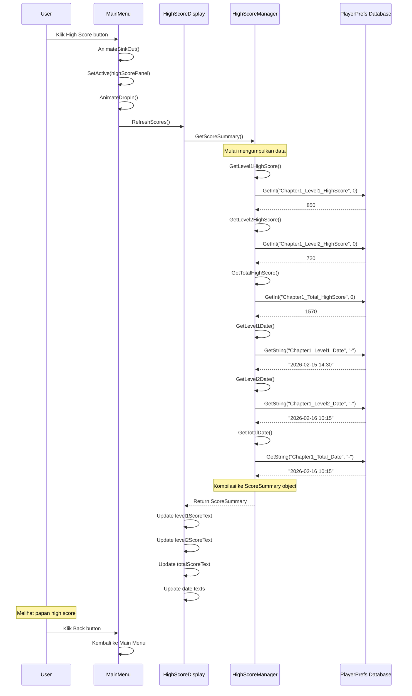

# Activity Diagram 7 - Membuka Papan High Score

## Alur Membuka dan Menampilkan High Score dari Main Menu

```mermaid
flowchart TD
    subgraph Aktor["Aktor"]
        A1[Berada di Main Menu]
        A2[Klik tombol High Score]
        A3[Melihat panel High Score]
        A4[Klik tombol Back]
    end
    
    subgraph Sistem["Sistem"]
        S1[OnHighScoreClicked]
        S2[Animasi Sink Out Main Menu]
        S3[Aktifkan High Score Panel]
        S4[Animasi Drop In Panel]
        S5[HighScoreManager.GetScoreSummary]
        S6[PlayerPrefs.GetInt untuk<br/>semua level scores]
        S7[PlayerPrefs.GetString untuk<br/>semua tanggal]
        S8{Data<br/>ditemukan?}
        S9[Return nilai tersimpan]
        S10[Return nilai default<br/>0 atau -]
        S11[Buat objek ScoreSummary]
        S12[Update UI Text:<br/>Level 1, Level 2, Total]
        S13[Tampilkan High Score]
        S14[Kembali ke Main Menu]
    end
    
    Start([●]) --> A1
    A1 --> A2
    A2 --> S1
    S1 --> S2
    S2 --> S3
    S3 --> S4
    S4 --> S5
    S5 --> S6
    S6 --> S7
    S7 --> S8
    S8 -->|Ya| S9
    S8 -->|Tidak| S10
    S9 --> S11
    S10 --> S11
    S11 --> S12
    S12 --> S13
    S13 --> A3
    A3 --> A4
    A4 --> S14
    S14 --> End([●])
    
    style Start fill:#000
    style End fill:#000
    style S8 fill:#FFC107
```



---

## Detail Proses Step-by-Step

### 1. User Interaksi - Klik Tombol High Score
**Aktor:** User (dari Main Menu)
**Aksi:** Klik tombol "High Score"

### 2. Handler Button Click
**Sistem:** `MainMenuManager.cs`
```csharp
public void OnHighScoreClicked()
{
    if (currentState != MenuState.MainMenu) return;
    currentState = MenuState.HighScore;
    
    // Trigger transition
    mainMenuAnimator.AnimateSinkOut(() => { ... });
}
```

### 3. Animasi Transisi - Main Menu Sink Out
**Sistem:** `MenuAnimationController`
- Main menu panel menenggelam ke bawah
- Durasi: ~0.5 detik
- Easing: ease-in

### 4. Aktivasi Panel High Score
**Sistem:** `MainMenuManager.cs`
```csharp
highScorePanel.SetActive(true);
```
- Panel diaktifkan SEBELUM animasi mulai
- Ini penting agar komponen dapat di-render

### 5. Animasi Drop In - Panel High Score
**Sistem:** `MenuAnimationController`
```csharp
highScoreAnimator.AnimateDropIn(() => 
{
    // Callback setelah animasi selesai
    highScoreDisplay.RefreshScores();
});
```
- Panel jatuh dari atas
- Durasi: ~0.5 detik
- Easing: ease-out

### 6. Refresh Scores - Pemanggilan Data
**Sistem:** `HighScoreDisplay.cs`
```csharp
public void RefreshScores()
{
    ScoreSummary summary = HighScoreManager.Instance.GetScoreSummary();
    
    // Update UI berdasarkan data
    level1ScoreText.text = summary.level1HighScore > 0 
        ? summary.level1HighScore.ToString() 
        : "---";
    // ... dst untuk level lain
}
```

---

## Proses PlayerPrefs - Mengambil Data dari Database Lokal

### A. GetScoreSummary - Kompilasi Data
**Sistem:** `HighScoreManager.cs`
```csharp
public ScoreSummary GetScoreSummary()
{
    return new ScoreSummary
    {
        level1HighScore = GetLevel1HighScore(),
        level2HighScore = GetLevel2HighScore(),
        level3HighScore = GetLevel3HighScore(),
        totalHighScore = GetTotalHighScore(),
        level1Date = GetLevel1Date(),
        level2Date = GetLevel2Date(),
        level3Date = GetLevel3Date(),
        totalDate = GetTotalDate()
    };
}
```

**Penjelasan:**
- Method ini mengumpulkan semua data score dari berbagai getter
- Mengembalikan objek `ScoreSummary` yang berisi semua informasi
- Proses ini SINKRONUS (tidak ada delay)

### B. GetLevel1HighScore - Ambil Score Level 1
**Sistem:** `HighScoreManager.cs`
```csharp
private const string CHAPTER1_LEVEL1_KEY = "Chapter1_Level1_HighScore";

public int GetLevel1HighScore()
{
    return PlayerPrefs.GetInt(CHAPTER1_LEVEL1_KEY, 0);
}
```

**Proses PlayerPrefs.GetInt:**
1. **Input:** Key string (`"Chapter1_Level1_HighScore"`) dan default value (0)
2. **Database Check:** Unity mengecek Registry (Windows) atau plist (Mac) atau shared preferences (Android)
3. **Outcome:**
   - Jika key DITEMUKAN → return nilai integer yang tersimpan
   - Jika key TIDAK DITEMUKAN → return default value (0)

**Lokasi Penyimpanan PlayerPrefs:**
- **Windows:** `HKEY_CURRENT_USER\Software\[company name]\[product name]`
- **Mac:** `~/Library/Preferences/com.[company name].[product name].plist`
- **Android:** SharedPreferences
- **Linux:** `~/.config/unity3d/[company name]/[product name]/prefs`

### C. GetLevel2HighScore - Ambil Score Level 2
**Sistem:** `HighScoreManager.cs`
```csharp
private const string CHAPTER1_LEVEL2_KEY = "Chapter1_Level2_HighScore";

public int GetLevel2HighScore()
{
    return PlayerPrefs.GetInt(CHAPTER1_LEVEL2_KEY, 0);
}
```

**Proses yang sama:** PlayerPrefs.GetInt dengan key `"Chapter1_Level2_HighScore"`

### D. GetTotalHighScore - Ambil Total Score
**Sistem:** `HighScoreManager.cs`
```csharp
private const string CHAPTER1_TOTAL_KEY = "Chapter1_Total_HighScore";

public int GetTotalHighScore()
{
    return PlayerPrefs.GetInt(CHAPTER1_TOTAL_KEY, 0);
}
```

### E. GetLevel1Date - Ambil Tanggal Score Level 1
**Sistem:** `HighScoreManager.cs`
```csharp
private const string CHAPTER1_LEVEL1_DATE_KEY = "Chapter1_Level1_Date";

public string GetLevel1Date()
{
    return PlayerPrefs.GetString(CHAPTER1_LEVEL1_DATE_KEY, "-");
}
```

**Proses PlayerPrefs.GetString:**
1. **Input:** Key string (`"Chapter1_Level1_Date"`) dan default value (`"-"`)
2. **Database Check:** Sama seperti GetInt, tapi untuk tipe string
3. **Outcome:**
   - Jika key DITEMUKAN → return string tanggal (format: `"yyyy-MM-dd HH:mm"`)
   - Jika key TIDAK DITEMUKAN → return default value (`"-"`)

### F. GetLevel2Date dan GetTotalDate
**Proses identik dengan GetLevel1Date**, menggunakan key berbeda:
- `"Chapter1_Level2_Date"`
- `"Chapter1_Total_Date"`

---

## Struktur Data PlayerPrefs

### Keys yang Digunakan untuk High Score

| Key | Type | Default Value | Contoh Nilai |
|-----|------|---------------|--------------|
| `Chapter1_Level1_HighScore` | int | 0 | 850 |
| `Chapter1_Level2_HighScore` | int | 0 | 720 |
| `Chapter1_Level3_HighScore` | int | 0 | 0 |
| `Chapter1_Total_HighScore` | int | 0 | 1570 |
| `Chapter1_Level1_Date` | string | "-" | "2026-02-15 14:30" |
| `Chapter1_Level2_Date` | string | "-" | "2026-02-16 10:15" |
| `Chapter1_Level3_Date` | string | "-" | "-" |
| `Chapter1_Total_Date` | string | "-" | "2026-02-16 10:15" |

---

## Cara Kerja PlayerPrefs (Technical Deep Dive)

### 1. Apa itu PlayerPrefs?
PlayerPrefs adalah persistent key-value storage system bawaan Unity yang:
- Menyimpan data LOKAL di device
- Bertahan setelah aplikasi ditutup
- Sederhana untuk digunakan (tidak perlu setup database)
- **TIDAK AMAN** untuk data sensitif (dapat diedit oleh user)

### 2. Operasi GET - Membaca Data

```csharp
// Format: PlayerPrefs.GetInt(string key, int defaultValue)
int score = PlayerPrefs.GetInt("Chapter1_Level1_HighScore", 0);

// Format: PlayerPrefs.GetString(string key, string defaultValue)
string date = PlayerPrefs.GetString("Chapter1_Level1_Date", "-");
```

**Alur Internal:**
```
1. Application memanggil PlayerPrefs.GetInt(key, default)
2. Unity Engine mengakses native storage (Registry/plist/prefs)
3. Cari entry dengan key yang diminta
4. IF found:
     Return stored value
   ELSE:
     Return default value
5. Return ke caller (HighScoreManager)
```

**Performance:** O(1) - instant, tidak ada lag karena data lokal

### 3. Default Values - Penanganan Data Kosong
Jika pemain BELUM PERNAH main level tersebut:
- Score akan 0
- Date akan "-"
- UI akan menampilkan "---" atau "Belum Main"

```csharp
// Di HighScoreDisplay.cs
level1ScoreText.text = summary.level1HighScore > 0 
    ? summary.level1HighScore.ToString()  // Ada score: "850"
    : noScoreText;  // Tidak ada score: "---"

level1DateText.text = summary.level1Date != "-"
    ? summary.level1Date  // Ada tanggal: "2026-02-15 14:30"
    : noDateText;  // Tidak ada tanggal: "Belum Main"
```

---

## Flow Diagram - Data Flow



---

## Skenario Lengkap dengan Data

### Skenario A: Pemain Baru (Belum Ada Data)

**Input:** User baru pertama kali membuka aplikasi

**Proses PlayerPrefs:**
```plaintext
GetInt("Chapter1_Level1_HighScore", 0) → 0 (tidak ada data)
GetInt("Chapter1_Level2_HighScore", 0) → 0 (tidak ada data)
GetInt("Chapter1_Total_HighScore", 0) → 0 (tidak ada data)
GetString("Chapter1_Level1_Date", "-") → "-" (tidak ada data)
GetString("Chapter1_Level2_Date", "-") → "-" (tidak ada data)
GetString("Chapter1_Total_Date", "-") → "-" (tidak ada data)
```

**Output di UI:**
```
Level 1 Score: ---
Level 1 Date:  Belum Main

Level 2 Score: ---
Level 2 Date:  Belum Main

Total Score:   ---
Total Date:    Belum Main
```

### Skenario B: Pemain Sudah Main Level 1 Saja

**Input:** User sudah menyelesaikan Level 1 dengan score 850

**Data di PlayerPrefs:**
```plaintext
Chapter1_Level1_HighScore = 850
Chapter1_Level1_Date = "2026-02-15 14:30"
(Level 2 dan Total belum ada data)
```

**Proses PlayerPrefs:**
```plaintext
GetInt("Chapter1_Level1_HighScore", 0) → 850 ✓
GetInt("Chapter1_Level2_HighScore", 0) → 0
GetInt("Chapter1_Total_HighScore", 0) → 0
GetString("Chapter1_Level1_Date", "-") → "2026-02-15 14:30" ✓
GetString("Chapter1_Level2_Date", "-") → "-"
GetString("Chapter1_Total_Date", "-") → "-"
```

**Output di UI:**
```
Level 1 Score: 850
Level 1 Date:  2026-02-15 14:30

Level 2 Score: ---
Level 2 Date:  Belum Main

Total Score:   ---
Total Date:    Belum Main
```

### Skenario C: Pemain Sudah Main Semua Level

**Input:** User sudah menyelesaikan Level 1 dan Level 2

**Data di PlayerPrefs:**
```plaintext
Chapter1_Level1_HighScore = 850
Chapter1_Level1_Date = "2026-02-15 14:30"
Chapter1_Level2_HighScore = 720
Chapter1_Level2_Date = "2026-02-16 10:15"
Chapter1_Total_HighScore = 1570
Chapter1_Total_Date = "2026-02-16 10:15"
```

**Proses PlayerPrefs:**
```plaintext
GetInt("Chapter1_Level1_HighScore", 0) → 850 ✓
GetInt("Chapter1_Level2_HighScore", 0) → 720 ✓
GetInt("Chapter1_Total_HighScore", 0) → 1570 ✓
GetString("Chapter1_Level1_Date", "-") → "2026-02-15 14:30" ✓
GetString("Chapter1_Level2_Date", "-") → "2026-02-16 10:15" ✓
GetString("Chapter1_Total_Date", "-") → "2026-02-16 10:15" ✓
```

**Output di UI:**
```
Level 1 Score: 850
Level 1 Date:  2026-02-15 14:30

Level 2 Score: 720
Level 2 Date:  2026-02-16 10:15

Total Score:   1570
Total Date:    2026-02-16 10:15
```

---

## Error Handling

### 1. Panel Tidak Ditemukan
```csharp
if (highScorePanel != null)
{
    highScorePanel.SetActive(true);
}
else
{
    Debug.LogError("[MainMenu] highScorePanel is NULL!");
    return;
}
```

### 2. Animator Komponen Hilang
```csharp
if (highScoreAnimator != null)
{
    highScoreAnimator.AnimateDropIn(() => { ... });
}
else
{
    Debug.LogError("[MainMenu] highScoreAnimator is NULL!");
}
```

### 3. Data Corrupted di PlayerPrefs
```csharp
try
{
    int score = PlayerPrefs.GetInt(key, 0);
    // Validasi score tidak negatif
    return Mathf.Max(0, score);
}
catch (Exception e)
{
    Debug.LogError($"Error reading PlayerPrefs: {e.Message}");
    return 0;
}
```

---

## Performance Notes

### 1. PlayerPrefs Access Speed
- **Read speed:** Instant (< 1ms) karena data lokal
- **No network latency:** Semua data di device
- **Synchronous:** Tidak ada async/await needed

### 2. UI Update Performance
- **Animation duration:** ~0.5s untuk sink out + 0.5s untuk drop in
- **Data fetch:** ~1-2ms untuk semua GetInt/GetString calls
- **UI text update:** ~1-2ms untuk set semua TextMeshProUGUI
- **Total time:** ~1 detik (dominated by animation, bukan data fetch)

### 3. Optimization Tips
```csharp
// Di OnEnable, langsung refresh
private void OnEnable()
{
    RefreshScores(); // Instant, tidak perlu delay
}

// Kill animation yang sedang berjalan untuk prevent overlap
DOTween.Kill(level1ScoreText);
```

---

## Testing Checklist

- [x] High Score button dapat diklik
- [x] Main menu sink out animation berjalan
- [x] High Score panel muncul dari atas
- [x] Scores load dari PlayerPrefs dengan benar
- [x] Default values ("---", "Belum Main") muncul jika tidak ada data
- [x] Date formatting benar (yyyy-MM-dd HH:mm)
- [x] Back button kembali ke main menu
- [x] Multi-klik tidak membuat panel duplicate
- [x] PlayerPrefs data persists setelah restart app

---

## Troubleshooting

### Problem: High Score selalu menampilkan "---"
**Cause:** PlayerPrefs keys tidak sesuai atau data belum pernah disimpan
**Solution:**
```csharp
// Cek apakah key ada di PlayerPrefs
if (PlayerPrefs.HasKey("Chapter1_Level1_HighScore"))
{
    Debug.Log("Key found!");
}
else
{
    Debug.Log("Key not found - user belum main");
}
```

### Problem: Date tidak ter-update
**Cause:** Lupa save date ketika menyimpan score
**Solution:**
```csharp
PlayerPrefs.SetInt(CHAPTER1_LEVEL1_KEY, score);
PlayerPrefs.SetString(CHAPTER1_LEVEL1_DATE_KEY, DateTime.Now.ToString("yyyy-MM-dd HH:mm"));
PlayerPrefs.Save(); // PENTING!
```

### Problem: Panel tidak muncul
**Cause:** Panel belum di-activate sebelum animasi
**Solution:**
```csharp
// SetActive DULU sebelum animasi
highScorePanel.SetActive(true);
highScoreAnimator.AnimateDropIn(() => { ... });
```

---

## Related Activity Diagrams
- [Activity Diagram 01 - Main Menu](ACTIVITY_DIAGRAM_01_MAIN_MENU.md)
- [Activity Diagram - Simpan High Score](ACTIVITY_DIAGRAM_SIMPAN_HIGHSCORE.md)
- [Activity Diagram 05 - Game Over](ACTIVITY_DIAGRAM_05_GAME_OVER.md)

---

## Revision History

| Date | Version | Changes |
|------|---------|---------|
| 2026-03-03 | 1.0 | Initial creation - Complete high score display flow with PlayerPrefs details |
