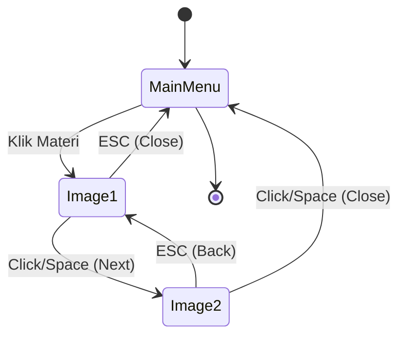

# Activity Diagram 8 - Membuka dan Melihat Materi

## Alur Membuka dan Navigasi Materi dari Main Menu

```mermaid
flowchart TD
    subgraph Aktor["Aktor"]
        A1[Berada di Main Menu]
        A2[Klik tombol Materi]
        A3[Melihat Gambar Materi 1]
        A4[Klik layar atau tekan Space]
        A5[Melihat Gambar Materi 2]
        A6[Klik layar atau tekan Space]
    end
    
    subgraph Sistem["Sistem"]
        S1[OnMateriClicked]
        S2[Animasi Sink Out Main Menu]
        S3[Aktifkan Material Panel]
        S4[MaterialDisplayController.ShowMaterial]
        S5[SetActive Gambar 1]
        S6[Animasi Fade In + Scale Gambar 1]
        S7[Tampilkan Gambar Materi 1]
        S8[OnNextClicked]
        S9{Current<br/>Index?}
        S10[TransitionToImage2]
        S11[Fade Out Gambar 1]
        S12[Fade In + Scale Gambar 2]
        S13[Tampilkan Gambar Materi 2]
        S14[CloseMaterial]
        S15[Fade Out + Scale Down]
        S16[SetActive false semua gambar]
        S17[Invoke OnMaterialClosed]
        S18[Kembali ke Main Menu]
    end
    
    Start([●]) --> A1
    A1 --> A2
    A2 --> S1
    S1 --> S2
    S2 --> S3
    S3 --> S4
    S4 --> S5
    S5 --> S6
    S6 --> S7
    S7 --> A3
    A3 --> A4
    A4 --> S8
    S8 --> S9
    S9 -->|Index = 0<br/>Gambar 1| S10
    S9 -->|Index = 1<br/>Gambar 2| S14
    S10 --> S11
    S11 --> S12
    S12 --> S13
    S13 --> A5
    A5 --> A6
    A6 --> S8
    S14 --> S15
    S15 --> S16
    S16 --> S17
    S17 --> S18
    S18 --> End([●])
    
    style Start fill:#000
    style End fill:#000
    style S9 fill:#ffffff
```



---

## Detail Proses Step-by-Step

### 1. User Interaksi - Klik Tombol Materi
**Aktor:** User (dari Main Menu)
**Aksi:** Klik tombol "Materi"

### 2. Handler Button Click
**Sistem:** `MainMenuManager.cs`
```csharp
public void OnMateriClicked()
{
    if (currentState != MenuState.MainMenu) return;
    currentState = MenuState.Material;
    
    // Trigger transition
    mainMenuAnimator.AnimateSinkOut(() => { ... });
}
```

### 3. Animasi Transisi - Main Menu Sink Out
**Sistem:** `MenuAnimationController`
- Main menu panel menenggelam ke bawah
- Durasi: ~0.5 detik
- Easing: ease-in

### 4. Aktivasi Material Panel
**Sistem:** `MainMenuManager.cs`
```csharp
materialPanel.SetActive(true);
```

### 5. Show Material - Inisialisasi Display
**Sistem:** `MaterialDisplayController.cs`
```csharp
public void ShowMaterial()
{
    Debug.Log("[MaterialDisplay] ShowMaterial called");
    currentImageIndex = 0;
    ShowImage1();
}
```

### 6. Show Image 1 - Tampilkan Gambar Pertama
**Sistem:** `MaterialDisplayController.cs`
```csharp
private void ShowImage1()
{
    materialImage1.SetActive(true);
    materialImage2.SetActive(false);
    
    // Animate fade in
    image1Component.color = new Color(1, 1, 1, 0);
    image1Component.DOFade(1f, fadeDuration);
    
    // Animate scale
    materialImage1.transform.localScale = Vector3.zero;
    materialImage1.transform.DOScale(1f, scaleDuration).SetEase(Ease.OutBack);
    
    currentImageIndex = 0;
}
```

**Animasi:**
- Fade in: opacity 0 → 1 (0.3 detik)
- Scale: 0 → 1 dengan ease out back (0.3 detik)
- Total transisi: ~0.3 detik

### 7. User Melihat Gambar Materi 1
**Aktor:** User melihat gambar materi pertama
**Interaksi yang tersedia:**
- Klik di mana saja pada layar → Next
- Tekan **Space** → Next
- Tekan **ESC** → Close (kembali ke main menu)

### 8. Navigation Input Detection
**Sistem:** `MaterialDisplayController.cs` - Update loop
```csharp
void Update()
{
    if (isTransitioning) return;
    
    // Click anywhere atau tekan space untuk next
    if (enableClickAnywhere && (Input.GetMouseButtonDown(0) || Input.GetKeyDown(nextKey)))
    {
        OnNextClicked();
    }
    
    // ESC untuk back
    if (Input.GetKeyDown(backKey))
    {
        OnBackClicked();
    }
}
```

### 9. OnNextClicked - Decision Point
**Sistem:** `MaterialDisplayController.cs`
```csharp
public void OnNextClicked()
{
    if (isTransitioning) return;
    
    switch (currentImageIndex)
    {
        case 0: // Gambar 1 → Gambar 2
            TransitionToImage2();
            break;
        case 1: // Gambar 2 → Close
            CloseMaterial();
            break;
    }
}
```

### 10. Transition to Image 2
**Sistem:** `MaterialDisplayController.cs`
```csharp
private void TransitionToImage2()
{
    isTransitioning = true;
    
    // Fade out + scale down gambar 1
    image1Component.DOFade(0f, fadeDuration);
    materialImage1.transform.DOScale(0.8f, fadeDuration).OnComplete(() =>
    {
        materialImage1.SetActive(false);
        
        // Show gambar 2
        materialImage2.SetActive(true);
        image2Component.color = new Color(1, 1, 1, 0);
        image2Component.DOFade(1f, fadeDuration);
        
        materialImage2.transform.localScale = Vector3.zero;
        materialImage2.transform.DOScale(1f, scaleDuration).SetEase(Ease.OutBack).OnComplete(() =>
        {
            currentImageIndex = 1;
            isTransitioning = false;
        });
    });
}
```

**Animasi sequence:**
1. Gambar 1 fade out (opacity 1 → 0) - 0.3s
2. Gambar 1 scale down (1 → 0.8) - 0.3s
3. SetActive(false) gambar 1
4. SetActive(true) gambar 2
5. Gambar 2 fade in (0 → 1) - 0.3s
6. Gambar 2 scale up (0 → 1) - 0.3s

### 11. User Melihat Gambar Materi 2
**Aktor:** User melihat gambar materi kedua
**Interaksi yang tersedia:**
- Klik di mana saja → Close (kembali ke main menu)
- Tekan **Space** → Close
- Tekan **ESC** → Back to Gambar 1

### 12. Close Material - Kembali ke Main Menu
**Sistem:** `MaterialDisplayController.cs`
```csharp
private void CloseMaterial()
{
    isTransitioning = true;
    
    GameObject activeImage = currentImageIndex == 0 ? materialImage1 : materialImage2;
    Image activeImageComponent = currentImageIndex == 0 ? image1Component : image2Component;
    
    // Fade out + scale down
    activeImageComponent.DOFade(0f, fadeDuration);
    activeImage.transform.DOScale(0f, scaleDuration).SetEase(Ease.InBack).OnComplete(() =>
    {
        materialImage1.SetActive(false);
        materialImage2.SetActive(false);
        
        // Notify main menu manager
        OnMaterialClosed?.Invoke();
        
        isTransitioning = false;
        currentImageIndex = 0;
    });
}
```

**Animasi:**
- Fade out aktif gambar (1 → 0)
- Scale to zero dengan ease in back
- SetActive(false) semua gambar
- Invoke callback ke MainMenuManager

---

## Navigation Flow Diagram



---

## Skenario Lengkap

### Skenario A: User Membuka dan Melihat Semua Materi

**Step 1: Buka Materi**
```
User: Klik tombol "Materi" di main menu
Sistem: 
  - Main menu sink out (0.5s)
  - Material panel aktif
  - Gambar 1 fade in + scale (0.3s)
Output: User melihat Gambar Materi 1
```

**Step 2: Next ke Gambar 2**
```
User: Klik layar atau tekan Space
Sistem:
  - Gambar 1 fade out + scale down (0.3s)
  - Gambar 2 fade in + scale up (0.3s)
Output: User melihat Gambar Materi 2
```

**Step 3: Close**
```
User: Klik layar atau tekan Space
Sistem:
  - Gambar 2 fade out + scale to zero (0.3s)
  - Invoke OnMaterialClosed callback
  - Main menu kembali muncul
Output: Kembali ke Main Menu
```

### Skenario B: User Langsung Close dari Gambar 1

**Step 1: Buka Materi**
```
User: Klik tombol "Materi"
Output: Melihat Gambar Materi 1
```

**Step 2: Close Langsung**
```
User: Tekan ESC
Sistem:
  - Gambar 1 fade out + scale to zero (0.3s)
  - Kembali ke main menu
Output: Kembali ke Main Menu
```

### Skenario C: User Navigate Back dari Gambar 2

**Step 1-2: Buka dan Next**
```
Output: User di Gambar Materi 2
```

**Step 3: Back**
```
User: Tekan ESC
Sistem:
  - Gambar 2 fade out + scale down (0.3s)
  - Gambar 1 fade in + scale up (0.3s)
Output: Kembali ke Gambar Materi 1
```

**Step 4: Close**
```
User: Tekan ESC lagi
Output: Kembali ke Main Menu
```

---

## Input Methods

### Keyboard Controls
| Key | Action | Context |
|-----|--------|---------|
| **Space** | Next/Close | Semua state |
| **ESC** | Back/Close | Semua state |

### Mouse Controls
| Input | Action | Context |
|-------|--------|---------|
| **Left Click** | Next/Close | Di mana saja di panel |

### Navigation Logic

**Dari Gambar 1:**
- **Next (Space/Click)** → Gambar 2
- **Back (ESC)** → Close ke Main Menu

**Dari Gambar 2:**
- **Next (Space/Click)** → Close ke Main Menu
- **Back (ESC)** → Gambar 1

---

## State Management

### Current Index States
```csharp
private int currentImageIndex = 0;

// 0 = Gambar 1
// 1 = Gambar 2
```

### Transition Lock
```csharp
private bool isTransitioning = false;

// true: Sedang animasi, ignore input
// false: Idle, accept input
```

**Mencegah spam click:**
```csharp
if (isTransitioning) return; // Ignore input saat animasi
```

---

## Animation Parameters

### Fade Animation
```csharp
[SerializeField] private float fadeDuration = 0.3f;

// Fade In: alpha 0 → 1
// Fade Out: alpha 1 → 0
```

### Scale Animation
```csharp
[SerializeField] private float scaleDuration = 0.3f;

// Scale Up: 0 → 1 dengan Ease.OutBack
// Scale Down: 1 → 0.8 (transition) atau 1 → 0 (close)
```

### Easing Functions
- **Ease.OutBack:** Overshoot effect untuk appear
- **Ease.InBack:** Retract effect untuk disappear

---

## Material Images Setup

### Required Assets
1. **Material Image 1** - Gambar materi pertama
2. **Material Image 2** - Gambar materi kedua

### GameObject Structure
```
MaterialPanel
├── MaterialImage1 (Image component)
│   └── Image sprite: material_1.png
└── MaterialImage2 (Image component)
    └── Image sprite: material_2.png
```

### Inspector Settings
```csharp
[Header("Material Images")]
[SerializeField] private GameObject materialImage1;
[SerializeField] private GameObject materialImage2;

[Header("UI References")]
[SerializeField] private Image image1Component;
[SerializeField] private Image image2Component;
```

---

## Error Handling

### 1. Material Panel Not Found
```csharp
if (materialPanel != null)
{
    materialPanel.SetActive(true);
}
else
{
    Debug.LogError("[MainMenu] materialPanel is NULL!");
    return;
}
```

### 2. Material Controller Not Found
```csharp
if (materialDisplayController != null)
{
    materialDisplayController.ShowMaterial();
}
else
{
    Debug.LogError("[MainMenu] materialDisplayController is NULL!");
}
```

### 3. Material Images Not Assigned
```csharp
if (materialImage1 == null || materialImage2 == null)
{
    Debug.LogError("[MaterialDisplay] Material images not assigned!");
    return;
}
```

### 4. Image Components Auto-Find
```csharp
// Get Image components if not assigned
if (image1Component == null && materialImage1 != null)
    image1Component = materialImage1.GetComponent<Image>();

if (image2Component == null && materialImage2 != null)
    image2Component = materialImage2.GetComponent<Image>();
```

---

## Performance Notes

### 1. Animation Performance
- **DOTween** digunakan untuk smooth animations
- GPU-accelerated alpha dan transform changes
- Minimal CPU overhead

### 2. Memory Management
```csharp
// Kill ongoing tweens saat disable
private void OnDisable()
{
    DOTween.Kill(materialImage1);
    DOTween.Kill(materialImage2);
}
```

### 3. Input Polling
```csharp
void Update()
{
    // Early return jika sedang transisi
    if (isTransitioning) return;
    
    // Minimal input checks per frame
}
```

---

## Testing Checklist

- [x] Tombol Materi dapat diklik dari main menu
- [x] Main menu sink out animation berjalan
- [x] Material panel muncul dengan benar
- [x] Gambar 1 fade in + scale animation smooth
- [x] Klik layar atau Space untuk next
- [x] Transisi dari Gambar 1 ke Gambar 2 smooth
- [x] Gambar 2 tampil dengan benar
- [x] ESC untuk back dari Gambar 2 ke Gambar 1
- [x] Close animation smooth (fade out + scale to zero)
- [x] Kembali ke main menu setelah close
- [x] Tidak ada memory leak dari animasi
- [x] Multi-input tidak menyebabkan bug (isTransitioning lock)

---

## Troubleshooting

### Problem: Material images tidak muncul
**Cause:** GameObject tidak di-assign di Inspector
**Solution:**
```csharp
// Di Inspector, assign:
// - Material Image 1 → GameObject dengan Image component
// - Material Image 2 → GameObject dengan Image component
```

### Problem: Click tidak respond
**Cause:** isTransitioning masih true
**Solution:**
```csharp
// Pastikan OnComplete callback set isTransitioning = false
.OnComplete(() => {
    isTransitioning = false;
});
```

### Problem: Animasi jerk atau tidak smooth
**Cause:** DOTween tidak ter-initialize
**Solution:**
```csharp
// Pastikan DOTween sudah di-setup di project
// Window → DOTween Utility Panel → Setup DOTween
```

### Problem: ESC tidak close dari Gambar 1
**Cause:** Ini adalah behavior yang benar
**Solution:**
```csharp
// ESC dari Gambar 1 = Close ke main menu
// ESC dari Gambar 2 = Back ke Gambar 1
// Ini adalah intended behavior
```

---

## Related Activity Diagrams
- [Activity Diagram 01 - Main Menu](ACTIVITY_DIAGRAM_01_MAIN_MENU.md)
- [Activity Diagram 07 - Buka High Score](ACTIVITY_DIAGRAM_07_BUKA_HIGHSCORE.md)
- [Material Display Setup Guide](MATERIAL_DISPLAY_SETUP_GUIDE.md)

---

## Revision History

| Date | Version | Changes |
|------|---------|---------|
| 2026-03-03 | 1.0 | Initial creation - Complete material display flow with navigation |
