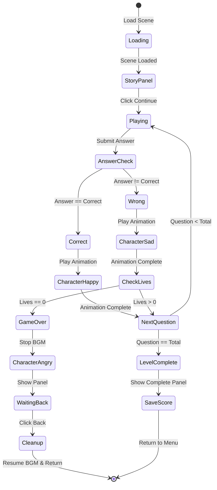

# Activity Diagram - Gameplay Chapter 1

## Gameplay Flow (Complete)

```
┌─────────────────────────────────────────────────────────────────────────────┐
│                         ACTIVITY DIAGRAM - GAMEPLAY                          │
└─────────────────────────────────────────────────────────────────────────────┘

     Semua Aktor                                    Sistem
┌──────────────────────┐                  ┌──────────────────────┐
│                      │                  │                      │
│        ●             │                  │                      │
│        │             │                  │                      │
│  ┌──────────────┐   │                  │  ┌──────────────┐   │
│  │ Pilih level  │───┼──────────────────┼─▶│ Load scene   │   │
│  │ dari menu    │   │                  │  │ Chapter 1    │   │
│  └──────────────┘   │                  │  └──────────┬───┘   │
│                      │                  │             │       │
│                      │                  │             ▼       │
│                      │                  │  ┌──────────────┐   │
│                      │                  │  │ Initialize   │   │
│                      │                  │  │ GameManager  │   │
│                      │                  │  └──────────┬───┘   │
│                      │                  │             │       │
│                      │                  │             ▼       │
│                      │                  │  ┌──────────────┐   │
│                      │                  │  │ Show story   │   │
│  ┌──────────────┐   │                  │  │ panel        │   │
│  │ Membaca      │◀──┼──────────────────┼──┤ (Narasi)     │   │
│  │ narasi story │   │                  │  └──────────┬───┘   │
│  └──────────┬───┘   │                  │             │       │
│             │        │                  │             ▼       │
│             ▼        │                  │  ┌──────────────┐   │
│  ┌──────────────┐   │                  │  │ Typewriter   │   │
│  │ Klik untuk   │───┼──────────────────┼──┤ animation    │   │
│  │ lanjutkan    │   │                  │  │ text         │   │
│  └──────────────┘   │                  │  └──────────┬───┘   │
│                      │                  │             │       │
│                      │                  │             ▼       │
│                      │                  │  ┌──────────────┐   │
│                      │                  │  │ Hide story   │   │
│                      │                  │  │ panel        │   │
│                      │                  │  └──────────┬───┘   │
│                      │                  │             │       │
│                      │                  │             ▼       │
│                      │                  │  ┌──────────────┐   │
│                      │                  │  │ Show gameplay│   │
│                      │                  │  │ UI           │   │
│                      │                  │  └──────────┬───┘   │
│                      │                  │             │       │
│                      │                  │             ▼       │
│                      │                  │  ┌──────────────┐   │
│                      │                  │  │ Generate     │   │
│  ┌──────────────┐   │                  │  │ soal         │   │
│  │ Melihat soal │◀──┼──────────────────┼──┤ trigonometri │   │
│  │ trigonometri │   │                  │  └──────────┬───┘   │
│  └──────────┬───┘   │                  │             │       │
│             │        │                  │             ▼       │
│             ▼        │                  │  ┌──────────────┐   │
│  ┌──────────────┐   │                  │  │ Display:     │   │
│  │ Menghitung   │   │                  │  │ - Pertanyaan │   │
│  │ jawaban      │   │                  │  │ - Lives (3)  │   │
│  └──────────┬───┘   │                  │  │ - Score (0)  │   │
│             │        │                  │  │ - Timer      │   │
│             ▼        │                  │  └──────────────┘   │
│  ┌──────────────┐   │                  │                      │
│  │ Memasukkan   │───┼──────────────────┼──┐                  │
│  │ angka jawaban│   │                  │  │                  │
│  └──────────────┘   │                  │  ▼                  │
│                      │                  │  ┌──────────────┐   │
│                      │                  │  │ Input handler│   │
│                      │                  │  │ (0-9 buttons)│   │
│                      │                  │  └──────────┬───┘   │
│                      │                  │             │       │
│                      │                  │             ▼       │
│                      │                  │  ┌──────────────┐   │
│                      │                  │  │ Update answer│   │
│                      │                  │  │ display      │   │
│                      │                  │  └──────────────┘   │
│                      │                  │                      │
│  ┌──────────────┐   │                  │                      │
│  │ Tekan tombol │───┼──────────────────┼──┐                  │
│  │ "Masuk"      │   │                  │  │                  │
│  └──────────────┘   │                  │  ▼                  │
│                      │                  │  ┌──────────────┐   │
│                      │                  │  │ Validasi     │   │
│                      │                  │  │ jawaban      │   │
│                      │                  │  └──────────┬───┘   │
│                      │                  │             │       │
│                      │                  │             ▼       │
│                      │                  │        ┌────────┐   │
│                      │                  │        │Jawaban?│   │
│                      │                  │        └───┬────┘   │
│                      │                  │            │        │
│                      │                  │     ┌──────┴──────┐ │
│                      │                  │     │             │ │
│                      │                  │   Benar        Salah│
│                      │                  │     │             │ │
│                      │                  │     ▼             ▼ │
│                      │                  │ ┌────────┐  ┌────────┐
│                      │                  │ │Play    │  │Play    │
│  ┌──────────────┐   │                  │ │Correct │  │Wrong   │
│  │ Melihat      │◀──┼──────────────────┼─┤SFX     │  │SFX     │
│  │ karakter     │   │                  │ └────┬───┘  └───┬────┘
│  │ animasi      │   │                  │      │          │    │
│  └──────────┬───┘   │                  │      ▼          ▼    │
│             │        │                  │ ┌────────┐  ┌────────┐
│             │        │                  │ │Show    │  │Show    │
│             │        │                  │ │Happy   │  │Sad     │
│             │        │                  │ │Char.   │  │Char.   │
│             │        │                  │ └────┬───┘  └───┬────┘
│             │        │                  │      │          │    │
│             │        │                  │      ▼          ▼    │
│             │        │                  │ ┌────────┐  ┌────────┐
│             │        │                  │ │Bubble  │  │Bubble  │
│             │        │                  │ │chat    │  │chat    │
│             │        │                  │ │"Hebat!"│  │"Coba   │
│             │        │                  │ │        │  │lagi!"  │
│             │        │                  │ └────┬───┘  └───┬────┘
│             │        │                  │      │          │    │
│             │        │                  │      ▼          ▼    │
│             │        │                  │ ┌────────┐  ┌────────┐
│             │        │                  │ │+10     │  │-1 life │
│             │        │                  │ │score   │  │        │
│             │        │                  │ └────┬───┘  └───┬────┘
│             │        │                  │      │          │    │
│             │        │                  │      │          ▼    │
│             │        │                  │      │     ┌────────┐
│             │        │                  │      │     │Lives=0?│
│             │        │                  │      │     └───┬────┘
│             │        │                  │      │         │    │
│             │        │                  │      │    ┌────┴───┐
│             │        │                  │      │    │        │
│             │        │                  │      │   Ya      Tidak
│             │        │                  │      │    │        │
│             │        │                  │      │    ▼        │
│             │        │                  │      │ ┌──────┐   │
│             │        │                  │      │ │Game  │   │
│             │        │                  │      │ │Over  │   │
│             │        │                  │      │ └──┬───┘   │
│             │        │                  │      │    │       │
│             │        │                  │      │    ▼       │
│             │        │                  │      │ ┌──────┐  │
│             │        │                  │      │ │Stop  │  │
│             │        │                  │      │ │BGM   │  │
│             │        │                  │      │ └──┬───┘  │
│             │        │                  │      │    │      │
│             │        │                  │      │    ▼      │
│             │        │                  │      │ ┌──────┐ │
│             │        │                  │      │ │Show  │ │
│  ┌──────────────┐   │                  │      │ │Angry │ │
│  │ Melihat      │◀──┼──────────────────┼──────┼─┤Char. │ │
│  │ game over    │   │                  │      │ │Anim. │ │
│  │ screen       │   │                  │      │ └──┬───┘ │
│  └──────────┬───┘   │                  │      │    │     │
│             │        │                  │      │    ▼     │
│             │        │                  │      │ ┌──────┐│
│             │        │                  │      │ │Show  ││
│             │        │                  │      │ │Game  ││
│             │        │                  │      │ │Over  ││
│             │        │                  │      │ │Panel ││
│             │        │                  │      │ └──┬───┘│
│             │        │                  │      │    │    │
│             ▼        │                  │      │    ▼    │
│  ┌──────────────┐   │                  │      │ ┌──────┐
│  │ Klik tombol  │───┼──────────────────┼──────┼─▶Resume│
│  │ "Kembali"    │   │                  │      │ │BGM   │
│  └──────────────┘   │                  │      │ └──┬───┘
│                      │                  │      │    │    │
│                      │                  │      │    ▼    │
│                      │                  │      │ ┌──────┐
│  ┌──────────────┐   │                  │      │ │Hide  │
│  │ Kembali ke   │◀──┼──────────────────┼──────┼─┤Char. │
│  │ level        │   │                  │      │ └──┬───┘
│  │ selection    │   │                  │      │    │    │
│  └──────────────┘   │                  │      │    ▼    │
│                      │                  │      │ ┌──────┐
│         ●            │                  │      │ │Return│
│                      │                  │      │ │to    │
│                      │                  │      │ │Level │
│                      │                  │      │ │Select│
│                      │                  │      │ └──────┘
│                      │                  │      │    │    │
│                      │                  │      └────┴────┘
│                      │                  │           │      │
│                      │                  │      [Lanjut]   │
│                      │                  │           │      │
│                      │                  │           ▼      │
│                      │                  │      ┌────────┐  │
│                      │                  │      │Soal    │  │
│                      │                  │      │selesai?│  │
│                      │                  │      └───┬────┘  │
│                      │                  │          │       │
│                      │                  │     ┌────┴────┐  │
│                      │                  │     │         │  │
│                      │                  │    Ya       Tidak│
│                      │                  │     │         │  │
│                      │                  │     ▼         │  │
│                      │                  │ ┌──────┐     │  │
│                      │                  │ │Show  │     │  │
│                      │                  │ │Comp- │     │  │
│                      │                  │ │lete  │     │  │
│                      │                  │ │Panel │     │  │
│                      │                  │ └──┬───┘     │  │
│                      │                  │    │         │  │
│                      │                  │    ▼         │  │
│                      │                  │ ┌──────┐    │  │
│                      │                  │ │Save  │    │  │
│                      │                  │ │Score │    │  │
│                      │                  │ └──┬───┘    │  │
│                      │                  │    │        │  │
│                      │                  │    ▼        ▼  │
│                      │                  │  Return  Generate│
│                      │                  │    to    next   │
│                      │                  │  Level  question│
│                      │                  │  Select   (loop)│
│                      │                  │    │             │
│                      │                  │    ●             │
│                      │                  │                  │
└──────────────────────┘                  └──────────────────┘
```

---

## Answer Validation Flow (Detail)

```
┌─────────────────────────────────────────────────────────────────────────────┐
│                        ANSWER VALIDATION DETAIL                              │
└─────────────────────────────────────────────────────────────────────────────┘

     Semua Aktor                                    Sistem
┌──────────────────────┐                  ┌──────────────────────┐
│                      │                  │                      │
│  ┌──────────────┐   │                  │  ┌──────────────┐   │
│  │ Input jawaban│───┼──────────────────┼─▶│ Store input  │   │
│  │ digit by     │   │                  │  │ in buffer    │   │
│  │ digit        │   │                  │  └──────────┬───┘   │
│  └──────────────┘   │                  │             │       │
│                      │                  │             ▼       │
│                      │                  │  ┌──────────────┐   │
│                      │                  │  │ Update display│  │
│                      │                  │  │ text         │   │
│                      │                  │  └──────────────┘   │
│                      │                  │                      │
│  ┌──────────────┐   │                  │                      │
│  │ Tekan "Masuk"│───┼──────────────────┼──┐                  │
│  └──────────────┘   │                  │  │                  │
│                      │                  │  ▼                  │
│                      │                  │  ┌──────────────┐   │
│                      │                  │  │ Parse input  │   │
│                      │                  │  │ to integer   │   │
│                      │                  │  └──────────┬───┘   │
│                      │                  │             │       │
│                      │                  │             ▼       │
│                      │                  │  ┌──────────────┐   │
│                      │                  │  │ Compare with │   │
│                      │                  │  │ correct answer│  │
│                      │                  │  └──────────┬───┘   │
│                      │                  │             │       │
│                      │                  │             ▼       │
│                      │                  │       ┌─────────┐   │
│                      │                  │       │ Match?  │   │
│                      │                  │       └────┬────┘   │
│                      │                  │            │        │
│                      │                  │    ┌───────┴──────┐ │
│                      │                  │    │              │ │
│                      │                  │  TRUE          FALSE│
│                      │                  │    │              │ │
│                      │                  │    ▼              ▼ │
│                      │                  │ ┌──────┐      ┌──────┐
│                      │                  │ │Audio │      │Audio │
│                      │                  │ │Mgr:  │      │Mgr:  │
│                      │                  │ │Play  │      │Play  │
│                      │                  │ │Correct│     │Wrong │
│                      │                  │ │SFX   │      │SFX   │
│                      │                  │ └──┬───┘      └──┬───┘
│                      │                  │    │             │   │
│                      │                  │    ▼             ▼   │
│                      │                  │ ┌──────┐      ┌──────┐
│                      │                  │ │Char. │      │Char. │
│                      │                  │ │Play  │      │Play  │
│                      │                  │ │Correct│     │Wrong │
│                      │                  │ │Anim. │      │Anim. │
│                      │                  │ └──┬───┘      └──┬───┘
│                      │                  │    │             │   │
│                      │                  │    ▼             ▼   │
│                      │                  │ ┌──────┐      ┌──────┐
│                      │                  │ │score │      │lives │
│                      │                  │ │+= 10 │      │-= 1  │
│                      │                  │ └──┬───┘      └──┬───┘
│                      │                  │    │             │   │
│                      │                  │    │             ▼   │
│                      │                  │    │         ┌──────┐
│                      │                  │    │         │lives │
│                      │                  │    │         │== 0? │
│                      │                  │    │         └──┬───┘
│                      │                  │    │            │   │
│                      │                  │    │       ┌────┴───┐
│                      │                  │    │       │        │
│                      │                  │    │      YES      NO│
│                      │                  │    │       │        │
│                      │                  │    │       ▼        │
│                      │                  │    │   ┌──────┐    │
│                      │                  │    │   │Game  │    │
│                      │                  │    │   │Over  │    │
│                      │                  │    │   │Flow  │    │
│                      │                  │    │   └──────┘    │
│                      │                  │    │       │       │
│                      │                  │    └───────┴───────┘
│                      │                  │            │        │
│                      │                  │            ▼        │
│                      │                  │     ┌──────────┐    │
│                      │                  │     │questionIdx│   │
│                      │                  │     │+= 1       │   │
│                      │                  │     └──────┬────┘   │
│                      │                  │            │        │
│                      │                  │            ▼        │
│                      │                  │     ┌──────────┐    │
│                      │                  │     │idx <     │    │
│                      │                  │     │totalQs?  │    │
│                      │                  │     └──────┬───┘    │
│                      │                  │            │        │
│                      │                  │       ┌────┴────┐   │
│                      │                  │       │         │   │
│                      │                  │      YES       NO   │
│                      │                  │       │         │   │
│                      │                  │       ▼         ▼   │
│                      │                  │  ┌────────┐ ┌──────┐
│                      │                  │  │Generate│ │Level │
│                      │                  │  │next    │ │Comp- │
│                      │                  │  │question│ │lete  │
│                      │                  │  └────────┘ └──────┘
│                      │                  │                      │
└──────────────────────┘                  └──────────────────────┘
```

---

## Character Animation Integration

```
┌─────────────────────────────────────────────────────────────────────────────┐
│                    CHARACTER ANIMATION FLOW IN GAMEPLAY                      │
└─────────────────────────────────────────────────────────────────────────────┘

Correct Answer Flow:
──────────────────────
1. User answers correctly
2. CalculationManager.HandleCorrectAnswer()
3. audioManager.PlayCorrectAnswerSFX()
4. characterController.PlayCorrectAnimation()
   ├─ Character moves UP from bottom (0.8s)
   ├─ 5-frame sprite animation loop (2.5s)
   ├─ Bubble chat shows random message:
   │  - "Hebat! Jawabanmu benar!"
   │  - "Luar biasa! Kamu pintar!"
   │  - "Sempurna! Pertahankan!"
   │  - "Bagus sekali! Terus seperti itu!"
   │  - "Mantap! Kamu memahaminya!"
   └─ Character moves DOWN to hide (0.8s)
5. Score += 10
6. Generate next question

Wrong Answer Flow:
─────────────────
1. User answers incorrectly
2. CalculationManager.HandleWrongAnswer()
3. audioManager.PlayWrongAnswerSFX()
4. characterController.PlayWrongAnimation()
   ├─ Character moves UP from bottom (0.8s)
   ├─ 5-frame sprite animation loop (2.5s)
   ├─ Bubble chat shows random message:
   │  - "Oops! Coba periksa lagi."
   │  - "Hmm, belum tepat. Semangat!"
   │  - "Jangan menyerah! Coba lagi."
   │  - "Hampir! Periksa perhitunganmu."
   │  - "Yuk, fokus dan coba lagi!"
   └─ Character moves DOWN to hide (0.8s)
5. Lives -= 1
6. Check if lives == 0
   ├─ If yes: Go to Game Over
   └─ If no: Generate next question

Game Over Flow:
──────────────
1. Lives == 0 detected
2. audioManager.PlayGameOverSFX()
3. audioManager.StopBGMForGameOver()
4. characterController.PlayGameOverAnimation()
   ├─ Character moves UP from bottom (0.8s)
   ├─ 5-frame ANGRY sprite animation LOOPS FOREVER
   ├─ Bubble chat shows random message:
   │  - "Yah, nyawa habis!"
   │  - "Waduh! Game Over."
   │  - "Semangat! Coba lagi ya!"
   │  - "Jangan menyerah!"
   │  - "Next time pasti lebih baik!"
   └─ Character STAYS ON SCREEN (no auto-hide)
5. Show Game Over Panel
6. Wait for user to click "Kembali"
7. When clicked:
   ├─ characterController.HideCharacter()
   │  └─ Character moves DOWN to hide (0.8s)
   ├─ audioManager.ResumeBGMAfterGameOver()
   └─ Return to Level Selection
```

---

## State Machine (Gameplay)



---

## Audio System Integration

```
┌─────────────────────────────────────────────────────────────────────────────┐
│                      AUDIO FLOW DURING GAMEPLAY                              │
└─────────────────────────────────────────────────────────────────────────────┘

Scene Load:
───────────
1. Chapter1AudioManager.Start()
2. If useGlobalAudioManagerForBGM == true:
   └─ GlobalAudioManager.PlayGameplayChapter1BGM()
      ├─ Crossfade from previous BGM (if any)
      └─ Loop gameplay music

During Gameplay:
───────────────
├─ Correct Answer:
│  └─ Chapter1AudioManager.PlayCorrectAnswerSFX()
│
├─ Wrong Answer:
│  └─ Chapter1AudioManager.PlayWrongAnswerSFX()
│
└─ Button Click:
   └─ ButtonClickSFX.PlayClickSound()
      └─ GlobalAudioManager.PlayButtonClickSFX()

Game Over:
─────────
1. Chapter1AudioManager.PlayGameOverSFX()
2. Chapter1AudioManager.StopBGMForGameOver()
   └─ GlobalAudioManager.StopBGM()
      └─ Fade out BGM (0.5s)

Resume from Game Over:
─────────────────────
1. User clicks "Kembali"
2. GameOverPanel.OnBackButtonClicked()
3. Chapter1AudioManager.ResumeBGMAfterGameOver()
   └─ GlobalAudioManager.PlayGameplayChapter1BGM()
      └─ Fade in BGM (1.0s)
4. Return to Level Selection
```

---

## Question Generation Flow

```
┌─────────────────────────────────────────────────────────────────────────────┐
│                        QUESTION GENERATION DETAIL                            │
└─────────────────────────────────────────────────────────────────────────────┘

Initialization:
──────────────
1. CalculationManager.Start()
2. Load level configuration:
   ├─ Total questions (e.g., 10)
   ├─ Difficulty level (1-3)
   └─ Operation types (sin/cos/tan)
3. currentQuestionIndex = 0
4. InitializeLevel()

Generate Question:
─────────────────
1. GenerateQuestion()
2. Based on difficulty and level:
   ├─ Level 1: Basic angles (0°, 30°, 45°, 60°, 90°)
   ├─ Level 2: Mixed angles, multiple operations
   └─ Level 3: Complex expressions
3. Generate problem:
   ├─ Random angle from allowed set
   ├─ Random operation (sin/cos/tan)
   └─ Calculate correct answer
4. Display question on UI:
   ├─ Update question text
   ├─ Clear previous answer
   └─ Reset input field
5. Start timer (optional)

Question Display Format:
───────────────────────
Level 1: "Berapa nilai sin(30°)?"
Level 2: "Hitung: 2 × cos(45°)"
Level 3: "Jika sin(θ) = 0.5, maka θ = ?"

Answer Format:
─────────────
- Degrees: 30, 45, 60, 90
- Decimals: 0.5, 0.707, 0.866
- Fractions converted to decimal
```

---

## UI Elements State

```
┌─────────────────────────────────────────────────────────────────────────────┐
│                          UI ELEMENTS DURING GAMEPLAY                         │
└─────────────────────────────────────────────────────────────────────────────┘

Top Bar:
────────
├─ Back Button (Always visible)
├─ Lives Display (3 hearts/icons)
│  └─ Updates on wrong answer
└─ Score Display (0, updates +10 per correct)

Main Area:
─────────
├─ Question Text Panel
│  └─ Shows current trigonometry question
│
├─ Answer Input Field
│  ├─ Displays entered digits
│  └─ Clears after submit
│
└─ Number Pad (0-9 buttons)
   └─ Click to input digits

Bottom Area:
───────────
├─ Clear Button (Clear input)
├─ Delete Button (Remove last digit)
└─ Submit Button ("Masuk")

Overlay Panels (Conditional):
────────────────────────────
├─ Story Panel (Start of level)
├─ Character Animation (After answer)
├─ Game Over Panel (Lives = 0)
└─ Level Complete Panel (All questions done)

Character Position:
──────────────────
├─ Hidden: Y = -800 (below screen)
├─ Center: Y = 0 (middle screen)
└─ Animation: DOTween movement
```

---

## Performance Optimization

```
Memory Management:
─────────────────
├─ Reuse question objects (pool pattern)
├─ Limit active animations (max 1 character anim)
├─ Clean up completed coroutines
└─ Clear input buffer after each question

Animation Optimization:
──────────────────────
├─ Use DOTween for smooth animations
├─ Kill previous animations before starting new
├─ Limit simultaneous DOTween sequences
└─ Use SetEase() for performance

Audio Optimization:
──────────────────
├─ Use AudioSource pooling for SFX
├─ Play SFX with PlayOneShot() (no stop needed)
├─ Crossfade BGM instead of hard stop/start
└─ Set appropriate audio clip load settings

UI Optimization:
───────────────
├─ Disable raycast on non-interactive elements
├─ Use TextMeshPro for better performance
├─ Update only changed UI elements
└─ Batch UI updates in same frame
```

---

## Error Handling

```
Common Issues & Handling:
────────────────────────

1. Invalid Input:
   ├─ Check: Input is numeric
   ├─ Handle: Show error message
   └─ Action: Clear and prompt again

2. Audio Manager Missing:
   ├─ Check: Instance != null
   ├─ Handle: Log warning
   └─ Action: Continue without audio

3. Character Controller Missing:
   ├─ Check: Reference assigned
   ├─ Handle: Log error
   └─ Action: Skip animation

4. Animation Interrupted:
   ├─ Check: isAnimating flag
   ├─ Handle: Kill previous animation
   └─ Action: Start new animation

5. Scene Load Failure:
   ├─ Check: Scene name valid
   ├─ Handle: Log error
   └─ Action: Return to main menu

6. Save Score Failure:
   ├─ Check: PlayerPrefs available
   ├─ Handle: Log warning
   └─ Action: Continue without save
```

---

## Testing Checklist

```
Gameplay Flow:
─────────────
□ Story panel displays correctly
□ Story text animates (typewriter)
□ Click to continue works
□ Gameplay UI appears after story
□ Questions generate correctly
□ Input system works (0-9 buttons)
□ Clear button works
□ Delete button works
□ Submit button validates answer

Answer Validation:
─────────────────
□ Correct answers increment score
□ Wrong answers decrement lives
□ Character animations play correctly
□ Audio SFX play at right time
□ Bubble chat shows random messages
□ Animations complete before next question

Game Over:
─────────
□ Triggers when lives == 0
□ BGM stops on game over
□ Angry character animation loops
□ Game over panel shows
□ Character doesn't auto-hide
□ Back button hides character
□ BGM resumes on back
□ Returns to level selection

Level Complete:
──────────────
□ Triggers when all questions done
□ Final score displayed
□ Score saved to PlayerPrefs
□ High score updated if applicable
□ Complete panel shown
□ Return to menu works

Audio System:
────────────
□ BGM plays on scene load
□ BGM loops correctly
□ Correct answer SFX plays
□ Wrong answer SFX plays
□ Game over SFX plays
□ Button click SFX works
□ BGM stops on game over
□ BGM resumes on return
□ No audio glitches/overlaps

Character Animation:
───────────────────
□ Character moves from bottom
□ Sprite animation loops
□ Bubble chat appears
□ Character hides after correct/wrong
□ Game over character stays visible
□ Hide works on back button
□ No animation stuttering
□ Proper timing for all steps
```

---

## Flow Summary

```
┌─────────────────────────────────────────────────────────────────┐
│                    COMPLETE GAMEPLAY LOOP                        │
└─────────────────────────────────────────────────────────────────┘

START
  │
  ├─► Load Scene
  │     │
  │     ├─► Show Story Panel
  │     │     │
  │     │     └─► User clicks continue
  │     │
  │     ├─► Initialize Gameplay
  │     │     ├─► Set lives = 3
  │     │     ├─► Set score = 0
  │     │     ├─► Set questionIndex = 0
  │     │     └─► Start BGM
  │     │
  │     └─► GAME LOOP ◄──────────────────┐
  │           │                            │
  │           ├─► Generate Question        │
  │           │     │                      │
  │           │     └─► Display UI         │
  │           │                            │
  │           ├─► Wait for User Input      │
  │           │     │                      │
  │           │     ├─► User enters digits │
  │           │     │                      │
  │           │     └─► User clicks Submit │
  │           │                            │
  │           ├─► Validate Answer          │
  │           │     │                      │
  │           │     ├─► IF CORRECT:        │
  │           │     │     ├─ Play SFX      │
  │           │     │     ├─ Show happy char│
  │           │     │     ├─ Score += 10   │
  │           │     │     └─ Next question ┤
  │           │     │                      │
  │           │     └─► IF WRONG:          │
  │           │           ├─ Play SFX      │
  │           │           ├─ Show sad char │
  │           │           ├─ Lives -= 1    │
  │           │           │                │
  │           │           ├─► IF lives > 0:│
  │           │           │     └─ Next Q ─┤
  │           │           │                │
  │           │           └─► IF lives == 0:
  │           │                 └─ GAME OVER
  │           │                      │
  │           │                      ├─► Stop BGM
  │           │                      ├─► Show angry char
  │           │                      ├─► Show panel
  │           │                      ├─► Wait for back
  │           │                      ├─► Resume BGM
  │           │                      └─► Return to menu
  │           │                            │
  │           ├─► questionIndex++          │
  │           │                            │
  │           ├─► IF questionIndex < total:│
  │           │     └─ Continue loop ──────┘
  │           │
  │           └─► IF questionIndex == total:
  │                 └─ LEVEL COMPLETE
  │                      │
  │                      ├─► Show complete panel
  │                      ├─► Save score
  │                      ├─► Update high score
  │                      └─► Return to menu
  │
END
```
