# Activity Diagram - Gameplay Keseluruhan

## Alur Gameplay Secara Keseluruhan

```mermaid
flowchart TD
    subgraph Actor["Semua Aktor"]
        A1[Memilih level]
        A2[Membaca soal]
        A3[Memasukkan jawaban]
        A4[Klik tombol Submit]
        A5[Melihat feedback]
        A6[Melihat hasil akhir]
        A7[Klik tombol Back/Next]
    end
    
    subgraph System["Sistem"]
        S1[Load level data]
        S2[Generate soal pertanyaan]
        S3[Tampilkan soal]
        S4[Validasi jawaban]
        S5{Jawaban benar?}
        S6[Tambah score<br/>Play animasi benar]
        S7[Kurangi lives<br/>Play animasi salah]
        S8{Lives > 0?}
        S9{Semua soal<br/>selesai?}
        S10[Show Level Complete Panel<br/>Unlock level berikutnya]
        S11[Show Game Over Panel<br/>Stop BGM]
        S12[Kembali ke Level Selection]
        S13[Load level berikutnya]
    end
    
    Start([●]) --> A1
    A1 --> S1
    S1 --> S2
    S2 --> S3
    S3 --> A2
    A2 --> A3
    A3 --> A4
    A4 --> S4
    S4 --> S5
    
    S5 -->|Ya| S6
    S5 -->|Tidak| S7
    
    S6 --> A5
    S7 --> A5
    A5 --> S8
    
    S8 -->|Tidak| S11
    S8 -->|Ya| S9
    
    S9 -->|Tidak| S2
    S9 -->|Ya| S10
    
    S10 --> A6
    S11 --> A6
    A6 --> A7
    
    A7 --> S12
    A7 --> S13
    
    S12 --> End1([●])
    S13 --> S2
    
    style Start fill:#000
    style End1 fill:#000
    style S5 fill:#FFC107
    style S8 fill:#FFC107
    style S9 fill:#FFC107
    style S10 fill:#4CAF50,color:#fff
    style S11 fill:#F44336,color:#fff
```



---

## Penjelasan Simbol

| Simbol | Nama | Keterangan |
|--------|------|------------|
| ● | Status awal | Sebuah diagram aktivitas memiliki sebuah status awal |
| ▭ | Aktivitas | Aktivitas yang dilakukan sistem, aktivitas biasanya diawali dengan kata kerja |
| ◇ | Percabangan / Decision | Percabangan dimana ada pilihan aktivitas yang lebih dari satu |
| ═══ | Penggabungan / Join | Penggabungan dimana yang mana lebih dari satu aktivitas lalu digabungkan jadi satu |
| ◎ | Status Akhir | Status akhir yang dilakukan sistem, sebuah diagram aktivitas memiliki sebuah status akhir |
| ▯ | Swimlane | Swimlane memisahkan organisasi bisnis yang bertanggung jawab terhadap aktivitas yang terjadi |

---

## Alur Proses Singkat

### 1. Persiapan Level
- Aktor memilih level dari menu level selection
- Sistem memuat data level (jumlah soal, tingkat kesulitan)
- Sistem menginisialisasi lives = 3, score = 0

### 2. Loop Pertanyaan (Diulang untuk setiap soal)
- Sistem generate soal trigonometri (sin/cos/tan dengan sudut tertentu)
- Sistem menampilkan soal ke layar
- Aktor membaca soal
- Aktor memasukkan jawaban menggunakan number pad
- Aktor menekan tombol Submit

### 3. Validasi Jawaban
- Sistem memvalidasi jawaban
- **Jika benar:** Score +100, play animasi karakter senang
- **Jika salah:** Lives -1, play animasi karakter sedih

### 4. Pengecekan Status Game
- **Jika Lives = 0:** Game Over
  - Tampilkan Game Over Panel
  - Matikan BGM
  - Tampilkan animasi karakter marah (loop)
  - Aktor klik Back → Kembali ke Level Selection
  
- **Jika Lives > 0 dan masih ada soal:** Lanjut ke soal berikutnya (kembali ke step 2)
  
- **Jika Lives > 0 dan semua soal selesai:** Level Complete
  - Tampilkan Level Complete Panel
  - Hitung rating bintang (1-3 bintang)
  - Unlock level berikutnya
  - Simpan high score
  - Aktor pilih Next (ke level berikutnya) atau Back (ke Level Selection)

---

## State Diagram Lives

```
Lives = 3 ❤️❤️❤️
    ↓ (jawaban salah)
Lives = 2 ❤️❤️🖤
    ↓ (jawaban salah)
Lives = 1 ❤️🖤🖤
    ↓ (jawaban salah)
Lives = 0 🖤🖤🖤 → GAME OVER
```

---

## State Diagram Progress Soal

```
Question 1/10 → Question 2/10 → ... → Question 10/10
                                              ↓
                                       LEVEL COMPLETE
```

---

## Kondisi Akhir Gameplay

### Level Complete (Berhasil)
- ✅ Semua soal terjawab
- ✅ Lives > 0
- ✅ Unlock level berikutnya
- ✅ Simpan high score dan rating bintang

### Game Over (Gagal)
- ❌ Lives habis (Lives = 0)
- ❌ Tidak unlock level baru
- ❌ Bisa retry level yang sama

---

## Catatan Implementasi

### Score System:
- **Jawaban Benar:** +100 points per soal
- **Jawaban Salah:** 0 points, lives -1
- **Maximum Score:** 1000 points (10 soal × 100)

### Star Rating:
- **3 Bintang ⭐⭐⭐:** Score ≥ 80% (≥800 points)
- **2 Bintang ⭐⭐:** Score ≥ 50% (≥500 points)
- **1 Bintang ⭐:** Score < 50% (<500 points)

### Lives System:
- **Start:** 3 lives
- **Wrong Answer:** -1 life
- **Game Over:** Lives = 0

### Audio:
- **BGM Chapter 1:** Terus berjalan selama gameplay
- **SFX:** Correct answer, wrong answer, button click
- **Game Over:** BGM berhenti, play game over SFX
- **Level Complete:** BGM tetap berjalan, play complete SFX

---

## Testing Checklist

- [ ] Level load dengan benar
- [ ] Soal generate sesuai tingkat kesulitan
- [ ] Validasi jawaban akurat (tolerance 0.01)
- [ ] Score bertambah saat jawaban benar
- [ ] Lives berkurang saat jawaban salah
- [ ] Animasi karakter muncul sesuai kondisi
- [ ] Game Over trigger saat lives = 0
- [ ] Level Complete trigger saat semua soal selesai
- [ ] BGM stop/resume berfungsi
- [ ] Next level unlock dan tersimpan
- [ ] High score tersimpan ke PlayerPrefs
- [ ] Back button kembali ke Level Selection
- [ ] Next button load level berikutnya

---

## Diagram ini mencakup:

✅ **Alur gameplay dari awal hingga akhir**  
✅ **Tidak terlalu bercabang** (hanya 3 decision point utama)  
✅ **Format swimlane** dengan kolom Aktor dan Sistem  
✅ **Simbol standar** sesuai dengan referensi yang diberikan  
✅ **Sederhana dan mudah dipahami** tanpa detail implementasi yang rumit
