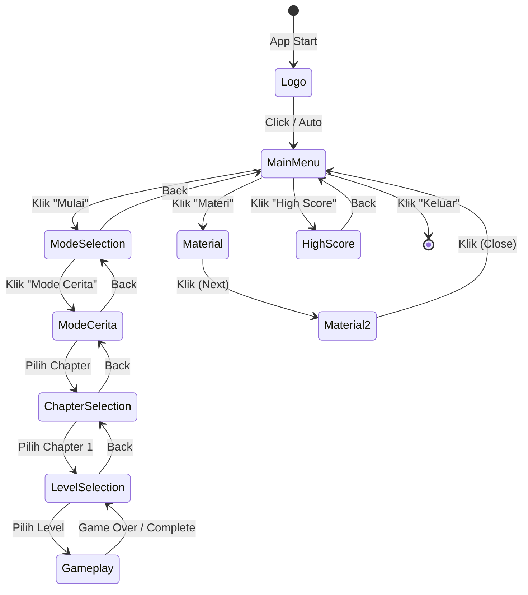

# Activity Diagram - Main Menu Trigosolver

## Main Menu Flow

```
┌─────────────────────────────────────────────────────────────────────────────┐
│                            ACTIVITY DIAGRAM - MAIN MENU                      │
└─────────────────────────────────────────────────────────────────────────────┘

     Semua Aktor                                    Sistem
┌──────────────────────┐                  ┌──────────────────────┐
│                      │                  │                      │
│        ●             │                  │                      │
│        │             │                  │                      │
│        ▼             │                  │                      │
│  ┌──────────────┐   │                  │  ┌──────────────┐   │
│  │ Buka aplikasi│───┼──────────────────┼─▶│ Menampilkan  │   │
│  │   Trigosolver│   │                  │  │  logo panel  │   │
│  └──────────────┘   │                  │  └──────────┬───┘   │
│                      │                  │             │       │
│                      │                  │             ▼       │
│                      │                  │  ┌──────────────┐   │
│                      │                  │  │  Animasi     │   │
│                      │                  │  │  logo drop   │   │
│  ┌──────────────┐   │                  │  └──────────┬───┘   │
│  │ Klik layar / │◀──┼──────────────────┼─────────────┘       │
│  │ tunggu delay │   │                  │                      │
│  └──────────┬───┘   │                  │                      │
│             │        │                  │  ┌──────────────┐   │
│             └────────┼──────────────────┼─▶│ Logo shrink  │   │
│                      │                  │  │  ke pojok    │   │
│                      │                  │  └──────────┬───┘   │
│                      │                  │             │       │
│                      │                  │             ▼       │
│                      │                  │  ┌──────────────┐   │
│                      │                  │  │ Menampilkan  │   │
│  ┌──────────────┐   │                  │  │  main menu   │   │
│  │ Melihat menu │◀──┼──────────────────┼──┤  panel       │   │
│  │   pilihan    │   │                  │  └──────────────┘   │
│  └──────────┬───┘   │                  │                      │
│             │        │                  │                      │
│             ▼        │                  │                      │
│        ┌────────┐   │                  │                      │
│        │ Pilih? │   │                  │                      │
│        └───┬────┘   │                  │                      │
│            │        │                  │                      │
│      ┌─────┼─────┬─────┬─────┐        │                      │
│      │     │     │     │     │        │                      │
│   Mulai  Materi HS  Keluar  │        │                      │
│      │     │     │     │     │        │                      │
│      ▼     ▼     ▼     ▼     │        │                      │
│  ┌──────┐ ┌───┐ ┌───┐ ┌───┐ │        │                      │
│  │Tekan │ │Klik│ │Klik│ │Klik│        │                      │
│  │Mulai │ │Mat.│ │HS │ │Exit│        │                      │
│  └───┬──┘ └─┬─┘ └─┬─┘ └─┬─┘ │        │                      │
│      │      │     │     │    │        │                      │
│      │      │     │     │    │        │  ┌──────────────┐   │
│      │      │     │     │    └────────┼─▶│ Sink main    │   │
│      │      │     │     │             │  │ menu panel   │   │
│      │      │     │     │             │  └──────────┬───┘   │
│      │      │     │     │             │             │       │
│      │      │     │     │             │             ▼       │
│      │      │     │     │             │       ┌─────────┐   │
│      │      │     │     │             │       │ Pilihan │   │
│      │      │     │     │             │       └────┬────┘   │
│      │      │     │     │             │            │        │
│      │      │     │     │             │    ┌───────┼────┬───┤
│      │      │     │     │             │    │       │    │   │
│      │      │     │     │             │  Mulai   Mat  HS Exit│
│      │      │     │     │             │    │       │    │   │
│      ▼      │     │     │             │    ▼       ▼    ▼   ▼
│  ┌──────┐  │     │     │             │ ┌────┐  ┌───┐┌──┐┌──┐
│  │Mode  │  │     │     │             │ │Show│  │Show││Show││Close│
│  │Select│  │     │     │             │ │Mode│  │Mat.││HS ││App│
│  └───┬──┘  │     │     │             │ │Panel  │Panel││Panel││  │
│      │      │     │     │             │ └─┬──┘  └─┬─┘└─┬┘└──┘
│      │      │     │     │             │   │       │    │    │
│      │      │     │     │             │   │       │    │    │
│      ▼      ▼     ▼     ▼             │   ▼       ▼    ▼    ●
│  ┌──────┐ ┌───┐ ┌───┐ ┌───┐          │  (Ke   (Materi (HS
│  │Pilih │ │Lihat│View│ ●   │          │  diagram (Display (Display
│  │Mode  │ │2 img│Score│     │          │  lain) flow)  flow)
│  └───┬──┘ └─┬─┘ └─┬─┘      │          │
│      │      │     │         │          │
│      ▼      │     │         │          │
│  ┌──────┐  │     │         │          │
│  │Mode  │  │     │         │          │
│  │Cerita│  │     │         │          │
│  └───┬──┘  │     │         │          │
│      │      │     │         │          │
│      ▼      │     │         │          │
│  ┌──────┐  │     │         │          │
│  │Pilih │  │     │         │          │
│  │Chapter  │     │         │          │
│  └───┬──┘  │     │         │          │
│      │      │     │         │          │
│      ▼      │     │         │          │
│  ┌──────┐  │     │         │          │
│  │Chapter│  │     │         │          │
│  │   1   │  │     │         │          │
│  └───┬──┘  │     │         │          │
│      │      │     │         │          │
│      ▼      │     │         │          │
│  ┌──────┐  │     │         │          │
│  │Pilih │  │     │         │          │
│  │Level │  │     │         │          │
│  └───┬──┘  │     │         │          │
│      │      │     │         │          │
│      │      │     │         │          │
│      └──────┼─────┼─────────┼──────────┼─▶ Ke Gameplay
│             │     │         │          │   (Lihat diagram gameplay)
│             │     │         │          │
│             │     │         │          │
│      [Back buttons untuk kembali      │
│       ke menu sebelumnya]             │
│                      │                  │                      │
└──────────────────────┘                  └──────────────────────┘
```

---

## Material Display Flow (Detail)

```
┌─────────────────────────────────────────────────────────────────────────────┐
│                      MATERIAL DISPLAY - DETAIL FLOW                          │
└─────────────────────────────────────────────────────────────────────────────┘

     Semua Aktor                                    Sistem
┌──────────────────────┐                  ┌──────────────────────┐
│                      │                  │                      │
│  ┌──────────────┐   │                  │  ┌──────────────┐   │
│  │ Klik tombol  │───┼──────────────────┼─▶│ Sink main    │   │
│  │   "Materi"   │   │                  │  │ menu panel   │   │
│  └──────────────┘   │                  │  └──────────┬───┘   │
│                      │                  │             │       │
│                      │                  │             ▼       │
│                      │                  │  ┌──────────────┐   │
│                      │                  │  │ Show material│   │
│  ┌──────────────┐   │                  │  │  panel       │   │
│  │ Melihat      │◀──┼──────────────────┼──┤              │   │
│  │ gambar 1     │   │                  │  │ Tampilkan    │   │
│  │              │   │                  │  │ gambar 1     │   │
│  └──────────┬───┘   │                  │  └──────────────┘   │
│             │        │                  │                      │
│             ▼        │                  │                      │
│  ┌──────────────┐   │                  │                      │
│  │ Klik layar / │───┼──────────────────┼──┐                  │
│  │ tekan Space  │   │                  │  │                  │
│  └──────────────┘   │                  │  ▼                  │
│                      │                  │  ┌──────────────┐   │
│                      │                  │  │ Transisi:    │   │
│                      │                  │  │ Gambar 1 out │   │
│  ┌──────────────┐   │                  │  │ Gambar 2 in  │   │
│  │ Melihat      │◀──┼──────────────────┼──┤              │   │
│  │ gambar 2     │   │                  │  └──────────────┘   │
│  └──────────┬───┘   │                  │                      │
│             │        │                  │                      │
│             ▼        │                  │                      │
│  ┌──────────────┐   │                  │                      │
│  │ Klik layar / │───┼──────────────────┼──┐                  │
│  │ tekan Space  │   │                  │  │                  │
│  └──────────────┘   │                  │  ▼                  │
│                      │                  │  ┌──────────────┐   │
│                      │                  │  │ Close material│   │
│                      │                  │  │ Fade out     │   │
│                      │                  │  └──────────┬───┘   │
│                      │                  │             │       │
│                      │                  │             ▼       │
│                      │                  │  ┌──────────────┐   │
│  ┌──────────────┐   │                  │  │ Show main    │   │
│  │ Kembali ke   │◀──┼──────────────────┼──┤ menu panel   │   │
│  │ main menu    │   │                  │  │ Drop in anim │   │
│  └──────────────┘   │                  │  └──────────────┘   │
│                      │                  │                      │
│         ●            │                  │         ●            │
│                      │                  │                      │
└──────────────────────┘                  └──────────────────────┘

Alternatif: Tekan ESC untuk kembali ke langkah sebelumnya
```

---

## High Score Display Flow (Detail)

```
┌─────────────────────────────────────────────────────────────────────────────┐
│                     HIGH SCORE DISPLAY - DETAIL FLOW                         │
└─────────────────────────────────────────────────────────────────────────────┘

     Semua Aktor                                    Sistem
┌──────────────────────┐                  ┌──────────────────────┐
│                      │                  │                      │
│  ┌──────────────┐   │                  │  ┌──────────────┐   │
│  │ Klik tombol  │───┼──────────────────┼─▶│ Sink main    │   │
│  │ "High Score" │   │                  │  │ menu panel   │   │
│  └──────────────┘   │                  │  └──────────┬───┘   │
│                      │                  │             │       │
│                      │                  │             ▼       │
│                      │                  │  ┌──────────────┐   │
│                      │                  │  │ Show high    │   │
│  ┌──────────────┐   │                  │  │ score panel  │   │
│  │ Melihat      │◀──┼──────────────────┼──┤              │   │
│  │ high score:  │   │                  │  │ Drop in anim │   │
│  │              │   │                  │  └──────────┬───┘   │
│  │ - Level 1    │   │                  │             │       │
│  │ - Level 2    │   │                  │             ▼       │
│  │ - Total      │   │                  │  ┌──────────────┐   │
│  │              │   │                  │  │ Load scores  │   │
│  └──────────┬───┘   │                  │  │ dari         │   │
│             │        │                  │  │ PlayerPrefs  │   │
│             │        │                  │  └──────────┬───┘   │
│             │        │                  │             │       │
│             │        │                  │             ▼       │
│             │        │                  │  ┌──────────────┐   │
│             │        │                  │  │ Refresh      │   │
│             │        │                  │  │ score display│   │
│             │        │                  │  └──────────┬───┘   │
│             │        │                  │             │       │
│             │        │                  │             ▼       │
│             │        │                  │  ┌──────────────┐   │
│             │        │                  │  │ Animate      │   │
│             │        │                  │  │ scores in    │   │
│             │        │                  │  │ (fade/scale) │   │
│             │        │                  │  └──────────────┘   │
│             │        │                  │                      │
│             ▼        │                  │                      │
│  ┌──────────────┐   │                  │                      │
│  │ Klik tombol  │───┼──────────────────┼──┐                  │
│  │  "Kembali"   │   │                  │  │                  │
│  └──────────────┘   │                  │  ▼                  │
│                      │                  │  ┌──────────────┐   │
│                      │                  │  │ Sink high    │   │
│                      │                  │  │ score panel  │   │
│                      │                  │  └──────────┬───┘   │
│                      │                  │             │       │
│                      │                  │             ▼       │
│                      │                  │  ┌──────────────┐   │
│  ┌──────────────┐   │                  │  │ Show main    │   │
│  │ Kembali ke   │◀──┼──────────────────┼──┤ menu panel   │   │
│  │ main menu    │   │                  │  │ Drop in anim │   │
│  └──────────────┘   │                  │  └──────────────┘   │
│                      │                  │                      │
│         ●            │                  │         ●            │
│                      │                  │                      │
└──────────────────────┘                  └──────────────────────┘
```

---

## State Transitions (Main Menu)



---

## Menu Navigation Tree

```
Main Menu (Logo → Main Menu Panel)
├── Mulai
│   └── Mode Selection
│       ├── Mode Cerita
│       │   └── Chapter Selection
│       │       └── Chapter 1
│       │           └── Level Selection
│       │               ├── Level 1 (Story + Gameplay)
│       │               ├── Level 2 (Story + Gameplay)
│       │               └── Level 3 (Story + Gameplay)
│       ├── Mode Bebas (Future)
│       └── [Back]
│
├── Materi
│   ├── Gambar 1 (Klik)
│   ├── Gambar 2 (Klik)
│   └── Close → Main Menu
│
├── High Score
│   ├── View Level 1 Score
│   ├── View Level 2 Score
│   ├── View Total Score
│   └── [Back]
│
└── Keluar
    └── Quit Application
```

---

## Animation Sequence (Main Menu Transitions)

```
Transition Type: Panel to Panel

1. Logo → Main Menu:
   ┌─────────────┐
   │ Logo        │ ─── Shrink to corner ───▶ ┌─────┐
   │ (Full)      │                            │Logo │
   └─────────────┘                            │Small│
                                              └─────┘
                                                 ↓
                                              ┌─────────────┐
                                              │ Main Menu   │
                                              │ (Drop In)   │
                                              └─────────────┘

2. Main Menu ↔ Other Panels:
   ┌─────────────┐
   │ Main Menu   │ ─── Sink Out ───▶ (Hidden)
   └─────────────┘
                         ↓
                  ┌─────────────┐
                  │ Target Panel│ ─── Drop In ───▶ Display
                  └─────────────┘

3. Back Navigation:
   ┌─────────────┐
   │Current Panel│ ─── Sink Out ───▶ (Hidden)
   └─────────────┘
                         ↓
                  ┌─────────────┐
                  │Previous Panel─── Drop In ───▶ Display
                  └─────────────┘
```

---

## Notes:

### Panel States:
- **Logo Panel:** Always visible (small in corner) after initial transition
- **Main Menu Panel:** Central hub for all navigation
- **Mode Selection:** Branch to different game modes
- **Material Panel:** Full-screen image display
- **High Score Panel:** Score leaderboard display

### Animation Types:
- **Drop In:** Panel slides down from top with bounce
- **Sink Out:** Panel slides down to bottom
- **Shrink to Corner:** Logo specific animation
- **Fade In/Out:** Used for material images
- **Scale In/Out:** Used for material images

### User Interactions:
- **Button Click:** Primary navigation method
- **Click Anywhere:** Logo panel and material display
- **Keyboard (Space):** Material navigation next
- **Keyboard (ESC):** Material navigation back
- **Back Button:** Return to previous panel

### System Behaviors:
- **Auto-Save:** Scores saved to PlayerPrefs
- **Persistent Logo:** Logo remains in corner across panels
- **State Management:** MenuState enum tracks current panel
- **Callback System:** Material display notifies main menu on close
