# Activity Diagram - Menyimpan High Score

## Alur Menyimpan High Score

```mermaid
flowchart TD
    subgraph Actor["Semua Aktor"]
        A1[Menyelesaikan level]
        A2[Melihat score akhir]
        A3[Melihat pesan high score]
    end
    
    subgraph System["Sistem"]
        S1[Hitung final score]
        S2[Buat key PlayerPrefs]
        S3[Load high score lama]
        S4{Final score ><br/>high score lama?}
        S5[Simpan final score sebagai high score baru]
        S6[PlayerPrefs.SetInt]
        S7[PlayerPrefs.Save]
        S8[Tampilkan pesan:<br/>NEW HIGH SCORE!]
        S9[Tetap gunakan high score lama]
        S10[Tampilkan score di panel]
        S11[Update display high score di Level Selection]
    end
    
    Start([●]) --> A1
    A1 --> S1
    S1 --> S2
    S2 --> S3
    S3 --> S4
    
    S4 -->|Ya| S5
    S4 -->|Tidak| S9
    
    S5 --> S6
    S6 --> S7
    S7 --> S8
    S8 --> A2
    
    S9 --> S10
    S10 --> A2
    
    A2 --> A3
    A3 --> S11
    S11 --> End([●])
    
    style Start fill:#000
    style End fill:#000
    style S4 fill:#FFC107
    style S8 fill:#FFD700,color:#000
    style S5 fill:#4CAF50,color:#fff
    style S9 fill:#9E9E9E,color:#fff
```



---

## Penjelasan Proses

### 1. Hitung Final Score
- Sistem menghitung total score dari gameplay
- Score = jumlah jawaban benar × 100 points
- Contoh: 8 jawaban benar = 800 points

### 2. Generate Key PlayerPrefs
- Format key: `"highScore_chapter{X}_level{Y}"`
- Contoh keys:
  - `"highScore_chapter1_level1"`
  - `"highScore_chapter1_level2"`
  - `"highScore_chapter1_level3"`

### 3. Load High Score Lama
```csharp
string key = $"highScore_chapter{chapterNumber}_level{levelNumber}";
int oldHighScore = PlayerPrefs.GetInt(key, 0); // Default 0
```

### 4. Perbandingan Score
- **Jika final score > high score lama:**
  - Simpan final score sebagai high score baru
  - Tampilkan pesan "NEW HIGH SCORE!"
  - Warna text: Gold/Yellow
  
- **Jika final score ≤ high score lama:**
  - Tetap gunakan high score lama
  - Tampilkan high score lama di panel
  - Warna text: White

### 5. Simpan ke PlayerPrefs
```csharp
if (finalScore > oldHighScore)
{
    PlayerPrefs.SetInt(key, finalScore);
    PlayerPrefs.Save();
    Debug.Log($"New high score saved: {finalScore}");
}
```

### 6. Update Display
- Update di Level Complete Panel
- Update di Game Over Panel
- Update di Level Selection (high score badge)

---

## Data Flow Diagram

```
Final Score (850)
    ↓
Generate Key: "highScore_chapter1_level1"
    ↓
Load Old High Score (700)
    ↓
Compare: 850 > 700?
    ↓ (Yes)
Save New High Score (850)
    ↓
PlayerPrefs.SetInt("highScore_chapter1_level1", 850)
    ↓
PlayerPrefs.Save()
    ↓
Display: "NEW HIGH SCORE! 850"
```

---

## Contoh Skenario

### Skenario 1: High Score Baru (Pertama Kali)
```
Level: Chapter 1 - Level 1
Final Score: 800
Old High Score: 0 (belum pernah main)
Result: Save 800 as new high score ✅
Message: "NEW HIGH SCORE! 800"
```

### Skenario 2: High Score Lebih Tinggi
```
Level: Chapter 1 - Level 2
Final Score: 950
Old High Score: 700
Result: Save 950 as new high score ✅
Message: "NEW HIGH SCORE! 950"
```

### Skenario 3: High Score Tidak Berubah
```
Level: Chapter 1 - Level 3
Final Score: 600
Old High Score: 850
Result: Keep old high score 850 ❌
Message: "Score: 600 | High Score: 850"
```

### Skenario 4: High Score Sama
```
Level: Chapter 1 - Level 1
Final Score: 800
Old High Score: 800
Result: Keep old high score 800 ❌
Message: "Score: 800 | High Score: 800"
```

---

## Struktur PlayerPrefs

### Chapter 1 High Scores:
```
Key: "highScore_chapter1_level1"
Value: 900

Key: "highScore_chapter1_level2"
Value: 750

Key: "highScore_chapter1_level3"
Value: 850
```

### Retrieval Example:
```csharp
int level1HighScore = PlayerPrefs.GetInt("highScore_chapter1_level1", 0);
int level2HighScore = PlayerPrefs.GetInt("highScore_chapter1_level2", 0);
int level3HighScore = PlayerPrefs.GetInt("highScore_chapter1_level3", 0);
```

---

## Implementasi Code

### Simpan High Score:
```csharp
public void SaveHighScore(int chapterNumber, int levelNumber, int finalScore)
{
    string key = $"highScore_chapter{chapterNumber}_level{levelNumber}";
    int oldHighScore = PlayerPrefs.GetInt(key, 0);
    
    if (finalScore > oldHighScore)
    {
        PlayerPrefs.SetInt(key, finalScore);
        PlayerPrefs.Save();
        
        Debug.Log($"New high score saved for {key}: {finalScore}");
        return true; // New high score
    }
    
    Debug.Log($"Score {finalScore} did not beat high score {oldHighScore}");
    return false; // Not a new high score
}
```

### Load High Score:
```csharp
public int LoadHighScore(int chapterNumber, int levelNumber)
{
    string key = $"highScore_chapter{chapterNumber}_level{levelNumber}";
    int highScore = PlayerPrefs.GetInt(key, 0);
    
    Debug.Log($"Loaded high score for {key}: {highScore}");
    return highScore;
}
```

### Display High Score:
```csharp
public void DisplayHighScore(int finalScore, int highScore, bool isNewHighScore)
{
    scoreText.text = $"Score: {finalScore}";
    
    if (isNewHighScore)
    {
        highScoreText.text = "NEW HIGH SCORE!";
        highScoreText.color = Color.yellow;
        highScoreValueText.text = finalScore.ToString();
    }
    else
    {
        highScoreText.text = "High Score:";
        highScoreText.color = Color.white;
        highScoreValueText.text = highScore.ToString();
    }
}
```

---

## UI Display Panel

### Level Complete Panel:
```
┌─────────────────────────────┐
│   🎉 LEVEL COMPLETE! 🎉     │
│                             │
│      ⭐ ⭐ ⭐                 │
│                             │
│   Final Score: 850          │
│   ━━━━━━━━━━━━━━━━━━━      │
│   NEW HIGH SCORE!           │ ← (Jika high score baru, warna gold)
│   850                       │
│                             │
└─────────────────────────────┘
```

### Game Over Panel:
```
┌─────────────────────────────┐
│       GAME OVER!            │
│                             │
│   Final Score: 600          │
│   High Score:  850          │ ← (High score lama tetap ditampilkan)
│                             │
└─────────────────────────────┘
```

---

## Error Handling

### PlayerPrefs Save Error:
```csharp
try
{
    PlayerPrefs.SetInt(key, finalScore);
    PlayerPrefs.Save();
}
catch (Exception e)
{
    Debug.LogError($"Failed to save high score: {e.Message}");
    // Show error message to user
}
```

### Invalid Score:
```csharp
if (finalScore < 0)
{
    Debug.LogWarning("Invalid score, cannot save negative value");
    return;
}

if (finalScore > maxPossibleScore)
{
    Debug.LogWarning($"Score {finalScore} exceeds max {maxPossibleScore}");
    // Clamp to max or reject
}
```

---

## Testing Checklist

**Basic Functionality:**
- [ ] High score saves correctly when final score is higher
- [ ] High score doesn't change when final score is lower
- [ ] High score doesn't change when final score is equal
- [ ] PlayerPrefs key format is correct
- [ ] PlayerPrefs.Save() is called

**Display:**
- [ ] "NEW HIGH SCORE!" message shows correctly
- [ ] High score value displays correctly
- [ ] Text color changes (gold for new, white for old)
- [ ] Final score always displays correctly

**Edge Cases:**
- [ ] First time playing (no existing high score)
- [ ] Score of 0 handled correctly
- [ ] Maximum score (1000) saves correctly
- [ ] Multiple levels maintain separate high scores
- [ ] PlayerPrefs persists after game restart

**Error Handling:**
- [ ] Negative scores rejected or clamped
- [ ] Save failures logged and handled
- [ ] Invalid keys caught
- [ ] Missing PlayerPrefs return default (0)

---

## Integration Points

### Level Complete:
```csharp
void OnLevelComplete()
{
    int finalScore = CalculateFinalScore();
    bool isNewHighScore = SaveHighScore(currentChapter, currentLevel, finalScore);
    
    levelCompletePanel.ShowPanel(finalScore, isNewHighScore);
}
```

### Game Over:
```csharp
void OnGameOver()
{
    int finalScore = CalculateFinalScore();
    int highScore = LoadHighScore(currentChapter, currentLevel);
    
    // Check if new high score (in case player did well but ran out of lives)
    bool isNewHighScore = SaveHighScore(currentChapter, currentLevel, finalScore);
    
    gameOverPanel.ShowPanel(finalScore, highScore, isNewHighScore);
}
```

### Level Selection Display:
```csharp
void UpdateLevelSelectionDisplay()
{
    for (int i = 1; i <= 3; i++)
    {
        int highScore = LoadHighScore(currentChapter, i);
        levelButtons[i].highScoreText.text = highScore > 0 ? highScore.ToString() : "---";
    }
}
```

---

## Performance Considerations

### Caching:
```csharp
private Dictionary<string, int> highScoreCache = new Dictionary<string, int>();

public int LoadHighScoreCached(int chapter, int level)
{
    string key = $"highScore_chapter{chapter}_level{level}";
    
    if (!highScoreCache.ContainsKey(key))
    {
        highScoreCache[key] = PlayerPrefs.GetInt(key, 0);
    }
    
    return highScoreCache[key];
}
```

### Batch Save:
```csharp
// Save multiple high scores at once
public void SaveMultipleHighScores(Dictionary<string, int> scores)
{
    foreach (var score in scores)
    {
        PlayerPrefs.SetInt(score.Key, score.Value);
    }
    
    PlayerPrefs.Save(); // Only call once
}
```

---

## Debug Logging

```csharp
Debug.Log($"=== HIGH SCORE SAVE ===");
Debug.Log($"Chapter: {chapterNumber}, Level: {levelNumber}");
Debug.Log($"Final Score: {finalScore}");
Debug.Log($"Old High Score: {oldHighScore}");
Debug.Log($"Is New High Score: {isNewHighScore}");
Debug.Log($"PlayerPrefs Key: {key}");
Debug.Log($"Save Result: {(isNewHighScore ? "SUCCESS" : "NOT NEEDED")}");
```

---

## Common Issues & Solutions

**Issue:** High score tidak tersimpan
**Solution:** Pastikan `PlayerPrefs.Save()` dipanggil setelah `SetInt()`

**Issue:** High score hilang setelah restart game
**Solution:** Cek apakah `PlayerPrefs.Save()` berhasil, cek logs

**Issue:** Semua level punya high score yang sama
**Solution:** Pastikan key unik per level (chapter dan level number berbeda)

**Issue:** High score negatif atau tidak valid
**Solution:** Tambahkan validasi score sebelum save

**Issue:** Performance lag saat banyak level
**Solution:** Gunakan caching untuk mengurangi akses PlayerPrefs

---

## Notes

- High score disimpan per level (setiap level punya high score sendiri)
- Menggunakan PlayerPrefs untuk persistensi data
- Format key: `"highScore_chapter{X}_level{Y}"`
- Default value: 0 (jika belum pernah main)
- Save hanya jika final score > old high score
- PlayerPrefs.Save() wajib dipanggil untuk persistensi
- Display update di Level Complete, Game Over, dan Level Selection
- Validasi score untuk mencegah nilai invalid
- Error handling untuk save failures
- Caching untuk performance optimization
