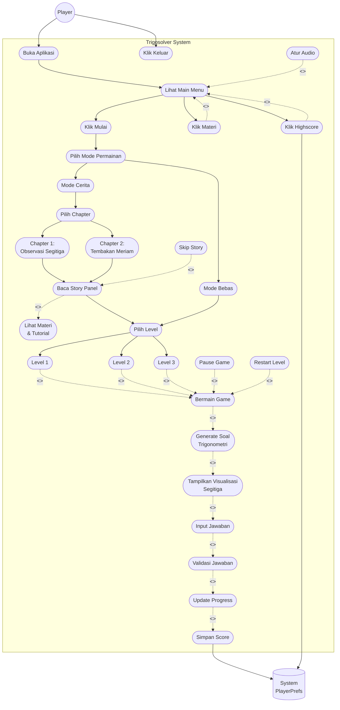
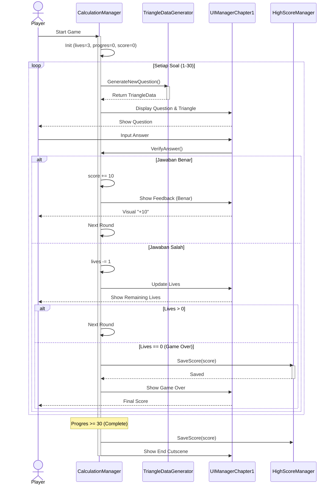
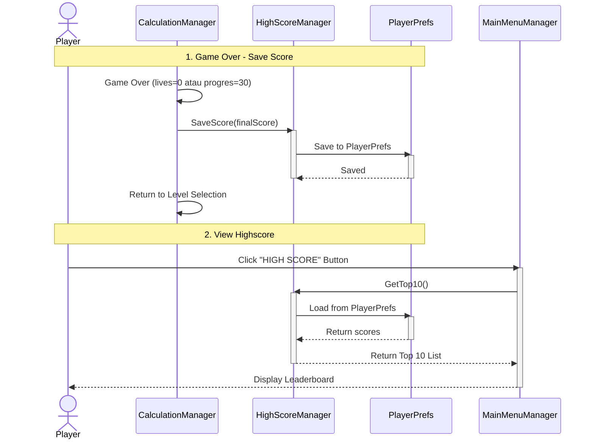
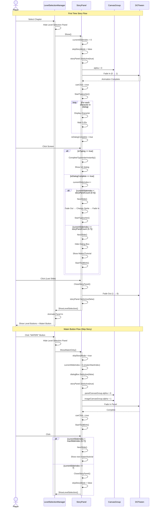
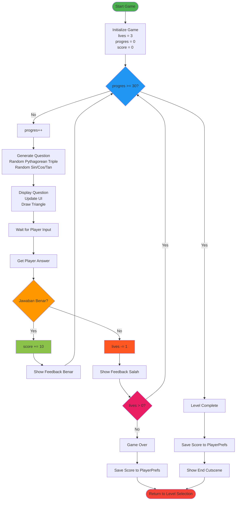
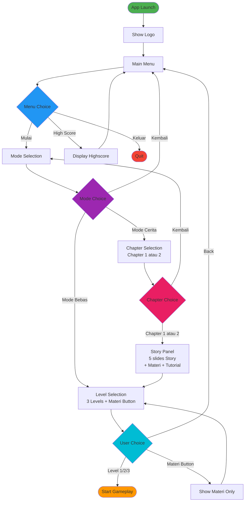
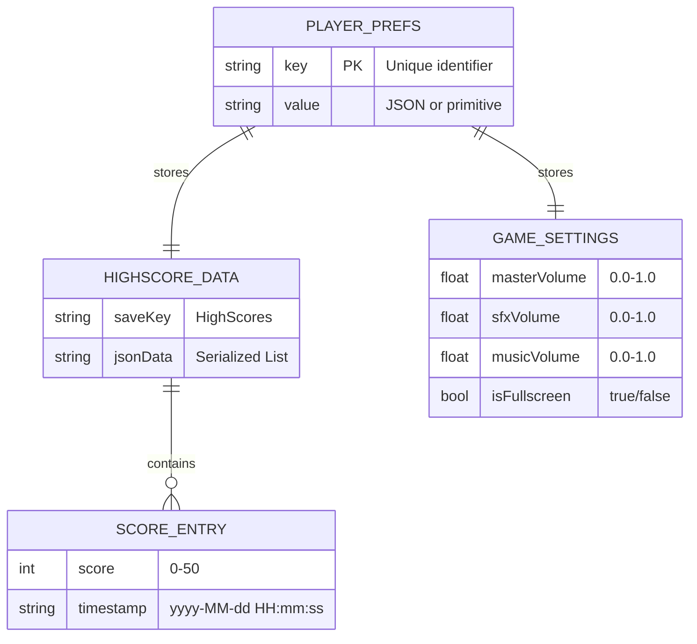
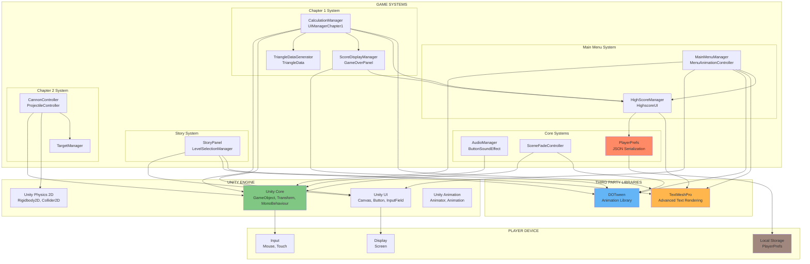
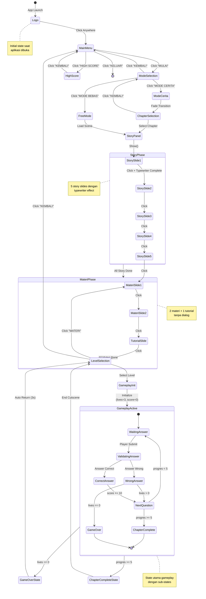

# BAB 4 - IMPLEMENTASI DAN PENGUJIAN SISTEM
## DIAGRAM RANCANG BANGUN GAME TRIGOSOLVER

---

## 📋 DAFTAR DIAGRAM

1. [Use Case Diagram](#1-use-case-diagram)
2. [Class Diagram](#2-class-diagram)
3. [Sequence Diagram - Main Gameplay](#3-sequence-diagram---main-gameplay)
4. [Sequence Diagram - Score System](#4-sequence-diagram---score-system)
5. [Sequence Diagram - Story Panel](#5-sequence-diagram---story-panel)
6. [Activity Diagram - Gameplay Flow](#6-activity-diagram---gameplay-flow)
7. [Activity Diagram - Menu Navigation](#7-activity-diagram---menu-navigation)
8. [Flowchart - Answer Verification](#8-flowchart---answer-verification)
9. [Entity Relationship Diagram - Data Persistence](#9-entity-relationship-diagram---data-persistence)
10. [Component Diagram - System Architecture](#10-component-diagram---system-architecture)
11. [State Diagram - Game States](#11-state-diagram---game-states)
12. [Deployment Diagram](#12-deployment-diagram)

---

## 1. USE CASE DIAGRAM

### Deskripsi:
Diagram ini menunjukkan interaksi antara pengguna (player) dengan sistem game Trigosolver, mencakup semua fitur utama yang tersedia dengan relasi **<<include>>** (wajib) dan **<<extend>>** (opsional), mengikuti standar UML 2.5.

### 📐 Simbol-simbol Use Case Diagram:

| Simbol | Keterangan |
|--------|------------|
| 🧍 (Stick figure) | **Aktor**: Mewakili peran orang, sistem lain, atau alat ketika berkomunikasi dengan use case |
| ⬭ (Oval) | **Use Case**: Abstraksi dan interaksi antara sistem dan aktor |
| ──→ (Solid arrow) | **Association**: Abstraksi dari penghubung antara aktor dengan use case |
| ┈→ (Dotted arrow) | **Generalisasi**: Menunjukkan spesialisasi aktor untuk dapat berpartisipasi dengan use case |
| ┈→ <<include>> | **Include**: Menunjukkan bahwa suatu use case seluruhnya merupakan fungsionalitas dari use case lainnya |
| ┈→ <<extend>> | **Extend**: Menunjukkan bahwa suatu use case merupakan tambahan fungsional dari use case lainnya jika suatu kondisi terpenuhi |

### 🎯 Aturan Standar UML yang Diikuti:

1. ✅ **System Boundary** - Use cases berada dalam kotak "Trigosolver System"
2. ✅ **Actor di luar boundary** - Player berada di luar system boundary
3. ✅ **Association** - Panah solid dari Actor ke Use Case
4. ✅ **Include stereotype** - Format `<<include>>` dengan kurung sudut ganda
5. ✅ **Extend stereotype** - Format `<<extend>>` dengan kurung sudut ganda
6. ✅ **Arah include** - Dari base use case ke included use case
7. ✅ **Arah extend** - Dari extending use case ke base use case
8. ✅ **Secondary actor** - System (PlayerPrefs) sebagai actor sekunder



---

### 📋 Daftar Use Cases (Flow Aplikasi yang Benar):

#### **A. Main Menu Level** (6 Use Cases)
| No | Use Case | Deskripsi | Relasi |
|----|----------|-----------|--------|
| UC1 | Buka Aplikasi | Launch aplikasi, tampil logo Trigosolver | Aktor: Player |
| UC2 | Lihat Main Menu | Tampilkan menu dengan 4 tombol | Flow dari UC1 |
| UC3 | Klik Mulai | Masuk ke Mode Selection | Flow dari UC2 |
| UC4 | Klik Materi | Langsung ke materi/tutorial | **Extend UC2** 🎯 |
| UC5 | Klik Highscore | Lihat leaderboard | **Extend UC2** 🎯 |
| UC6 | Klik Keluar | Quit aplikasi | Aktor: Player, Flow dari UC2 |

#### **B. Mode Selection Level** (3 Use Cases)
| No | Use Case | Deskripsi | Relasi |
|----|----------|-----------|--------|
| UC7 | Pilih Mode Permainan | Tampilkan Mode Cerita/Mode Bebas | Flow dari UC3 |
| UC8 | Mode Cerita | Pilih dengan story & tutorial | Flow dari UC7 |
| UC9 | Mode Bebas | Pilih tanpa story | Flow dari UC7 |

#### **C. Chapter Selection (Mode Cerita Only)** (3 Use Cases)
| No | Use Case | Deskripsi | Relasi |
|----|----------|-----------|--------|
| UC10 | Pilih Chapter | Tampilkan Chapter 1 & 2 | Flow dari UC8 |
| UC11 | Chapter 1: Observasi Segitiga | Pilih Chapter 1 (Sin, Cos, Tan) | Flow dari UC10 |
| UC12 | Chapter 2: Tembakan Meriam | Pilih Chapter 2 (Proyektil) | Flow dari UC10 |

#### **D. Story & Tutorial (Mode Cerita Only)** (3 Use Cases)
| No | Use Case | Deskripsi | Relasi |
|----|----------|-----------|--------|
| UC13 | Baca Story Panel | Tampilkan 5 panel story dengan typewriter | Flow dari UC11/UC12 |
| UC14 | Lihat Materi & Tutorial | Tampilkan 2 materi + 1 tutorial | **Include dari UC13** |
| UC15 | Skip Story | Tombol MATERI untuk skip story langsung | **Extend UC13** 🎯 |

#### **E. Level Selection** (4 Use Cases)
| No | Use Case | Deskripsi | Relasi |
|----|----------|-----------|--------|
| UC16 | Pilih Level | Tampilkan Level 1, 2, 3 + tombol Materi | Flow dari UC13 (Cerita) atau UC9 (Bebas) |
| UC17 | Level 1 | Soal nomor 1-5 | Flow dari UC16 |
| UC18 | Level 2 | Soal nomor 6-10 | Flow dari UC16 |
| UC19 | Level 3 | Soal nomor 11-15 | Flow dari UC16 |

#### **F. Gameplay Core - Include Chain** (7 Use Cases)
| No | Use Case | Deskripsi | Relasi |
|----|----------|-----------|--------|
| UC20 | Bermain Game | Main gameplay Chapter 1 | **Include dari UC17/UC18/UC19** |
| UC21 | Generate Soal Trigonometri | Buat soal Sin/Cos/Tan random | **Include dari UC20** |
| UC22 | Tampilkan Visualisasi Segitiga | Gambar segitiga dengan nilai sisi | **Include dari UC21** |
| UC23 | Input Jawaban | Player input jawaban | **Include dari UC22** |
| UC24 | Validasi Jawaban | Cek jawaban ±0.01 tolerance | **Include dari UC23** |
| UC25 | Update Progress | Update score/lives/progres | **Include dari UC24** |
| UC26 | Simpan Score | Save ke PlayerPrefs | **Include dari UC25** |

**💡 Include Chain:**
```
UC17/18/19 -.include.-> UC20 -.include.-> UC21 -.include.-> UC22 
-.include.-> UC23 -.include.-> UC24 -.include.-> UC25 -.include.-> UC26
```

#### **G. Extended Features** (3 Use Cases)
| No | Use Case | Deskripsi | Relasi |
|----|----------|-----------|--------|
| UC27 | Pause Game | Jeda gameplay, menu pause | **Extend UC20** 🎯 |
| UC28 | Restart Level | Reset level (lives=3, progres=0) | **Extend UC20** 🎯 |
| UC29 | Atur Audio | Setting volume BGM & SFX | **Extend UC2** 🎯 |

---

### 🔗 Penjelasan Relasi (Standar UML 2.5):

#### **Flow Normal (Solid Arrow):**
Menunjukkan alur navigasi normal antar use case.

**Main Menu → Mode Selection → Chapter Selection → Story → Level Selection → Gameplay**

#### **<<include>> (Stereotype Include):** 
Base use case **WAJIB** memanggil included use case.

**Include dalam Trigosolver:**
- **UC13 -.include.-> UC14**: Story panel WAJIB menampilkan materi setelah 5 panel story
- **UC17/18/19 -.include.-> UC20**: Pilih level WAJIB memulai gameplay
- **UC20→UC21→UC22→UC23→UC24→UC25→UC26**: Gameplay chain wajib berurutan

#### **<<extend>> (Stereotype Extend):** 
Extending use case bersifat **opsional** jika kondisi terpenuhi.

**Extend dalam Trigosolver:**
- **UC4 <<extend>> UC2**: Klik MATERI di Main Menu (opsional)
- **UC5 <<extend>> UC2**: Klik HIGHSCORE di Main Menu (opsional)
- **UC15 <<extend>> UC13**: Klik tombol MATERI saat Story Panel (opsional skip)
- **UC27 <<extend>> UC20**: Pause saat gameplay (opsional)
- **UC28 <<extend>> UC20**: Restart saat gameplay (opsional)
- **UC29 <<extend>> UC2**: Atur audio di Main Menu (opsional)

---

### 🎯 Skenario Flow yang Benar:

**Flow 1: Mode Cerita (Dengan Story):**
```
Player → UC1 (Buka) → UC2 (Main Menu) → UC3 (Klik Mulai) 
       → UC7 (Mode Selection) → UC8 (Mode Cerita) 
       → UC10 (Chapter Selection) → UC11 (Chapter 1)
       → UC13 (Story 5 panel) -.include.-> UC14 (Materi)
       → UC16 (Level Selection) → UC17 (Level 1)
       → UC20 → UC21 → UC22 → UC23 → UC24 → UC25 → UC26 → System
```

**Flow 2: Mode Cerita (Skip Story):**
```
Player → ... → UC11 (Chapter 1) → UC13 (Story slide 1-2)
       → [Player klik MATERI button]
       → UC15 (Skip Story - EXTEND) → UC14 (langsung Materi)
       → UC16 (Level Selection) → ...
```

**Flow 3: Mode Bebas (Tanpa Story):**
```
Player → UC1 → UC2 → UC3 → UC7 (Mode Selection) 
       → UC9 (Mode Bebas)
       → UC16 (Level Selection) → UC17 (Level 1)
       → UC20 → UC21 → ... → UC26 → System
```

**Flow 4: Langsung Materi dari Main Menu:**
```
Player → UC1 → UC2 (Main Menu)
       → [Player klik MATERI button]
       → UC4 (Lihat Materi - EXTEND) → Tampil materi/tutorial
```

**Flow 5: Lihat Highscore:**
```
Player → UC1 → UC2 (Main Menu)
       → [Player klik HIGHSCORE button]
       → UC5 (Lihat Highscore - EXTEND) → System (Load PlayerPrefs)
```

---

### 💡 Perubahan dari Diagram Sebelumnya:

**Yang Diperbaiki:**
1. ✅ **Flow yang benar** - Main Menu → Mode Selection → Chapter Selection → Story → Level Selection
2. ✅ **Main Menu 4 tombol** - Mulai, Materi, Highscore, Keluar
3. ✅ **Chapter Selection** - Tampil setelah pilih Mode Cerita
4. ✅ **Story + Materi** - Story include Materi (wajib), bukan terpisah
5. ✅ **Level Selection** - Tampil setelah Story (cerita) atau langsung (bebas)

**Struktur yang Benar:**
```
Level 1: Main Menu (UC1-UC6)
  ├─ UC3: Mulai → Level 2
  ├─ UC4: Materi (extend)
  ├─ UC5: Highscore (extend)
  └─ UC6: Keluar

Level 2: Mode Selection (UC7-UC9)
  ├─ UC8: Mode Cerita → Level 3
  └─ UC9: Mode Bebas → Level 5

Level 3: Chapter Selection (UC10-UC12) - Only Mode Cerita
  ├─ UC11: Chapter 1 → Level 4
  └─ UC12: Chapter 2 → Level 4

Level 4: Story & Tutorial (UC13-UC15) - Only Mode Cerita
  ├─ UC13: Story Panel (5 slides)
  ├─ UC14: Materi (include dari UC13)
  └─ UC15: Skip Story (extend)

Level 5: Level Selection (UC16-UC19)
  ├─ UC17: Level 1 → Level 6
  ├─ UC18: Level 2 → Level 6
  └─ UC19: Level 3 → Level 6

Level 6: Gameplay (UC20-UC26)
  UC20 → UC21 → UC22 → UC23 → UC24 → UC25 → UC26 → System
```

**Total Use Cases: 29** (naik dari 17)
- Main Menu: 6 (UC1-UC6)
- Mode Selection: 3 (UC7-UC9)
- Chapter Selection: 3 (UC10-UC12)
- Story & Tutorial: 3 (UC13-UC15)
- Level Selection: 4 (UC16-UC19)
- Gameplay Core: 7 (UC20-UC26)
- Extended Features: 3 (UC27-UC29)

---

## 2. CLASS DIAGRAM

### Deskripsi:
Diagram ini menampilkan struktur kelas utama dalam sistem game Trigosolver beserta relasi antar kelas.

```mermaid
classDiagram
    %% ==================== MAIN MENU SYSTEM ====================
    class MainMenuManager {
        -MenuState currentState
        -MenuAnimationController logoAnimator
        -MenuAnimationController mainMenuAnimator
        -MenuAnimationController modeSelectionAnimator
        -GameObject logoPanel
        -GameObject mainMenuPanel
        -bool clickAnywhereEnabled
        +Start()
        +Update()
        +ShowLogo()
        +TransitionToMainMenu()
        +OnMulaiClicked()
        +OnModeCeritaClicked()
        +OnHighScoreClicked()
        +LoadScene(string sceneName)
    }
    
    class MenuAnimationController {
        -RectTransform rectTransform
        -CanvasGroup canvasGroup
        +float dropDuration
        +float bounceStrength
        +AnimateDropIn(Action onComplete)
        +AnimateSinkOut(Action onComplete)
        +ShowInstant()
        +HideInstant()
    }
    
    class MenuState {
        <<enumeration>>
        Logo
        MainMenu
        ModeSelection
        ModeCeritaSelection
        HighScore
    }
    
    %% ==================== HIGHSCORE SYSTEM ====================
    class HighScoreManager {
        -List~ScoreEntry~ scoreEntries
        -string saveKey
        +Instance : HighScoreManager
        +SaveScore(int score)
        +List~ScoreEntry~ GetTop10()
        +List~ScoreEntry~ GetRecent3()
        -LoadScores()
        -SaveScores()
    }
    
    class ScoreEntry {
        +int score
        +string timestamp
        +ScoreEntry(int score, string timestamp)
    }
    
    class HighscoreUI {
        -TextMeshProUGUI top10Text
        -TextMeshProUGUI recent3Text
        +DisplayHighScores()
        -FormatScoreText(List~ScoreEntry~ scores)
    }
    
    %% ==================== CHAPTER 1 GAMEPLAY ====================
    class CalculationManager {
        -int lives
        -int progres
        -int totalSoal
        -int score
        -TriangleData dataSoalSaatIni
        -float answerTolerance
        +UIManagerChapter1 uiManager
        +TriangleDataGenerator dataGenerator
        +ScoreDisplayManager scoreDisplayManager
        +Start()
        +StartNewRound()
        +VerifyAnswer()
        +HandleWrongAnswer()
        +EndChapter()
    }
    
    class TriangleDataGenerator {
        -List~Vector3Int~ pythagoreanTriples
        +TriangleData GenerateNewQuestion()
        -Vector3Int GetRandomTriple()
        -float CalculateRatio(TriangleData data)
    }
    
    class TriangleData {
        +float sisiDepan
        +float sisiSamping
        +float sisiMiring
        +SoalType jenisPerbandingan
        +float jawabanBenar
    }
    
    class SoalType {
        <<enumeration>>
        Sin
        Cos
        Tan
    }
    
    class UIManagerChapter1 {
        -TextMeshProUGUI soalText
        -TextMeshProUGUI progresText
        -TMP_InputField answerInput
        -GameObject[] livesIcons
        +SetupNewQuestion(int progres, int total, TriangleData data)
        +UpdateLives(int currentLives)
        +ShowFeedback(string message, bool isCorrect)
        +HighlightCorrectAnswer()
        +HighlightWrongAnswer(SoalType type)
    }
    
    %% ==================== SCORE SYSTEM ====================
    class ScoreDisplayManager {
        -TextMeshProUGUI scoreText
        -GameObject scorePopupPrefab
        -int currentScore
        +UpdateScore(int newScore)
        +ShowScorePopup(int points)
        -AnimateScorePopup(GameObject popup)
    }
    
    class GameOverPanel {
        -GameObject gameOverPanel
        -TextMeshProUGUI finalScoreText
        -float autoReturnDelay
        +ShowGameOver(int finalScore)
        -AutoReturnToLevelSelection()
    }
    
    %% ==================== STORY & LEVEL SYSTEM ====================
    class StoryPanel {
        -List~Sprite~ slideImages
        -List~string~ storyDialogs
        -int currentSlideIndex
        -int materiStartIndex
        -int storyPanelCount
        -bool skipStoryMode
        -bool isTyping
        -bool canClick
        +Show()
        +ShowMateriOnly()
        +Close()
        -StartTypewriter()
        -NextSlide()
        -HandleClick()
    }
    
    class LevelSelectionManager {
        -GameObject levelSelectionPanel
        -Button level1Button
        -Button level2Button
        -Button level3Button
        -Button materiButton
        -StoryPanel storyPanel
        +ShowLevelSelection()
        +HideAllGameObjects()
        -OnLevelSelected(int level)
        -OnMateriButtonClicked()
    }
    
    %% ==================== CHAPTER 2 GAMEPLAY ====================
    class CannonController {
        -Transform cannonTransform
        -float rotationSpeed
        -float minAngle
        -float maxAngle
        +RotateCannon(float input)
        +GetCurrentAngle() : float
        +Fire(float power)
    }
    
    class ProjectileController {
        -Rigidbody2D rb
        -float gravity
        -Vector2 velocity
        -bool isFlying
        +Launch(float angle, float power)
        +CalculateTrajectory() : Vector2[]
        -OnCollisionEnter2D()
    }
    
    class TargetManager {
        -List~GameObject~ targets
        -int targetsHit
        -int totalTargets
        +CheckTargetHit(GameObject target) : bool
        +GetRemainingTargets() : int
        +ResetTargets()
    }
    
    %% ==================== RELATIONSHIPS ====================
    MainMenuManager --> MenuAnimationController : uses
    MainMenuManager --> MenuState : uses
    MainMenuManager --> HighScoreManager : accesses
    
    HighScoreManager --> ScoreEntry : contains
    HighscoreUI --> HighScoreManager : reads from
    HighscoreUI --> ScoreEntry : displays
    
    CalculationManager --> TriangleDataGenerator : uses
    CalculationManager --> TriangleData : processes
    CalculationManager --> UIManagerChapter1 : updates
    CalculationManager --> ScoreDisplayManager : updates
    CalculationManager --> HighScoreManager : saves to
    CalculationManager --> GameOverPanel : triggers
    
    TriangleDataGenerator --> TriangleData : generates
    TriangleData --> SoalType : has
    
    UIManagerChapter1 --> TriangleData : displays
    
    ScoreDisplayManager --> HighScoreManager : notifies
    GameOverPanel --> HighScoreManager : saves score
    GameOverPanel --> LevelSelectionManager : returns to
    
    StoryPanel --> LevelSelectionManager : transitions to
    LevelSelectionManager --> StoryPanel : shows
    
    CannonController --> ProjectileController : launches
    ProjectileController --> TargetManager : notifies
    TargetManager --> HighScoreManager : saves score

    %% ==================== STYLING ====================
    style MainMenuManager fill:#E3F2FD
    style HighScoreManager fill:#FFF3E0
    style CalculationManager fill:#FCE4EC
    style StoryPanel fill:#F3E5F5
    style CannonController fill:#E0F2F1
```



### Penjelasan Relasi:
1. **MainMenuManager** → MenuAnimationController: Menggunakan animator untuk transisi panel
2. **CalculationManager** → TriangleDataGenerator: Menggunakan generator untuk membuat soal
3. **CalculationManager** → HighScoreManager: Menyimpan score setelah game selesai
4. **StoryPanel** ↔ LevelSelectionManager: Transisi antar panel story dan level selection
5. **CannonController** → ProjectileController: Meluncurkan projectile dengan parameter sudut dan kekuatan

---

## 3. SEQUENCE DIAGRAM - Main Gameplay

### Deskripsi:
Diagram ini menunjukkan alur interaksi antar objek saat pemain memainkan Chapter 1 (Observasi Segitiga).



---

## 4. SEQUENCE DIAGRAM - Score System

### Deskripsi:
Diagram ini menunjukkan alur penyimpanan dan penampilan score pada sistem highscore.



---

## 5. SEQUENCE DIAGRAM - Story Panel

### Deskripsi:
Diagram ini menunjukkan alur story panel dengan typewriter effect dan materi button.



---

## 6. ACTIVITY DIAGRAM - Gameplay Flow

### Deskripsi:
Diagram aktivitas yang menunjukkan alur lengkap gameplay dari start hingga game over.



---

## 7. ACTIVITY DIAGRAM - Menu Navigation

### Deskripsi:
Diagram aktivitas yang menunjukkan navigasi menu dari logo hingga gameplay.



---

## 8. FLOWCHART - Answer Verification

### Deskripsi:
Flowchart detail untuk proses verifikasi jawaban pemain.

```mermaid
flowchart TD
    Start([Player Submit Answer]) --> GetInput[Get Input from InputField]
    GetInput --> CheckEmpty{Input Empty?}
    
    CheckEmpty -->|Yes| ShowError1[Show Error:<br/>"Masukkan jawaban terlebih dahulu"]
    ShowError1 --> End1([Return])
    
    CheckEmpty -->|No| CheckFormat{Input Contains '/'?}
    
    CheckFormat -->|Yes - Fraction| SplitFrac[Split by '/']
    SplitFrac --> CheckParts{2 Parts?}
    
    CheckParts -->|No| ShowError2[Show Error:<br/>"Format tidak valid"]
    ShowError2 --> End1
    
    CheckParts -->|Yes| ParseNum[Parse Numerator]
    ParseNum --> ParseDen[Parse Denominator]
    ParseDen --> CheckDenZero{Denominator == 0?}
    
    CheckDenZero -->|Yes| ShowError3[Show Error:<br/>"Pembagi tidak boleh 0"]
    ShowError3 --> End1
    
    CheckDenZero -->|No| CalcFrac[Calculate:<br/>playerAnswer = num / den]
    CalcFrac --> CheckRange
    
    CheckFormat -->|No - Decimal| ReplaceComma[Replace ',' with '.']
    ReplaceComma --> ParseDec[Parse Decimal<br/>InvariantCulture]
    ParseDec --> CheckValid{Parse Success?}
    
    CheckValid -->|No| ShowError4[Show Error:<br/>"Format angka tidak valid"]
    ShowError4 --> End1
    
    CheckValid -->|Yes| CheckRange{playerAnswer<br/>in range 0-1?}
    
    CheckRange -->|No| ShowError5[Show Warning:<br/>"Jawaban di luar rentang"]
    ShowError5 --> End1
    
    CheckRange -->|Yes| CalcError[Calculate Absolute Error:<br/>absError = |playerAnswer - correctAnswer|]
    CalcError --> CheckTolerance{absError <= 0.01?}
    
    CheckTolerance -->|Yes - Correct| IncScore[score += 10]
    IncScore --> ShowPopup[Show +10 Score Popup<br/>Green Animation]
    ShowPopup --> HighlightGreen[Highlight Correct Side<br/>Green Border + Sparkle]
    HighlightGreen --> PlayCorrectSFX[Play Correct Sound]
    PlayCorrectSFX --> Wait2sCorrect[Wait 2 seconds]
    Wait2sCorrect --> NextRound1[Start Next Round]
    NextRound1 --> End2([Continue Game])
    
    CheckTolerance -->|No - Wrong| DecLives[lives--]
    DecLives --> UpdateUI[Update Lives Icons<br/>Disable 1 Heart]
    UpdateUI --> ShowFeedback[Show "SALAH!" Feedback]
    ShowFeedback --> HighlightRed[Highlight Wrong Side<br/>Red Border]
    HighlightRed --> PlayWrongSFX[Play Wrong Sound]
    PlayWrongSFX --> CheckLivesRemain{lives > 0?}
    
    CheckLivesRemain -->|Yes| Wait2sWrong[Wait 2 seconds]
    Wait2sWrong --> NextRound2[Start Next Round]
    NextRound2 --> End2
    
    CheckLivesRemain -->|No - Game Over| SaveFinalScore[Save Final Score<br/>to PlayerPrefs]
    SaveFinalScore --> ShowGameOverPanel[Show Game Over Panel<br/>Display Score]
    ShowGameOverPanel --> AutoReturnTimer[Wait 3 seconds]
    AutoReturnTimer --> LoadLevelSelect[Load Level Selection Scene]
    LoadLevelSelect --> End3([End Game])
    
    style Start fill:#4CAF50
    style End1 fill:#FF9800
    style End2 fill:#2196F3
    style End3 fill:#F44336
    style CheckTolerance fill:#9C27B0
    style CheckEmpty fill:#FFC107
    style CheckFormat fill:#00BCD4
    style CheckLivesRemain fill:#E91E63
    style IncScore fill:#8BC34A
    style DecLives fill:#FF5722
```

---

## 9. ENTITY RELATIONSHIP DIAGRAM - Data Persistence

### Deskripsi:
Diagram relasi data yang disimpan dalam sistem menggunakan PlayerPrefs dan JSON.



### Data Structure JSON:

#### HighScore Data:
```json
{
  "scoreEntries": [
    {
      "score": 50,
      "timestamp": "2026-01-07 14:30:45"
    },
    {
      "score": 40,
      "timestamp": "2026-01-06 10:15:20"
    },
    {
      "score": 30,
      "timestamp": "2026-01-05 16:45:10"
    }
  ]
}
```

### PlayerPrefs Keys:
| Key | Type | Description |
|-----|------|-------------|
| `HighScores` | JSON | List of all score entries |
| `MasterVolume` | float | Volume master (0.0 - 1.0) |
| `SFXVolume` | float | Volume SFX (0.0 - 1.0) |
| `MusicVolume` | float | Volume musik (0.0 - 1.0) |
| `IsFullscreen` | int | Fullscreen mode (0 = false, 1 = true) |

---

## 10. COMPONENT DIAGRAM - System Architecture

### Deskripsi:
Diagram komponen yang menunjukkan arsitektur sistem dan dependensi antar modul.



### Penjelasan Komponen:

#### Unity Engine:
- **Unity Core**: Sistem dasar Unity (GameObject, Transform, MonoBehaviour)
- **Unity UI**: Sistem UI (Canvas, Button, InputField, Image)
- **Unity Physics 2D**: Sistem fisika untuk Chapter 2
- **Unity Animation**: Sistem animasi

#### Third Party:
- **DOTween**: Library animasi untuk transisi dan effect
- **TextMeshPro**: Advanced text rendering untuk UI

#### Game Systems:
1. **Main Menu System**: Navigasi menu dan highscore
2. **Chapter 1 System**: Gameplay observasi segitiga
3. **Chapter 2 System**: Gameplay tembakan meriam
4. **Story System**: Story panel dan level selection
5. **Core Systems**: Audio, scene transition, data persistence

---

## 11. STATE DIAGRAM - Game States

### Deskripsi:
Diagram state yang menunjukkan semua state dalam game dan transisinya.



---

## 12. DEPLOYMENT DIAGRAM

### Deskripsi:
Diagram deployment yang menunjukkan arsitektur deployment aplikasi.

```mermaid
graph TB
    subgraph "DEVELOPMENT ENVIRONMENT"
        subgraph "Developer Machine"
            UnityEditor[Unity Editor 6.0<br/>Windows 11]
            VSCode[Visual Studio Code<br/>C# Development]
            Git[Git Version Control<br/>GitHub Repository]
        end
    end
    
    subgraph "BUILD ARTIFACTS"
        subgraph "Windows Build"
            WinExe[Trigosolver.exe<br/>x86_64]
            WinData[Trigosolver_Data/<br/>Assets, Scenes, DLLs]
            WinMono[MonoBleedingEdge/<br/>Mono Runtime]
        end
        
        subgraph "Android Build"
            APK[Trigosolver.apk<br/>ARM64 / ARM32]
            Assets[Assets<br/>Compressed]
            LibIl2cpp[libil2cpp.so<br/>IL2CPP Runtime]
        end
        
        subgraph "WebGL Build"
            Index[index.html]
            BuildJS[Build.js<br/>WebAssembly]
            BuildData[Build.data<br/>Game Assets]
        end
    end
    
    subgraph "TARGET PLATFORMS"
        subgraph "Windows PC"
            WinOS[Windows 10/11<br/>64-bit]
            DirectX[DirectX 11/12]
            LocalStorage1[AppData/LocalLow/<br/>PlayerPrefs]
        end
        
        subgraph "Android Device"
            Android[Android 7.0+<br/>ARM Architecture]
            OpenGLES[OpenGL ES 3.0+]
            LocalStorage2[/data/data/<br/>PlayerPrefs]
        end
        
        subgraph "Web Browser"
            Browser[Chrome / Firefox / Edge<br/>WebGL 2.0 Support]
            IndexedDB[IndexedDB<br/>PlayerPrefs]
        end
    end
    
    UnityEditor -->|Build| WinExe
    UnityEditor -->|Build| APK
    UnityEditor -->|Build| Index
    
    WinExe --> WinOS
    WinData --> WinOS
    WinMono --> WinOS
    
    WinOS --> DirectX
    WinOS --> LocalStorage1
    
    APK --> Android
    Assets --> Android
    LibIl2cpp --> Android
    
    Android --> OpenGLES
    Android --> LocalStorage2
    
    Index --> Browser
    BuildJS --> Browser
    BuildData --> Browser
    
    Browser --> IndexedDB
    
    VSCode -.->|Edit Code| UnityEditor
    Git -.->|Version Control| UnityEditor
    
    style UnityEditor fill:#81C784
    style WinExe fill:#64B5F6
    style APK fill:#4DB6AC
    style Index fill:#FFB74D
    style WinOS fill:#E1BEE7
    style Android fill:#A5D6A7
    style Browser fill:#FFCC80
```

### Platform Requirements:

#### Windows:
- OS: Windows 10/11 (64-bit)
- Graphics: DirectX 11/12 compatible
- Storage: 500 MB
- RAM: 2 GB minimum

#### Android:
- OS: Android 7.0 (Nougat) atau lebih tinggi
- Architecture: ARM64-v8a / ARMv7
- Graphics: OpenGL ES 3.0+
- Storage: 200 MB
- RAM: 1 GB minimum

#### WebGL:
- Browser: Chrome 90+, Firefox 88+, Edge 90+
- WebGL: 2.0 support required
- RAM: 2 GB minimum
- Connection: Stable internet (first load)

---

## 📊 KESIMPULAN DIAGRAM

### Ringkasan Diagram yang Telah Dibuat:

1. **Use Case Diagram**: Menunjukkan 13 use case utama dengan 2 aktor (Player dan System)
2. **Class Diagram**: Mencakup 20+ kelas utama dengan relasi lengkap
3. **Sequence Diagram (3x)**: Main Gameplay, Score System, Story Panel
4. **Activity Diagram (2x)**: Gameplay Flow dan Menu Navigation
5. **Flowchart**: Detail Answer Verification dengan 15+ decision points
6. **ERD**: Struktur data persistence dengan PlayerPrefs dan JSON
7. **Component Diagram**: Arsitektur sistem dengan 4 layer utama
8. **State Diagram**: 15+ states dengan transisi lengkap
9. **Deployment Diagram**: Multi-platform deployment (Windows, Android, WebGL)

### Catatan Implementasi:

Semua diagram di atas menggunakan format **Mermaid** yang dapat di-render langsung di:
- GitHub (Markdown files)
- VS Code (dengan extension Mermaid Preview)
- GitLab
- Notion
- Obsidian
- Dan platform lain yang support Mermaid

### Cara Render Diagram:

#### Di VS Code:
1. Install extension "Markdown Preview Mermaid Support"
2. Buka file ini (.md)
3. Klik preview (Ctrl+Shift+V)

#### Di GitHub:
1. Upload file ini ke repository
2. GitHub otomatis render diagram Mermaid

#### Export ke Gambar:
1. Gunakan: https://mermaid.live/
2. Copy-paste kode diagram
3. Export sebagai PNG/SVG

---

**Dibuat untuk:** Skripsi Rancang Bangun Game Edukasi Trigonometri "Trigosolver"  
**Dokumentasi:** BAB 4 - Implementasi dan Pengujian Sistem  
**Tanggal:** Januari 2026  
**Platform:** Unity 6.0 (6000.0.23f1)

