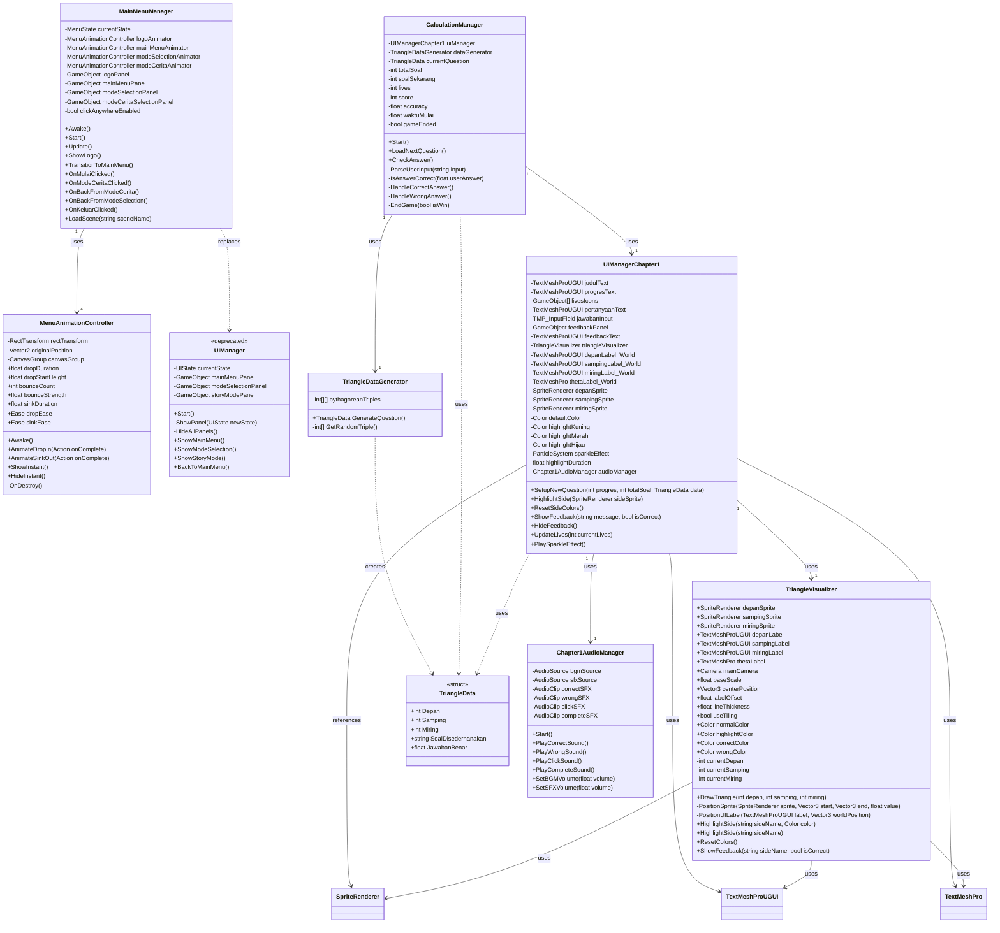

# Class Diagram - Trigosolver Game

## Main Class Diagram (Mermaid Format)



---

## PlantUML Version

```plantuml
@startuml

!define MAIN_COLOR #E3F2FD
!define GAME_COLOR #FFF3E0
!define DATA_COLOR #F1F8E9
!define AUDIO_COLOR #FCE4EC

package "Main Menu System" MAIN_COLOR {
    class MainMenuManager {
        -MenuState currentState
        -MenuAnimationController logoAnimator
        -MenuAnimationController mainMenuAnimator
        -MenuAnimationController modeSelectionAnimator
        -MenuAnimationController modeCeritaAnimator
        -GameObject logoPanel
        -GameObject mainMenuPanel
        -GameObject modeSelectionPanel
        -GameObject modeCeritaSelectionPanel
        -bool clickAnywhereEnabled
        +Awake()
        +Start()
        +Update()
        +ShowLogo()
        +TransitionToMainMenu()
        +OnMulaiClicked()
        +OnModeCeritaClicked()
        +OnBackFromModeCerita()
        +OnBackFromModeSelection()
        +OnKeluarClicked()
        +LoadScene(string sceneName)
    }
    
    class MenuAnimationController {
        -RectTransform rectTransform
        -Vector2 originalPosition
        -CanvasGroup canvasGroup
        +float dropDuration
        +float dropStartHeight
        +int bounceCount
        +float bounceStrength
        +float sinkDuration
        +Ease dropEase
        +Ease sinkEase
        +Awake()
        +AnimateDropIn(Action onComplete)
        +AnimateSinkOut(Action onComplete)
        +ShowInstant()
        +HideInstant()
        -OnDestroy()
    }
    
    enum MenuState {
        Logo
        MainMenu
        ModeSelection
        ModeCeritaSelection
    }
    
    class UIManager <<deprecated>> {
        -UIState currentState
        -GameObject mainMenuPanel
        -GameObject modeSelectionPanel
        -GameObject storyModePanel
        +Start()
        -ShowPanel(UIState newState)
        -HideAllPanels()
        +ShowMainMenu()
        +ShowModeSelection()
        +ShowStoryMode()
        +BackToMainMenu()
    }
}

package "Chapter 1 Gameplay" GAME_COLOR {
    class UIManagerChapter1 {
        -TextMeshProUGUI judulText
        -TextMeshProUGUI progresText
        -GameObject[] livesIcons
        -TextMeshProUGUI pertanyaanText
        -TMP_InputField jawabanInput
        -GameObject feedbackPanel
        -TextMeshProUGUI feedbackText
        -TriangleVisualizer triangleVisualizer
        -TextMeshProUGUI depanLabel_World
        -TextMeshProUGUI sampingLabel_World
        -TextMeshProUGUI miringLabel_World
        -TextMeshPro thetaLabel_World
        -SpriteRenderer depanSprite
        -SpriteRenderer sampingSprite
        -SpriteRenderer miringSprite
        -Color defaultColor
        -Color highlightKuning
        -Color highlightMerah
        -Color highlightHijau
        -ParticleSystem sparkleEffect
        -float highlightDuration
        -Chapter1AudioManager audioManager
        +SetupNewQuestion(int progres, int totalSoal, TriangleData data)
        +HighlightSide(SpriteRenderer sideSprite)
        +ResetSideColors()
        +ShowFeedback(string message, bool isCorrect)
        +HideFeedback()
        +UpdateLives(int currentLives)
        +PlaySparkleEffect()
    }
    
    class TriangleVisualizer {
        +SpriteRenderer depanSprite
        +SpriteRenderer sampingSprite
        +SpriteRenderer miringSprite
        +TextMeshProUGUI depanLabel
        +TextMeshProUGUI sampingLabel
        +TextMeshProUGUI miringLabel
        +TextMeshPro thetaLabel
        +Camera mainCamera
        +float baseScale
        +Vector3 centerPosition
        +float labelOffset
        +float lineThickness
        +bool useTiling
        +Color normalColor
        +Color highlightColor
        +Color correctColor
        +Color wrongColor
        -int currentDepan
        -int currentSamping
        -int currentMiring
        +DrawTriangle(int depan, int samping, int miring)
        -PositionSprite(SpriteRenderer sprite, Vector3 start, Vector3 end, float value)
        -PositionUILabel(TextMeshProUGUI label, Vector3 worldPosition)
        +HighlightSide(string sideName, Color color)
        +HighlightSide(string sideName)
        +ResetColors()
        +ShowFeedback(string sideName, bool isCorrect)
    }
    
    class CalculationManager {
        -UIManagerChapter1 uiManager
        -TriangleDataGenerator dataGenerator
        -TriangleData currentQuestion
        -int totalSoal
        -int soalSekarang
        -int lives
        -int score
        -float accuracy
        -float waktuMulai
        -bool gameEnded
        +Start()
        +LoadNextQuestion()
        +CheckAnswer()
        -ParseUserInput(string input)
        -IsAnswerCorrect(float userAnswer)
        -HandleCorrectAnswer()
        -HandleWrongAnswer()
        -EndGame(bool isWin)
    }
}

package "Data Models" DATA_COLOR {
    class TriangleData <<struct>> {
        +int Depan
        +int Samping
        +int Miring
        +string SoalDisederhanakan
        +float JawabanBenar
    }
    
    class TriangleDataGenerator {
        -int[][] pythagoreanTriples
        +TriangleData GenerateQuestion()
        -int[] GetRandomTriple()
    }
}

package "Audio System" AUDIO_COLOR {
    class Chapter1AudioManager {
        -AudioSource bgmSource
        -AudioSource sfxSource
        -AudioClip correctSFX
        -AudioClip wrongSFX
        -AudioClip clickSFX
        -AudioClip completeSFX
        +Start()
        +PlayCorrectSound()
        +PlayWrongSound()
        +PlayClickSound()
        +PlayCompleteSound()
        +SetBGMVolume(float volume)
        +SetSFXVolume(float volume)
    }
}

%% Relationships
MainMenuManager "1" *-- "4" MenuAnimationController
MainMenuManager +-- MenuState
MainMenuManager ..> UIManager : <<replaces>>

UIManagerChapter1 "1" o-- "1" TriangleVisualizer : uses
UIManagerChapter1 "1" o-- "1" Chapter1AudioManager : uses
UIManagerChapter1 ..> TriangleData : <<uses>>

CalculationManager "1" --> "1" UIManagerChapter1 : manages
CalculationManager "1" --> "1" TriangleDataGenerator : uses
CalculationManager ..> TriangleData : <<uses>>

TriangleDataGenerator ..> TriangleData : <<creates>>

note right of UIManager
  Deprecated - replaced by
  MainMenuManager with
  animation support
end note

note bottom of TriangleData
  Struct for holding
  triangle question data
end note

@enduml
```

---

## Detailed Class Descriptions

### Main Menu System

#### MainMenuManager
**Responsibility**: Mengatur state dan transisi antar panel menu dengan animasi  
**Key Methods**:
- `TransitionToMainMenu()`: Transisi dari logo ke main menu
- `OnMulaiClicked()`: Handler untuk tombol mulai
- `OnModeCeritaClicked()`: Transisi ke mode cerita selection

**Dependencies**: 
- 4 instance `MenuAnimationController` (satu untuk setiap panel)
- Enum `MenuState` untuk tracking state saat ini

#### MenuAnimationController
**Responsibility**: Mengatur animasi drop, bounce, dan sink untuk panel menu  
**Key Methods**:
- `AnimateDropIn(Action)`: Animasi jatuh dari atas dengan bounce
- `AnimateSinkOut(Action)`: Animasi tenggelam ke bawah

**Technologies**: DOTween library untuk smooth animations

#### UIManager (Deprecated)
**Status**: Legacy class, digantikan oleh `MainMenuManager`  
**Reason**: Tidak mendukung animasi, hanya show/hide langsung

---

### Chapter 1 Gameplay

#### UIManagerChapter1
**Responsibility**: Mengatur semua UI element di gameplay Chapter 1  
**Key Methods**:
- `SetupNewQuestion()`: Setup UI untuk soal baru
- `HighlightSide()`: Highlight sisi segitiga yang benar/salah
- `ShowFeedback()`: Tampilkan feedback benar/salah
- `UpdateLives()`: Update tampilan nyawa

**Dependencies**:
- `TriangleVisualizer`: Untuk visualisasi segitiga
- `Chapter1AudioManager`: Untuk sound effects
- TextMeshPro components untuk UI text

#### TriangleVisualizer
**Responsibility**: Render visualisasi segitiga siku-siku dengan sprite dan label  
**Key Methods**:
- `DrawTriangle(depan, samping, miring)`: Gambar segitiga berdasarkan nilai
- `PositionSprite()`: Posisikan dan scale sprite untuk garis
- `HighlightSide()`: Highlight sisi dengan warna tertentu

**Algorithm**: 
- Menghitung 3 vertex: bottomLeft, bottomRight, topLeft
- Position sprite dengan rotation dan scale dinamis
- Convert world position ke screen space untuk UI labels

#### CalculationManager
**Responsibility**: Game logic, validasi jawaban, dan progress tracking  
**Key Methods**:
- `LoadNextQuestion()`: Load soal berikutnya
- `CheckAnswer()`: Validasi jawaban user
- `ParseUserInput()`: Parse input (support desimal dan pecahan)
- `IsAnswerCorrect()`: Cek dengan toleransi error 0.01

**Game Flow**:
1. Generate question via `TriangleDataGenerator`
2. Display via `UIManagerChapter1`
3. Validate user input
4. Update score/lives
5. Check win/lose condition

---

### Data Models

#### TriangleData (Struct)
**Responsibility**: Data container untuk satu soal trigonometri  
**Fields**:
- `Depan`, `Samping`, `Miring`: Panjang sisi segitiga
- `SoalDisederhanakan`: String soal (e.g., "Sinθ", "Cosθ")
- `JawabanBenar`: Nilai jawaban yang benar (float)

**Type**: Struct (value type) untuk performance

#### TriangleDataGenerator
**Responsibility**: Generate soal random menggunakan Pythagorean triples  
**Algorithm**:
1. Pilih random triple: (3,4,5), (5,12,13), (8,15,17), (7,24,25)
2. Random shuffle untuk variasi
3. Random pilih tipe soal: Sin(0), Cos(1), Tan(2)
4. Hitung jawaban: depan/miring, samping/miring, atau depan/samping

---

### Audio System

#### Chapter1AudioManager
**Responsibility**: Mengatur background music dan sound effects  
**Key Methods**:
- `PlayCorrectSound()`: SFX untuk jawaban benar
- `PlayWrongSound()`: SFX untuk jawaban salah
- `SetBGMVolume()`: Atur volume BGM (0-1)
- `SetSFXVolume()`: Atur volume SFX (0-1)

**Components**: 
- 2 AudioSource (satu untuk BGM, satu untuk SFX)
- 4 AudioClip (correct, wrong, click, complete)

---

## Design Patterns Used

### 1. **Manager Pattern**
- `MainMenuManager`: Manage menu state machine
- `CalculationManager`: Manage game logic
- `UIManagerChapter1`: Manage UI updates
- `Chapter1AudioManager`: Manage audio playback

### 2. **Component Pattern** (Unity ECS)
- Semua class inherit dari `MonoBehaviour`
- Dependency injection via Inspector serialized fields

### 3. **State Pattern**
- `MenuState` enum di `MainMenuManager`
- State transitions via explicit methods

### 4. **Factory Pattern**
- `TriangleDataGenerator.GenerateQuestion()` creates `TriangleData`

### 5. **Observer Pattern** (Implicit)
- Unity Event System untuk button clicks
- Callbacks via `Action` delegates dalam animations

---

## Dependency Graph

```
MainMenuManager
    └── MenuAnimationController (×4)

CalculationManager
    ├── UIManagerChapter1
    │   ├── TriangleVisualizer
    │   └── Chapter1AudioManager
    └── TriangleDataGenerator
        └── TriangleData (creates)
```

---

## Unity Component Architecture

```
Scene: Main Menu
├── Canvas
│   ├── Logo (MenuAnimationController)
│   ├── MainMenu (MenuAnimationController)
│   ├── ModeSelection (MenuAnimationController)
│   └── ModeCeritaSelection (MenuAnimationController)
└── MenuManager (MainMenuManager)

Scene: Chapter 1
├── Canvas (UI)
│   └── UIManager (UIManagerChapter1)
├── TriangleVisualization (TriangleVisualizer)
├── GameManager (CalculationManager)
├── DataGenerator (TriangleDataGenerator)
└── AudioManager (Chapter1AudioManager)
```

---

## Class Statistics

- **Total Classes**: 8 main classes + 2 structs/enums
- **Main Menu System**: 3 classes
- **Gameplay System**: 4 classes
- **Data Layer**: 2 classes
- **Audio System**: 1 class

---

**Generated**: December 18, 2025  
**Game Version**: Unity 6.0  
**Architecture**: Component-Based (Unity ECS style)  
**Language**: C# (.NET Framework 4.x)
