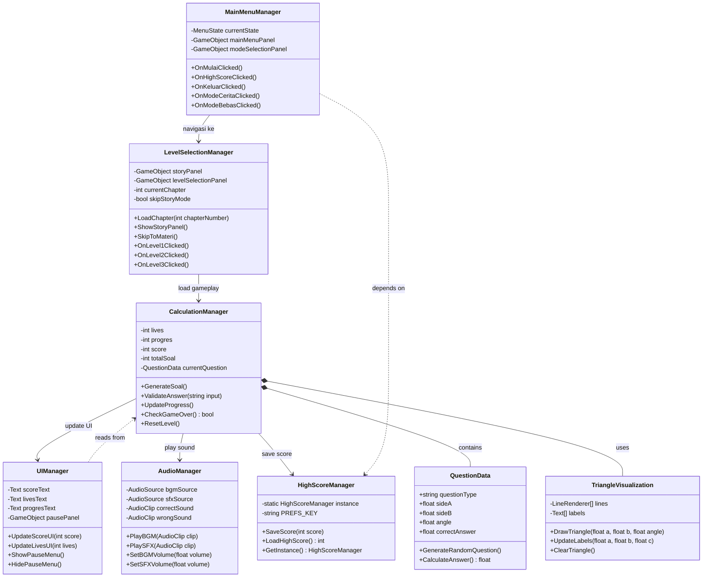

# CLASS DIAGRAM - GAME TRIGOSOLVER

**Dokumentasi:** Class Diagram fokus pada komponen penting  
**Proyek:** Game Edukasi Trigonometri - Trigosolver  
**Tanggal:** 7 Januari 2026  

---

## 📐 IDENTIFIKASI CLASS PENTING

### **Core Classes** (8 classes)

1. **MainMenuManager** - Mengelola navigasi menu utama
2. **LevelSelectionManager** - Mengelola level selection & story panel
3. **CalculationManager** - Mengelola gameplay & logic soal
4. **HighScoreManager** - Mengelola penyimpanan score (Singleton)
5. **UIManager** - Mengelola UI elements & panels
6. **AudioManager** - Mengelola BGM & SFX
7. **QuestionData** - Data model untuk soal trigonometri
8. **TriangleVisualization** - Visualisasi segitiga dinamis

---

## 📊 CLASS DIAGRAM



---

## 📋 PENJELASAN CLASS

### **1. MainMenuManager** 🎮
**Tanggung Jawab:** Mengelola semua navigasi menu utama

**Attributes:**
- `currentState: MenuState` - State menu saat ini (Logo, MainMenu, ModeSelection, dll)
- `mainMenuPanel: GameObject` - Panel main menu
- `modeSelectionPanel: GameObject` - Panel mode selection

**Methods:**
- `OnMulaiClicked()` - Handle klik tombol Mulai
- `OnHighScoreClicked()` - Handle klik tombol Highscore
- `OnKeluarClicked()` - Handle klik tombol Keluar
- `OnModeCeritaClicked()` - Handle pilih Mode Cerita
- `OnModeBebasClicked()` - Handle pilih Mode Bebas

**Relasi:**
- → `LevelSelectionManager` (navigasi ke level selection)
- ⋯> `HighScoreManager` (dependency untuk load highscore)

---

### **2. LevelSelectionManager** 📚
**Tanggung Jawab:** Mengelola chapter selection, story panel, dan level selection

**Attributes:**
- `storyPanel: GameObject` - Panel untuk story slides
- `levelSelectionPanel: GameObject` - Panel pilih level
- `currentChapter: int` - Chapter yang sedang dipilih (1 atau 2)
- `skipStoryMode: bool` - Flag untuk skip story

**Methods:**
- `LoadChapter(int chapterNumber)` - Load chapter tertentu
- `ShowStoryPanel()` - Tampilkan story panel dengan typewriter
- `SkipToMateri()` - Skip story langsung ke materi
- `OnLevel1Clicked()` - Handle pilih Level 1
- `OnLevel2Clicked()` - Handle pilih Level 2
- `OnLevel3Clicked()` - Handle pilih Level 3

**Relasi:**
- → `CalculationManager` (load gameplay setelah pilih level)

---

### **3. CalculationManager** 🎯
**Tanggung Jawab:** Core gameplay logic - generate soal, validasi jawaban, update progress

**Attributes:**
- `lives: int` - Nyawa pemain (default: 3)
- `progres: int` - Progress soal (0-5)
- `score: int` - Score pemain
- `totalSoal: int` - Total soal per level (default: 5)
- `currentQuestion: QuestionData` - Soal yang sedang aktif

**Methods:**
- `GenerateSoal()` - Generate soal trigonometri random
- `ValidateAnswer(string input)` - Validasi jawaban dengan tolerance ±0.01
- `UpdateProgress()` - Update score, lives, progres
- `CheckGameOver(): bool` - Cek kondisi game over
- `ResetLevel()` - Reset level (lives=3, progres=0, score=0)

**Relasi:**
- ⬩ `QuestionData` (composition - owns question)
- ⬩ `TriangleVisualization` (composition - uses visualization)
- → `UIManager` (update UI elements)
- → `AudioManager` (play sound effects)
- → `HighScoreManager` (save final score)

---

### **4. HighScoreManager** 💾
**Tanggung Jawab:** Singleton untuk manage score persistence dengan PlayerPrefs

**Pattern:** Singleton

**Attributes:**
- `instance: HighScoreManager` (static) - Singleton instance
- `PREFS_KEY: string` - Key untuk PlayerPrefs ("HighScore")

**Methods:**
- `SaveScore(int score)` - Simpan score ke PlayerPrefs jika > highscore
- `LoadHighScore(): int` - Load highscore dari PlayerPrefs
- `GetInstance(): HighScoreManager` - Get singleton instance

**Relasi:**
- ← `CalculationManager` (dipanggil saat simpan score)
- ← `MainMenuManager` (dipanggil saat load highscore)

---

### **5. UIManager** 🖥️
**Tanggung Jawab:** Update semua UI elements (score, lives, progress, pause menu)

**Attributes:**
- `scoreText: Text` - UI Text untuk score
- `livesText: Text` - UI Text untuk lives
- `progresText: Text` - UI Text untuk progress
- `pausePanel: GameObject` - Panel pause menu

**Methods:**
- `UpdateScoreUI(int score)` - Update tampilan score
- `UpdateLivesUI(int lives)` - Update tampilan lives (❤️)
- `ShowPauseMenu()` - Tampilkan pause menu
- `HidePauseMenu()` - Sembunyikan pause menu

**Relasi:**
- ⋯> `CalculationManager` (dependency - reads game state)

---

### **6. AudioManager** 🔊
**Tanggung Jawab:** Manage BGM dan SFX

**Attributes:**
- `bgmSource: AudioSource` - AudioSource untuk background music
- `sfxSource: AudioSource` - AudioSource untuk sound effects
- `correctSound: AudioClip` - SFX jawaban benar
- `wrongSound: AudioClip` - SFX jawaban salah

**Methods:**
- `PlayBGM(AudioClip clip)` - Play background music
- `PlaySFX(AudioClip clip)` - Play sound effect
- `SetBGMVolume(float volume)` - Set volume BGM
- `SetSFXVolume(float volume)` - Set volume SFX

**Relasi:**
- ← `CalculationManager` (dipanggil saat play SFX benar/salah)

---

### **7. QuestionData** 📝
**Tanggung Jawab:** Data model untuk soal trigonometri

**Attributes:**
- `questionType: string` - Tipe soal ("Sin", "Cos", "Tan")
- `sideA: float` - Panjang sisi A
- `sideB: float` - Panjang sisi B
- `angle: float` - Sudut (dalam derajat)
- `correctAnswer: float` - Jawaban yang benar

**Methods:**
- `GenerateRandomQuestion()` - Generate random question data
- `CalculateAnswer(): float` - Hitung jawaban berdasarkan tipe soal

**Relasi:**
- ⬦ `CalculationManager` (owned by CalculationManager)

---

### **8. TriangleVisualization** 📐
**Tanggung Jawab:** Render visualisasi segitiga dengan LineRenderer

**Attributes:**
- `lines: LineRenderer[]` - Array LineRenderer untuk 3 sisi
- `labels: Text[]` - Array Text untuk label sisi A, B, C

**Methods:**
- `DrawTriangle(float a, float b, float angle)` - Gambar segitiga
- `UpdateLabels(float a, float b, float c)` - Update label panjang sisi
- `ClearTriangle()` - Clear visualisasi

**Relasi:**
- ⬦ `CalculationManager` (used by CalculationManager)

---

## 🔗 TIPE RELASI

### **1. Association (→)** - "menggunakan" / "memanggil"
Relasi biasa antar class, satu class menggunakan method class lain.

**Contoh:**
- `MainMenuManager → LevelSelectionManager` (navigasi)
- `CalculationManager → UIManager` (update UI)
- `CalculationManager → AudioManager` (play sound)

---

### **2. Composition (⬩ / *--)** - "memiliki" (strong ownership)
Class A memiliki class B, jika A dihapus maka B juga dihapus.

**Contoh:**
- `CalculationManager *-- QuestionData` (question owned by manager)
- `CalculationManager *-- TriangleVisualization` (visualization owned by manager)

---

### **3. Dependency (⋯> / ..>)** - "bergantung pada"
Class A bergantung pada class B untuk operasi tertentu, tapi tidak memiliki instance permanen.

**Contoh:**
- `MainMenuManager ..> HighScoreManager` (load highscore saat ditampilkan)
- `UIManager ..> CalculationManager` (reads game state untuk update UI)

---

## 📊 DIAGRAM FLOW

### **Navigation Flow**
```
MainMenuManager
    ↓ (klik Mulai)
LevelSelectionManager
    ↓ (pilih Chapter → Story → Level)
CalculationManager
    ↓ (gameplay selesai)
HighScoreManager (save score)
```

### **Gameplay Flow**
```
CalculationManager
    ├─→ QuestionData (generate soal)
    ├─→ TriangleVisualization (draw triangle)
    ├─→ UIManager (update score/lives/progres)
    ├─→ AudioManager (play correct/wrong SFX)
    └─→ HighScoreManager (save final score)
```

---

## 🎯 DESIGN PATTERNS

### **1. Singleton Pattern**
**Class:** `HighScoreManager`

**Alasan:**
- Hanya butuh 1 instance untuk manage PlayerPrefs
- Diakses dari berbagai class (MainMenuManager, CalculationManager)
- Prevent multiple instance yang bisa corrupt data

**Implementasi:**
```csharp
public class HighScoreManager : MonoBehaviour
{
    private static HighScoreManager instance;
    
    public static HighScoreManager GetInstance()
    {
        if (instance == null)
        {
            instance = FindObjectOfType<HighScoreManager>();
        }
        return instance;
    }
}
```

---

### **2. Manager Pattern**
**Classes:** `MainMenuManager`, `LevelSelectionManager`, `CalculationManager`, `AudioManager`, `UIManager`

**Alasan:**
- Separation of concerns (setiap manager handle 1 responsibility)
- Easier maintenance dan testing
- Clear class boundaries

---

## 📈 STATISTIK

| Kategori | Jumlah | Keterangan |
|----------|--------|------------|
| **Total Classes** | 8 | Fokus pada class penting saja |
| **Manager Classes** | 5 | MainMenu, Level, Calculation, HighScore, Audio |
| **UI Classes** | 1 | UIManager |
| **Data Classes** | 2 | QuestionData, TriangleVisualization |
| **Association** | 5 | Relasi normal antar manager |
| **Composition** | 2 | QuestionData & TriangleViz owned by CalculationManager |
| **Dependency** | 2 | MainMenu & UI depends on other classes |
| **Design Patterns** | 2 | Singleton (HighScore) & Manager Pattern |

---

## ✅ VALIDASI

| No | Aspek | Status | Keterangan |
|----|-------|--------|------------|
| 1 | **Class Name** | ✅ | PascalCase, jelas dan deskriptif |
| 2 | **Attributes** | ✅ | Visibility (-, +), type annotation |
| 3 | **Methods** | ✅ | Return type, parameter types |
| 4 | **Relationships** | ✅ | Association, Composition, Dependency |
| 5 | **Single Responsibility** | ✅ | Setiap class 1 tanggung jawab |
| 6 | **Design Patterns** | ✅ | Singleton & Manager pattern |
| 7 | **Fokus Penting** | ✅ | Hanya 8 class inti, tidak berlebihan |

---

## 🔍 REFERENSI

### **Source Code:**
- `MainMenuManager.cs` - Assets/Scripts/Managers/
- `LevelSelectionManager.cs` - Assets/Scripts/Managers/
- `CalculationManager.cs` - Assets/Scripts/Managers/
- `HighScoreManager.cs` - Assets/Scripts/Managers/
- `UIManager.cs` - Assets/Scripts/UI/
- `AudioManager.cs` - Assets/Scripts/Audio/

### **UML Standards:**
- UML 2.5 Class Diagram Notation
- Visibility: `+` public, `-` private, `#` protected
- Relationships: Association, Aggregation, Composition, Dependency, Inheritance

### **Dokumentasi Terkait:**
- `USE_CASE_DIAGRAM_TRIGOSOLVER.md` - Use case diagram
- `BAB_4_DIAGRAM_SKRIPSI.md` - Complete thesis diagrams

---

**End of Class Diagram Documentation**
