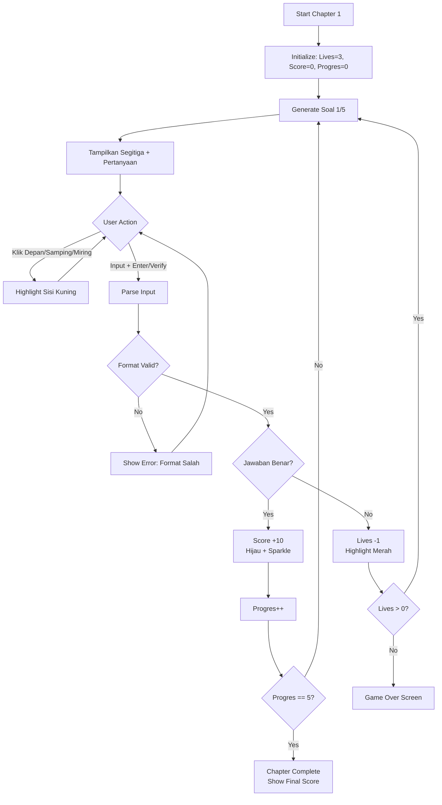

# Chapter 1: Mode Observasi Segitiga - Dokumentasi Skripsi
## Implementasi Game Edukasi Trigonometri

---

## 📋 Ringkasan Implementasi

Chapter 1 "Mode Observasi Segitiga (Latihan Dasar Teodolit)" telah diimplementasikan dengan fokus pada pemahaman dasar trigonometri: **Sin = Depan/Miring**, **Cos = Samping/Miring**, dan **Tan = Depan/Samping**.

---

## 🎮 A. Konsep dan Tujuan Pedagogis

### Tujuan Pembelajaran:
1. **Kognitif:** Memahami definisi rasio trigonometri (Sin, Cos, Tan)
2. **Prosedural:** Mengidentifikasi sisi segitiga relatif terhadap sudut
3. **Aplikatif:** Menghitung rasio dengan akurat

### Konteks Naratif:
> Rizqi (Pemain) menjalani **Tes Orientasi Pengukuran Dasar** di Pangkalan Militer, menggunakan **Teodolit Virtual** untuk menghitung rasio trigonometri pada objek statis (Menara Kontrol).

### Mekanisme Pedagogis:
- ✅ **Visualisasi Dinamis:** Segitiga siku-siku dengan label numerik
- ✅ **Instant Feedback:** Highlight sisi yang salah (merah)
- ✅ **Guided Practice:** Tombol interaktif untuk identifikasi sisi
- ✅ **Formative Assessment:** 5 soal dengan tracking lives & score

---

## 🖼️ B. Perancangan Antarmuka Pengguna (UI/UX)

### 1. Layout Hierarki

```
┌─────────────────────────────────────────────┐
│  CHAPTER 1: LATIHAN DASAR TEODOLIT          │
│  Soal: 1/5           ♥ ♥ ♥                  │
├─────────────────────────────────────────────┤
│                                             │
│        📐 Visualisasi Segitiga               │
│           (World Space)                     │
│                                             │
│         3 ├─┐                               │
│           │ │ 5                             │
│           └─┤                               │
│             4                               │
│                                             │
├─────────────────────────────────────────────┤
│  Berapakah nilai Sinθ?                      │
│  ┌─────────────────────────────┐            │
│  │ Masukkan jawaban (0.6/3/5) │            │
│  └─────────────────────────────┘            │
│        [  VERIFIKASI  ]                     │
│                                             │
│  [ DEPAN ] [ SAMPING ] [ MIRING ]          │
│                                             │
├─────────────────────────────────────────────┤
│  ✓ PENGUKURAN TEPAT! +10 Poin              │
└─────────────────────────────────────────────┘
```

### 2. Elemen UI Detail

| Elemen | Spesifikasi | Fungsi |
|--------|-------------|--------|
| **Header Status** | Strip atas, font 36px | Judul chapter, progress (1/5), lives (3♥) |
| **Visualisasi Segitiga** | World Space, center | Segitiga siku-siku dengan label panjang sisi |
| **Area Interaktif** | 3 tombol biru | Highlight sisi (kuning) saat diklik |
| **Panel Pertanyaan** | Yellow text, 32px | Teks soal dinamis (Sin/Cos/Tan) |
| **Input Field** | TMP_InputField, 400x60 | Terima desimal (0.6) atau pecahan (3/5) |
| **Tombol Verifikasi** | Green button, 300x70 | Submit jawaban, trigger validasi |
| **Feedback Panel** | Bottom, semi-transparent | Pesan benar (hijau) / salah (merah) |

### 3. Color Scheme

```
Primary Colors:
- Background: Dark Blue (#1A2332)
- UI Panel: Semi-transparent Black (#000000AA)
- Text: White (#FFFFFF)

Highlight Colors:
- Default: White (#FFFFFF)
- Interactive: Yellow (#FFFF00)
- Correct: Green (#00FF00)
- Wrong: Red (#FF0000)

Button Colors:
- Primary Action: Green (#00AA00)
- Secondary Action: Blue (#0099FF)
```

---

## ⚙️ C. Implementasi Mekanisme Game

### 1. Arsitektur Sistem

```
┌─────────────────────────────────────────┐
│       CalculationManager                │
│  (Game Logic Controller)                │
│  - Lives management                     │
│  - Score tracking                       │
│  - Answer validation                    │
└────────┬────────────────────┬───────────┘
         │                    │
         ▼                    ▼
┌─────────────────┐  ┌─────────────────┐
│TriangleData     │  │UIManagerChapter1│
│Generator        │  │ (View Controller)│
│- Random triples │  │- UI updates     │
│- Calculate ratio│  │- Animations     │
└─────────────────┘  └─────────────────┘
```

### 2. Komponen Utama

#### A. **TriangleDataGenerator.cs**
**Fungsi:** Menghasilkan soal acak dengan Pythagorean Triples

```csharp
// Pythagorean Triples yang digunakan:
(3, 4, 5)
(5, 12, 13)
(8, 15, 17)
(7, 24, 25)

// Output:
- Depan, Samping, Miring (int)
- SoalDisederhanakan (string): "Sinθ", "Cosθ", "Tanθ"
- JawabanBenar (float): Rasio yang benar
```

**Algoritma:**
1. Pilih random triple dari list
2. Random assignment (Depan bisa jadi a atau b)
3. Pilih random operation (0=Sin, 1=Cos, 2=Tan)
4. Hitung jawaban benar (float division)

#### B. **CalculationManager.cs**
**Fungsi:** Mengelola flow game, validasi jawaban, tracking state

**State Variables:**
- `lives` (int): 3 nyawa awal
- `progres` (int): Counter soal (1-5)
- `score` (int): Akumulasi poin (max 50)
- `dataSoalSaatIni` (TriangleData): Data soal aktif

**Key Methods:**
- `StartNewRound()`: Generate soal baru, update UI
- `VerifyAnswer()`: Parse input, validasi dengan tolerance
- `HandleWrongAnswer()`: Kurangi lives, highlight sisi
- `EndChapter()`: Trigger cutscene selesai

**Validasi Input:**
```csharp
// Support 2 format:
1. Desimal: 0.6, 0.8, 0.75
2. Pecahan: 3/5, 4/5, 3/4

// Tolerance: ±0.01 (untuk floating point error)
Mathf.Abs(playerAnswer - correctAnswer) <= 0.01f
```

#### C. **UIManagerChapter1.cs**
**Fungsi:** Mengelola tampilan UI, animasi, feedback visual

**Key Methods:**
- `SetupNewQuestion()`: Update teks, label, reset colors
- `HighlightSide()`: Kuning untuk tombol interaktif
- `HighlightCorrectAnswer()`: Hijau + sparkle untuk benar
- `HighlightWrongAnswer()`: Merah untuk sisi yang seharusnya
- `UpdateLives()`: Show/hide heart icons

#### D. **InputFieldHandler.cs**
**Fungsi:** Auto-focus input field, submit dengan Enter key

**Fitur:**
- OnEndEdit listener untuk Enter key
- Auto-focus saat soal baru
- Prevent unfocus (user tidak perlu klik input field)

---

## 🔄 D. Alur Bermain (User Flow)

### Flowchart Detail



### Tabel Langkah User

| # | Aksi Pemain | Respons Sistem | Umpan Balik |
|---|-------------|----------------|-------------|
| 1 | Game dimulai | Generate soal 1/5 | Tampil segitiga + pertanyaan |
| 2 | Klik "DEPAN" | Highlight sisi Depan kuning | Konfirmasi visual |
| 3 | Input "0.6" + Enter | Validasi jawaban | - |
| 4a | Jawaban BENAR | Score +10, segitiga hijau, sparkle | "PENGUKURAN TEPAT! +10 Poin" |
| 4b | Jawaban SALAH | Lives -1, sisi benar merah | "SALAH! Perhatikan: Sinθ = 3/5 = 0.6" |
| 5 | 5 soal selesai | Show end cutscene | Badge + final score |

---

## 📊 E. Data & Analytics

### Metrics yang Di-track:
1. **Score:** Total poin (0-50)
2. **Lives Remaining:** Nyawa tersisa (0-3)
3. **Accuracy Rate:** % jawaban benar
4. **Time per Question:** Rata-rata waktu (opsional)

### Performance Grading:
| Score | Badge | Keterangan |
|-------|-------|------------|
| 45-50 | 🥇 Emas | Luar Biasa (90-100%) |
| 35-44 | 🥈 Perak | Bagus (70-89%) |
| 25-34 | 🥉 Perunggu | Cukup (50-69%) |
| 0-24 | ❌ Gagal | Perlu Belajar Lagi (<50%) |

---

## 🧪 F. Testing & Validasi

### Test Cases Fungsional:

| ID | Test Case | Expected Result | Status |
|----|-----------|-----------------|--------|
| TC01 | Soal baru muncul dengan triple valid | Segitiga dengan rasio Pythagoras | ✅ |
| TC02 | Input desimal "0.6" untuk Sin(3,4,5) | Jawaban diterima, score +10 | ✅ |
| TC03 | Input pecahan "3/5" untuk Sin(3,4,5) | Jawaban diterima, score +10 | ✅ |
| TC04 | Input salah "0.5" untuk Sin(3,4,5) | Lives -1, highlight merah | ✅ |
| TC05 | Lives habis (0) | Show Game Over screen | ✅ |
| TC06 | 5 soal selesai | Show End Cutscene + badge | ✅ |
| TC07 | Klik "DEPAN" | Sisi Depan highlight kuning | ✅ |
| TC08 | Press Enter di input field | Submit jawaban | ✅ |

### Usability Testing (Opsional):
- [ ] 5-10 user testing sessions
- [ ] Measure: Time to complete, error rate, user satisfaction
- [ ] Iterate based on feedback

---

## 📁 G. Struktur File untuk Dokumentasi Skripsi

### Bab 4: Perancangan dan Implementasi

```
4.1 Perancangan Sistem
    4.1.1 Arsitektur Game (Diagram)
    4.1.2 Use Case Diagram
    4.1.3 Activity Diagram

4.2 Perancangan UI/UX
    4.2.1 Wireframe & Mockup (Screenshot)
    4.2.2 Color Scheme & Typography
    4.2.3 User Flow Diagram

4.3 Implementasi Chapter 1
    4.3.1 TriangleDataGenerator (Code + Penjelasan)
    4.3.2 CalculationManager (Code + Penjelasan)
    4.3.3 UIManagerChapter1 (Code + Penjelasan)
    4.3.4 Integrasi Komponen

4.4 Mekanisme Pedagogis
    4.4.1 Scaffolding: Tombol Interaktif
    4.4.2 Immediate Feedback: Highlight System
    4.4.3 Formative Assessment: Lives & Score

4.5 Testing & Evaluasi
    4.5.1 Functional Testing (Test Cases)
    4.5.2 Usability Testing (User Feedback)
    4.5.3 Bug Fixes & Iterations
```

### Screenshot yang Dibutuhkan:
1. ✅ UI Layout (full screen)
2. ✅ Visualisasi Segitiga dengan label
3. ✅ Highlight kuning (tombol interaktif)
4. ✅ Highlight hijau + sparkle (jawaban benar)
5. ✅ Highlight merah (jawaban salah)
6. ✅ End Cutscene dengan badge
7. ✅ Game Over screen

---

## 🎯 H. Poin Penting untuk Skripsi

### Kontribusi/Novelty:
1. **Visualisasi Interaktif:** Tombol untuk identifikasi sisi (scaffolding)
2. **Dual Format Input:** Support desimal & pecahan (accessible)
3. **Instant Feedback Visual:** Color-coded highlighting
4. **Gamification:** Lives, score, badges untuk motivasi

### Justifikasi Desain:
- **Pythagorean Triples:** Menghasilkan bilangan bulat → mudah dihitung
- **3 Lives:** Balance antara challenge & frustration
- **5 Soal:** Cukup untuk mastery, tidak terlalu panjang
- **Tolerance 0.01:** Akomodasi floating point error

### Referensi Teori:
- **Gagne's 9 Events of Instruction:** Feedback, practice
- **Bloom's Taxonomy:** Remember (rasio), Apply (hitung)
- **Scaffolding Theory:** Guided practice dengan tombol

---

## 📝 I. Kesimpulan Chapter 1

Chapter 1 berhasil diimplementasikan dengan fitur:
- ✅ 5 soal random dengan Pythagorean Triples
- ✅ Visualisasi segitiga dinamis
- ✅ Tombol interaktif untuk scaffolding
- ✅ Validasi input (desimal & pecahan)
- ✅ Instant feedback (color-coded)
- ✅ Lives & scoring system
- ✅ End cutscene dengan badge

**Selanjutnya:** Chapter 2 (Uji Coba Meriam - Trajectory Calculation)

---

## 📚 Appendix: Code Snippets

### Snippet 1: Answer Validation
```csharp
// Support decimal and fraction input
if (input.Contains("/")) {
    string[] parts = input.Split('/');
    playerAnswer = float.Parse(parts[0]) / float.Parse(parts[1]);
} else {
    playerAnswer = float.Parse(input);
}

// Validate with tolerance
if (Mathf.Abs(playerAnswer - correctAnswer) <= 0.01f) {
    // Correct!
}
```

### Snippet 2: Pythagorean Triple Generator
```csharp
List<(int, int, int)> triples = new List<(int, int, int)> {
    (3, 4, 5), (5, 12, 13), (8, 15, 17), (7, 24, 25)
};

var triple = triples[Random.Range(0, triples.Count)];
// Assign to Depan, Samping, Miring
```

---

**Dokumen dibuat untuk keperluan skripsi**
**Trigosolver - Game Edukasi Trigonometri Berbasis Unity**
