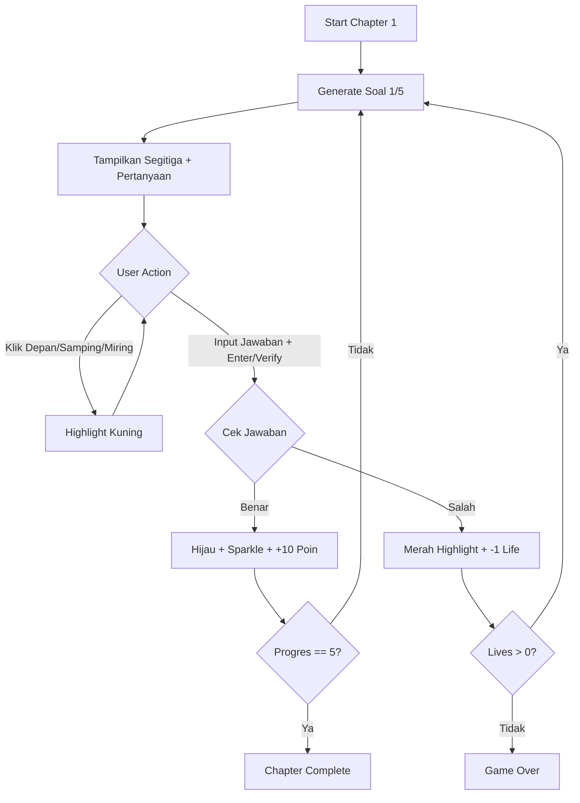

# Panduan Setup Chapter 1: Mode Observasi Segitiga
## Latihan Dasar Teodolit - Trigosolver

---

## 📋 Daftar Isi
1. [Struktur Hierarki Scene](#struktur-hierarki-scene)
2. [Setup UI Canvas](#setup-ui-canvas)
3. [Setup Visualisasi Segitiga (World Space)](#setup-visualisasi-segitiga)
4. [Konfigurasi Scripts](#konfigurasi-scripts)
5. [Testing & Debugging](#testing--debugging)

---

## 🎮 1. Struktur Hierarki Scene

Buat hierarki GameObject seperti berikut di Scene Chapter 1:

```
Chapter1_Scene
├── Canvas (UI)
│   ├── Header Panel
│   │   ├── Judul Text (TMP)
│   │   ├── Progress Text (TMP)
│   │   └── Lives Panel
│   │       ├── Heart_1 (Image)
│   │       ├── Heart_2 (Image)
│   │       └── Heart_3 (Image)
│   ├── Question Panel
│   │   ├── Question Text (TMP)
│   │   ├── Input Field (TMP_InputField)
│   │   └── Verify Button
│   ├── Interactive Buttons Panel
│   │   ├── Button_Depan
│   │   ├── Button_Samping
│   │   └── Button_Miring
│   └── Feedback Panel
│       └── Feedback Text (TMP)
│
├── TriangleVisualization (World Space)
│   ├── Triangle_Depan (Sprite)
│   │   └── Label_Depan (TextMeshPro - World Space)
│   ├── Triangle_Samping (Sprite)
│   │   └── Label_Samping (TextMeshPro - World Space)
│   ├── Triangle_Miring (Sprite)
│   │   └── Label_Miring (TextMeshPro - World Space)
│   ├── Angle_Indicator (Sprite - Arc)
│   └── SparkleEffect (Particle System)
│
├── GameManager (Empty GameObject)
│   ├── CalculationManager (Script)
│   ├── TriangleDataGenerator (Script)
│   └── InputFieldHandler (Script)
│
└── Main Camera
```

---

## 🖼️ 2. Setup UI Canvas

### A. Canvas Settings
1. **Canvas Component:**
   - Render Mode: `Screen Space - Overlay`
   - UI Scale Mode: `Scale With Screen Size`
   - Reference Resolution: `1920 x 1080`

### B. Header Panel (Top)
Position: Anchor Top-Center
- **Judul Text (TextMeshProUGUI):**
  - Text: "Chapter 1: Latihan Dasar Teodolit"
  - Font Size: 42
  - Alignment: Center
  - Color: White

- **Progress Text (TextMeshProUGUI):**
  - Text: "Soal: 1/5"
  - Font Size: 28
  - Alignment: Center

- **Lives Panel:**
  - Layout: Horizontal Layout Group
  - Spacing: 10
  - **Heart Icons (Image x3):**
    - Sprite: Heart Icon (Red)
    - Size: 50x50
    - Tag masing-masing: Heart_1, Heart_2, Heart_3

### C. Question Panel (Center)
- **Question Text (TextMeshProUGUI):**
  - Text: "Berapakah nilai Sinθ?"
  - Font Size: 36
  - Alignment: Center
  - Color: Yellow

- **Input Field (TMP_InputField):**
  - Width: 400
  - Height: 60
  - Placeholder: "Masukkan jawaban (misal: 0.6 atau 3/5)"
  - Font Size: 32
  - Content Type: Standard (untuk support pecahan)

- **Verify Button:**
  - Text: "VERIFIKASI"
  - Size: 300x70
  - Color: Green (#00FF00)
  - OnClick: `CalculationManager.VerifyAnswer()`

### D. Interactive Buttons Panel
Layout: Horizontal Layout Group
- **Button_Depan:**
  - Text: "DEPAN"
  - OnClick: `UIManagerChapter1.OnDepanButtonClicked()`
  
- **Button_Samping:**
  - Text: "SAMPING"
  - OnClick: `UIManagerChapter1.OnSampingButtonClicked()`
  
- **Button_Miring:**
  - Text: "MIRING"
  - OnClick: `UIManagerChapter1.OnMiringButtonClicked()`

### E. Feedback Panel (Bottom)
- Initially: SetActive = false
- Background: Semi-transparent black (Color: #000000AA)
- **Feedback Text (TextMeshProUGUI):**
  - Font Size: 28
  - Alignment: Center
  - Color: White (akan berubah saat runtime)

---

## 🔺 3. Setup Visualisasi Segitiga (World Space)

### A. Triangle Sprites
Buat 3 GameObject dengan SpriteRenderer untuk sisi segitiga:

1. **Triangle_Depan (Vertical Line - Sisi Depan):**
   - SpriteRenderer:
     - Sprite: Line Sprite (atau buat sendiri)
     - Color: White
     - Sorting Layer: Triangle
     - Order in Layer: 0
   - Transform:
     - Position: (0, 0, 0)
     - Scale: Sesuaikan dengan ukuran visual

2. **Triangle_Samping (Horizontal Line - Sisi Samping):**
   - Similar dengan Depan
   - Rotation disesuaikan

3. **Triangle_Miring (Diagonal Line - Sisi Miring):**
   - Similar dengan Depan
   - Rotation disesuaikan untuk hypotenuse

### B. World Space Labels
Untuk setiap sisi, tambahkan child GameObject dengan TextMeshPro (World Space):

- **Label_Depan:**
  - TextMeshPro Component:
    - Font Size: 5
    - Alignment: Center
    - Color: White
  - Position: Di tengah sisi Depan

- **Label_Samping:**
  - Similar dengan Label_Depan
  - Position: Di tengah sisi Samping

- **Label_Miring:**
  - Similar dengan Label_Depan
  - Position: Di tengah sisi Miring

### C. Angle Indicator
- Sprite: Arc/Curve untuk menunjukkan sudut θ
- Position: Di vertex sudut
- Color: Yellow

### D. Sparkle Effect (Particle System)
- **Particle System Settings:**
  - Start Lifetime: 0.5-1.0
  - Start Speed: 1-3
  - Start Size: 0.1-0.3
  - Start Color: Yellow to White gradient
  - Emission: Burst (10-20 particles)
  - Shape: Sphere
  - Renderer: Sprite (Star atau Sparkle)
  - Play On Awake: `false` (dikontrol via script)

---

## ⚙️ 4. Konfigurasi Scripts

### A. GameManager GameObject
Attach 3 scripts ke GameObject kosong bernama "GameManager":

#### **CalculationManager Component:**
```
UI Manager: [Drag UIManagerChapter1 component]
Data Generator: [Drag TriangleDataGenerator component]
Answer Tolerance: 0.01
```

#### **TriangleDataGenerator Component:**
- No configuration needed (menggunakan default Pythagorean Triples)

#### **InputFieldHandler Component:**
```
Input Field: [Drag Input Field TMP dari Canvas]
Calculation Manager: [Drag CalculationManager component]
```

### B. UIManagerChapter1 Component
Attach ke Canvas atau GameObject terpisah:

#### **Header Status:**
```
Judul Text: [Drag Judul Text TMP]
Progres Text: [Drag Progress Text TMP]
Lives Icons: [Drag 3 Heart Images dalam array]
```

#### **Interaksi & Pertanyaan:**
```
Pertanyaan Text: [Drag Question Text TMP]
Jawaban Input: [Drag Input Field TMP]
```

#### **Umpan Balik:**
```
Feedback Panel: [Drag Feedback Panel GameObject]
Feedback Text: [Drag Feedback Text TMP]
```

#### **Visualisasi Segitiga:**
```
Depan Label_World: [Drag Label_Depan TextMeshPro]
Samping Label_World: [Drag Label_Samping TextMeshPro]
Miring Label_World: [Drag Label_Miring TextMeshPro]
Depan Sprite: [Drag Triangle_Depan SpriteRenderer]
Samping Sprite: [Drag Triangle_Samping SpriteRenderer]
Miring Sprite: [Drag Triangle_Miring SpriteRenderer]
```

#### **Warna Highlight:**
```
Default Color: White (#FFFFFF)
Highlight Kuning: Yellow (#FFFF00)
Highlight Merah: Red (#FF0000)
Highlight Hijau: Green (#00FF00)
```

#### **Efek Visual:**
```
Sparkle Effect: [Drag SparkleEffect Particle System]
Highlight Duration: 1.5
```

---

## 🧪 5. Testing & Debugging

### Checklist Testing:
- [ ] Soal baru muncul dengan nilai segitiga yang benar
- [ ] Tombol Depan/Samping/Miring highlight sisi yang tepat (kuning)
- [ ] Input field bisa menerima angka desimal (0.6)
- [ ] Input field bisa menerima pecahan (3/5)
- [ ] Tekan Enter langsung submit jawaban
- [ ] Jawaban benar: Segitiga hijau + sparkle + feedback positif
- [ ] Jawaban salah: Sisi yang benar highlight merah + lives berkurang
- [ ] Lives habis (0): Game Over message
- [ ] 5 soal selesai: Chapter complete message dengan total score
- [ ] Progress text update (1/5, 2/5, dst.)

### Debug Tips:
1. Gunakan `Debug.Log()` di `CalculationManager.VerifyAnswer()` untuk cek nilai jawaban
2. Cek Console untuk error NullReferenceException (biasanya dari referensi yang belum di-drag)
3. Pastikan semua TMP_InputField sudah di-import (Window > TextMeshPro > Import TMP Essential Resources)

---

## 📊 Alur Gameplay Chapter 1



---

## 🎯 Tips Implementasi untuk Skripsi

### Bab 4: Perancangan dan Implementasi
Gunakan struktur ini untuk dokumentasi:

1. **Perancangan UI/UX:**
   - Screenshot mock-up UI
   - Penjelasan setiap elemen UI
   - Color scheme & typography

2. **Implementasi Mekanisme Game:**
   - Flowchart alur gameplay
   - Pseudocode untuk algoritma kunci
   - Code snippet dengan penjelasan

3. **Integrasi Konten Pedagogis:**
   - Mapping soal ke kompetensi trigonometri
   - Sistem feedback yang mendukung learning

4. **Testing & Iterasi:**
   - Hasil playtesting
   - Bug fixes & improvements

---

## 📝 Catatan Penting

- **Pythagorean Triples yang digunakan:**
  - (3, 4, 5)
  - (5, 12, 13)
  - (8, 15, 17)
  - (7, 24, 25)

- **Format Jawaban yang Diterima:**
  - Desimal: 0.6, 0.8, 0.75
  - Pecahan: 3/5, 4/5, 3/4
  - Toleransi: ±0.01

- **Scoring System:**
  - Jawaban Benar: +10 poin
  - Total Maksimal Chapter 1: 50 poin (5 soal)

---

**Selamat mengimplementasikan Chapter 1! 🎮📐**
