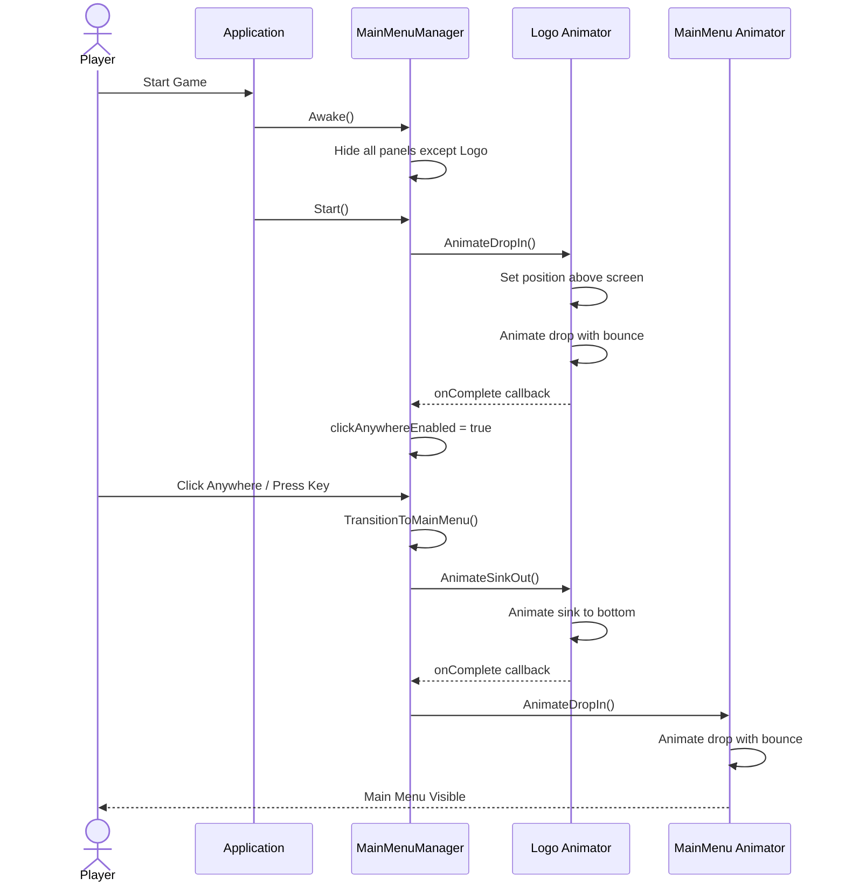
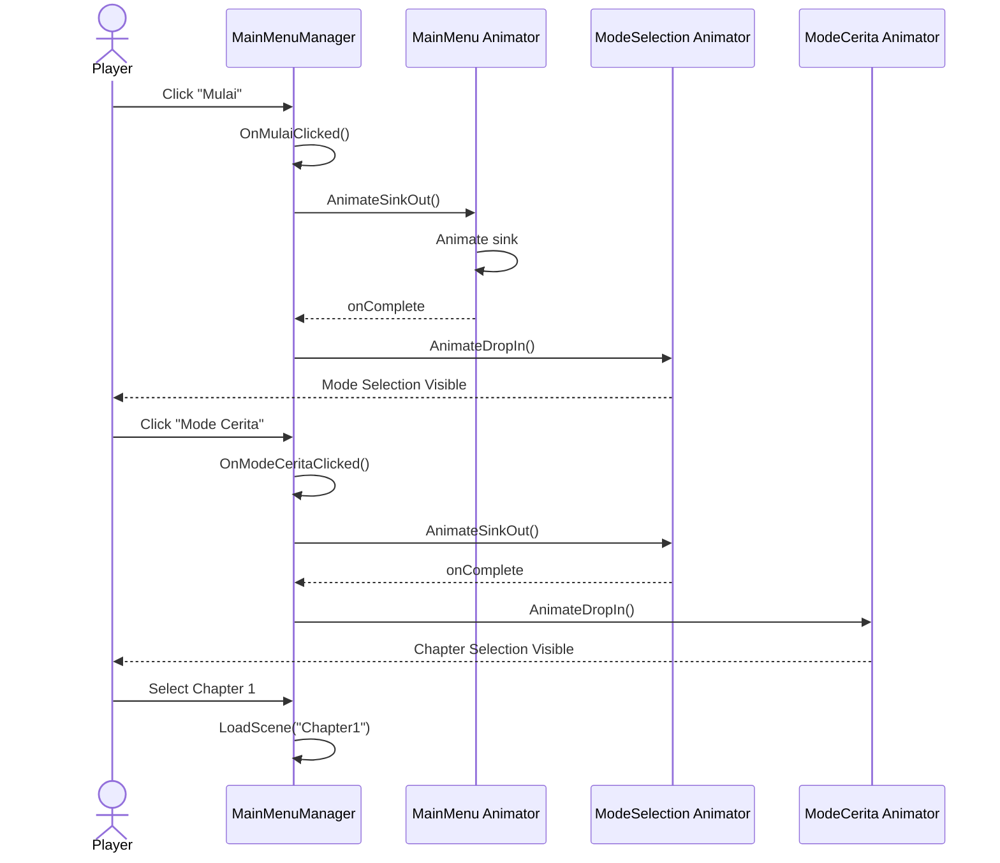
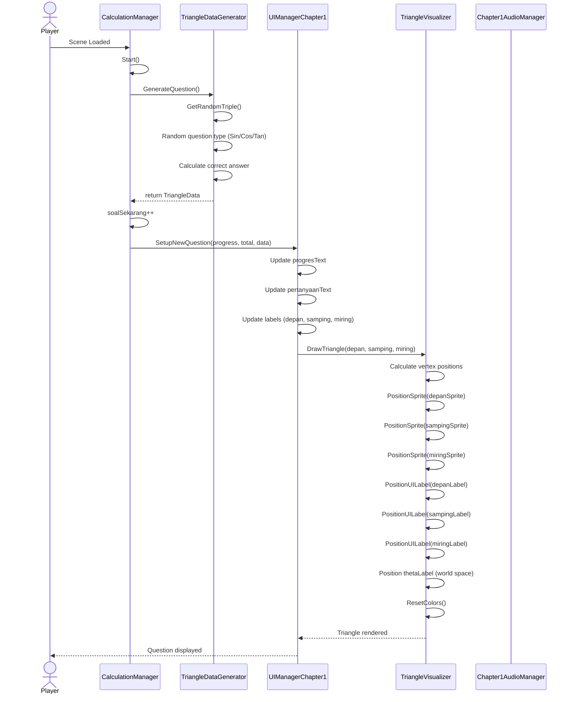
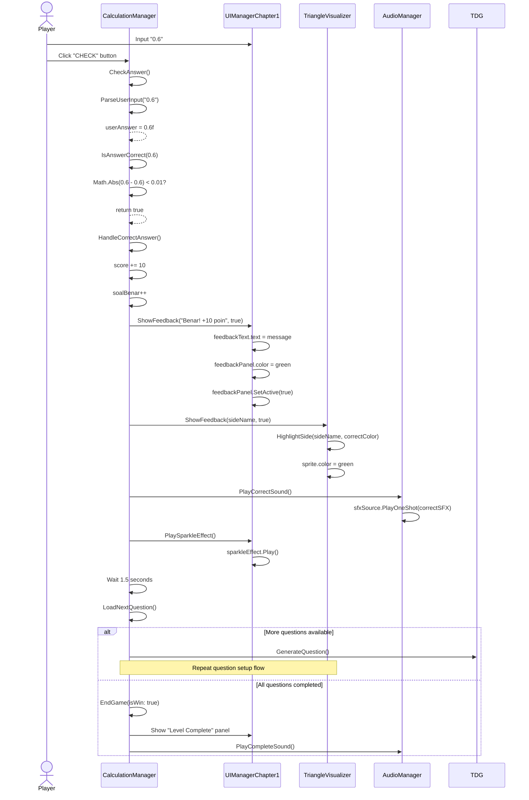
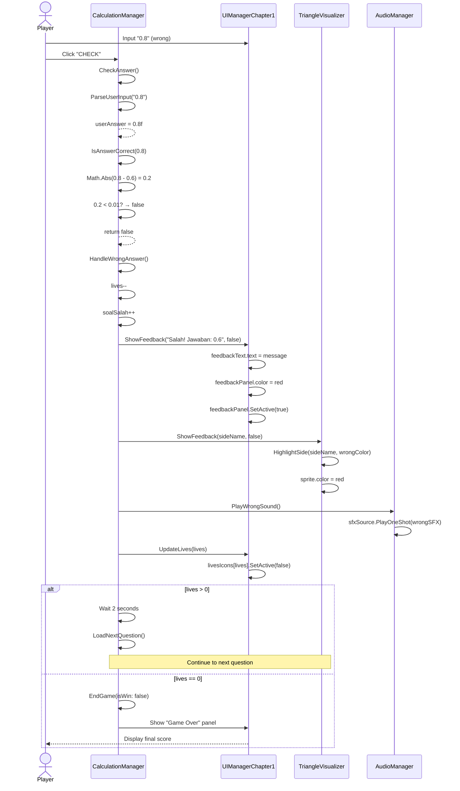
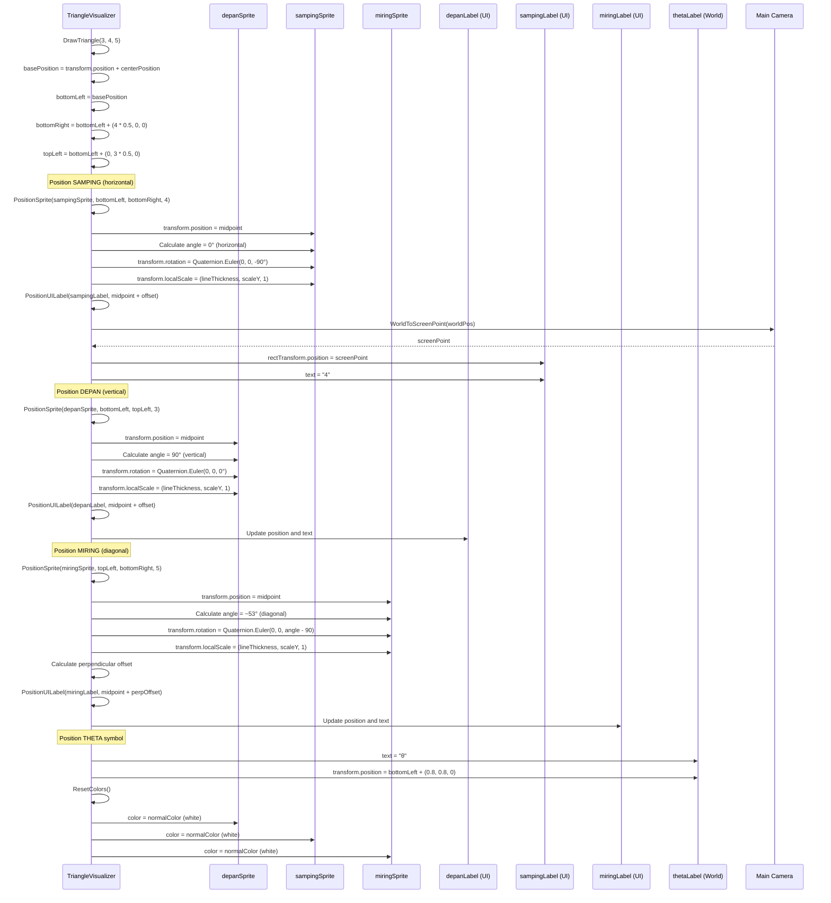
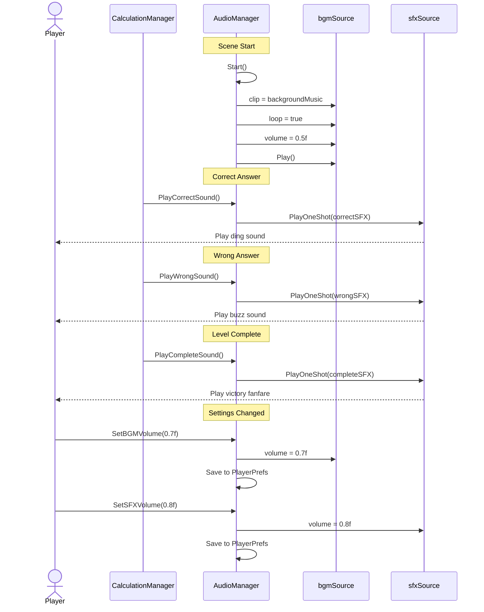
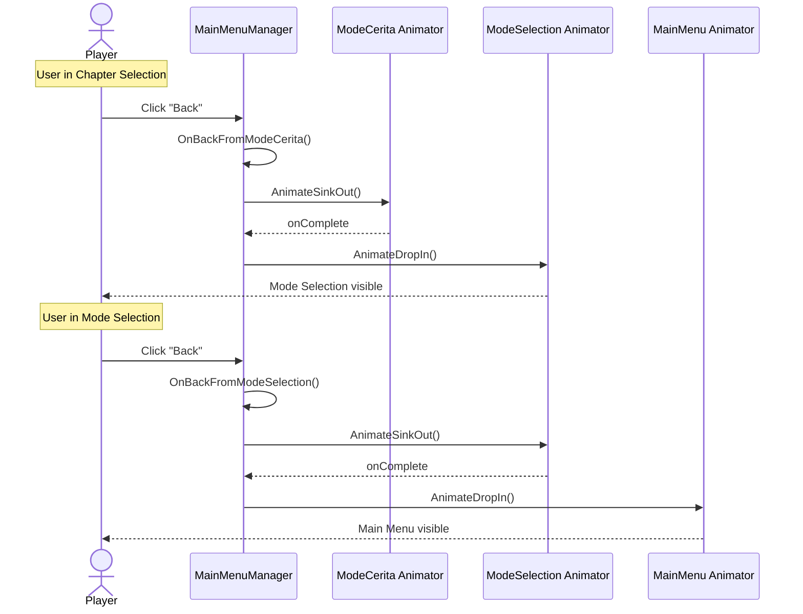
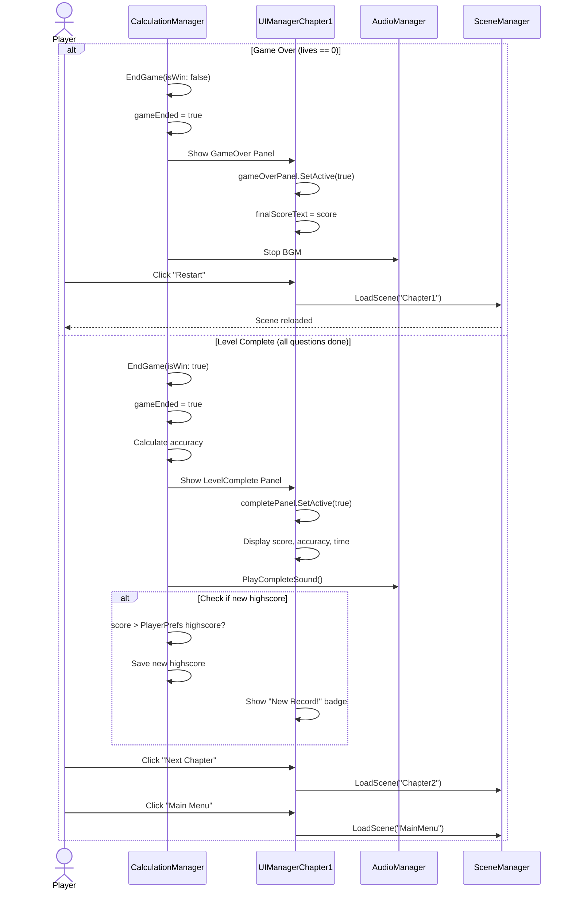
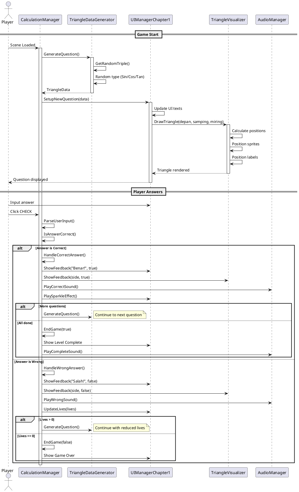

# Sequence Diagram - Trigosolver Game

## 1. Main Menu Flow

### Logo to Main Menu Transition



### Main Menu to Chapter Selection



---

## 2. Gameplay Flow - Start New Question



---

## 3. Correct Answer Flow



---

## 4. Wrong Answer Flow



---

## 5. Triangle Visualization Detail



---

## 6. Audio System Flow



---

## 7. Back Navigation Flow



---

## 8. Game Over / Level Complete Flow



---

## PlantUML Version - Main Gameplay Flow



---

## Timing Diagram - Animation Sequence

```mermaid
gantt
    title Menu Animation Timeline
    dateFormat X
    axisFormat %Ls
    
    section Logo
    Drop Animation (0.8s)     :a1, 0, 800ms
    Bounce Effect            :a2, 600ms, 200ms
    Click Wait               :a3, 800ms, 2000ms
    
    section Transition
    Logo Sink (0.6s)         :b1, 2800ms, 600ms
    
    section Main Menu
    Drop Animation (0.8s)    :c1, 3400ms, 800ms
    Bounce Effect            :c2, 4000ms, 200ms
    User Interaction         :c3, 4200ms, 3000ms
```

---

## State Transition Summary

```
[App Start] 
    → [Logo Animation] 
    → [Click Anywhere] 
    → [Main Menu] 
    → [Mode Selection] 
    → [Chapter Selection] 
    → [Gameplay]
    
[Gameplay Loop]
    → [Generate Question]
    → [Display Triangle]
    → [Wait Input]
    → [Validate Answer]
    → [Feedback]
    → Back to Generate Question (if not done)
    
[Game End]
    → [Level Complete / Game Over]
    → [Show Stats]
    → [Return to Menu / Next Level]
```

---

## Key Interaction Points

1. **Player → MainMenuManager**: Button clicks untuk navigasi menu
2. **CalculationManager → UIManagerChapter1**: Update semua UI elements
3. **UIManagerChapter1 → TriangleVisualizer**: Request render segitiga
4. **TriangleVisualizer → Sprites/Labels**: Direct manipulation visual elements
5. **CalculationManager → AudioManager**: Trigger sound effects
6. **TriangleDataGenerator → TriangleData**: Create question data objects

---

**Generated**: December 18, 2025  
**Diagrams**: 8 detailed sequence flows  
**Format**: Mermaid + PlantUML  
**Coverage**: Menu navigation, gameplay loop, visual rendering, audio system
