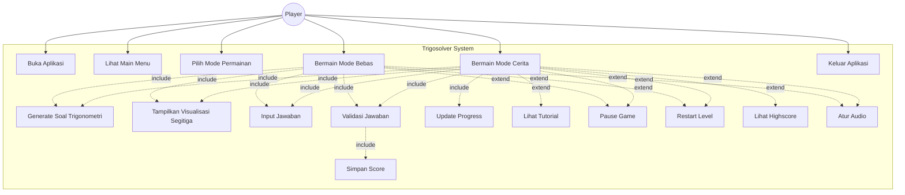
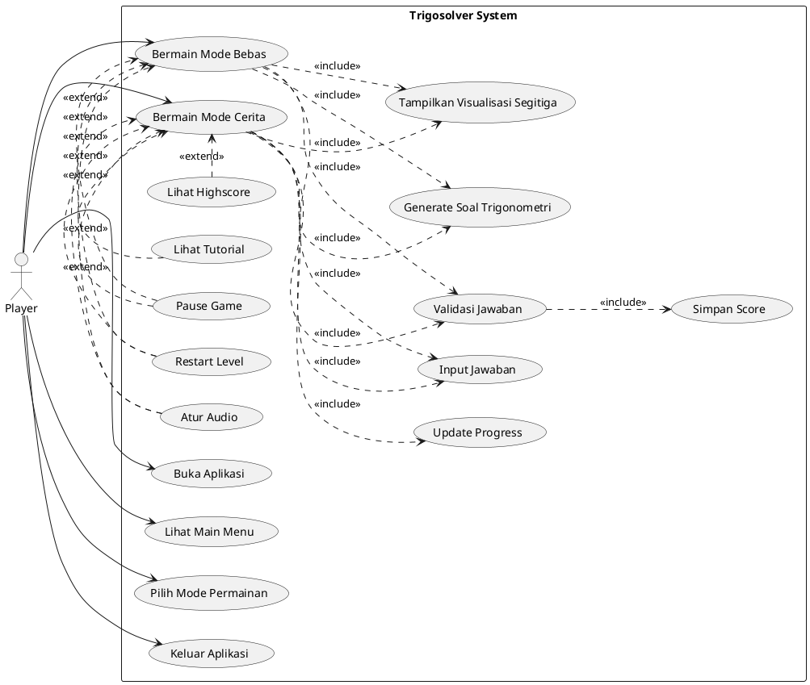

# Use Case Diagram - Trigosolver Game

## Diagram (Mermaid Format)

---

## Use Case Descriptions

### 📋 Base Use Cases

#### UC1: Buka Aplikasi
- **Actor**: Player
- **Description**: Player membuka aplikasi Trigosolver dan melihat logo dengan animasi drop
- **Flow**: 
  1. Aplikasi dimulai
  2. Logo Trigosolver muncul dengan animasi jatuh dari atas
  3. Logo memantul di tengah layar
  4. Sistem menunggu input "click anywhere"

#### UC2: Lihat Main Menu
- **Actor**: Player
- **Description**: Player melihat menu utama dengan opsi Mulai dan Keluar
- **Precondition**: Logo animation selesai dan player klik anywhere
- **Flow**:
  1. Logo tenggelam ke bawah
  2. Main Menu muncul dengan animasi drop
  3. Tampilkan tombol "Mulai" dan "Keluar"

#### UC3: Pilih Mode Permainan
- **Actor**: Player
- **Description**: Player memilih mode cerita atau mode bebas
- **Precondition**: Player klik "Mulai" di main menu
- **Flow**:
  1. Main Menu tenggelam
  2. Mode Selection panel muncul
  3. Tampilkan pilihan "Mode Cerita" dan "Mode Bebas"
  4. Player memilih salah satu mode

#### UC4: Bermain Mode Cerita
- **Actor**: Player
- **Description**: Player bermain game dengan sistem chapter terstruktur
- **Precondition**: Player memilih "Mode Cerita" dan memilih chapter
- **Flow**:
  1. Load scene chapter yang dipilih
  2. Tampilkan tutorial dasar (extend)
  3. Generate soal trigonometri (include)
  4. Tampilkan visualisasi segitiga (include)
  5. Player input jawaban (include)
  6. Validasi jawaban (include)
  7. Update progress dan lives (include)
  8. Ulangi langkah 2-7 hingga selesai atau game over
- **Include**: UC7, UC8, UC9, UC10, UC11
- **Extend**: UC13, UC14, UC15, UC16, UC17

#### UC5: Bermain Mode Bebas
- **Actor**: Player
- **Description**: Player berlatih tanpa batasan nyawa atau chapter
- **Precondition**: Player memilih "Mode Bebas"
- **Flow**:
  1. Load scene mode bebas
  2. Generate soal random (include)
  3. Tampilkan visualisasi (include)
  4. Player input jawaban (include)
  5. Validasi jawaban (include)
  6. Ulangi tanpa batasan
- **Include**: UC7, UC8, UC9, UC10
- **Extend**: UC14, UC15, UC17

#### UC6: Keluar Aplikasi
- **Actor**: Player
- **Description**: Player keluar dari aplikasi
- **Flow**: Application.Quit()

---

### 🔗 Include Use Cases

#### UC7: Generate Soal Trigonometri
- **Description**: Sistem generate soal Sin θ, Cos θ, atau Tan θ secara random
- **Flow**:
  1. Pilih Pythagorean triple random: (3,4,5), (5,12,13), (8,15,17), (7,24,25)
  2. Assign nilai Depan, Samping, Miring
  3. Random pilih tipe soal (0=Sin, 1=Cos, 2=Tan)
  4. Hitung jawaban benar
  5. Return TriangleData

#### UC8: Tampilkan Visualisasi Segitiga
- **Description**: Render segitiga siku-siku dengan 3 sprite dan label
- **Flow**:
  1. Hitung posisi 3 vertex segitiga
  2. Position dan scale sprite untuk sisi Depan, Samping, Miring
  3. Tampilkan label angka untuk setiap sisi
  4. Tampilkan simbol θ di sudut siku-siku

#### UC9: Input Jawaban
- **Description**: Player mengetik jawaban di input field
- **Flow**:
  1. Aktifkan TMP_InputField
  2. Player ketik jawaban (format desimal atau pecahan)
  3. Player klik tombol "Check" atau tekan Enter

#### UC10: Validasi Jawaban
- **Description**: Sistem validasi jawaban player dengan toleransi error
- **Flow**:
  1. Parse input player menjadi float
  2. Hitung selisih dengan jawaban benar
  3. Jika selisih < 0.01 → Benar
  4. Jika tidak → Salah
  5. Update feedback panel
  6. Highlight sisi segitiga (hijau/merah)
  7. Play sound effect
- **Include**: UC12 (jika benar)

#### UC11: Update Progress
- **Description**: Update progres soal dan lives player
- **Flow**:
  1. Update text "Soal: X/Y"
  2. Jika salah: kurangi 1 lives, update heart icons
  3. Jika lives = 0: Game Over
  4. Jika soal selesai semua: Level Complete

#### UC12: Simpan Score
- **Description**: Simpan score player untuk leaderboard
- **Flow**:
  1. Hitung total score (benar × 10)
  2. Simpan ke PlayerPrefs atau database
  3. Update highscore jika lebih tinggi

---

### ⚡ Extend Use Cases

#### UC13: Lihat Tutorial
- **Description**: Player melihat tutorial cara bermain (opsional di awal chapter)
- **Trigger**: Chapter baru pertama kali dimainkan
- **Flow**:
  1. Tampilkan popup tutorial
  2. Jelaskan konsep Sin, Cos, Tan
  3. Contoh soal
  4. Player klik "Mengerti"

#### UC14: Pause Game
- **Description**: Player pause game sementara
- **Trigger**: Player klik tombol pause atau ESC
- **Flow**:
  1. Time.timeScale = 0
  2. Tampilkan pause menu
  3. Opsi: Resume, Restart, Main Menu

#### UC15: Restart Level
- **Description**: Player restart level dari awal
- **Trigger**: Player klik "Restart" di pause menu atau game over
- **Flow**:
  1. Reset lives ke 3
  2. Reset progress ke 0
  3. Generate soal baru
  4. Reload scene

#### UC16: Lihat Highscore
- **Description**: Player melihat skor tertinggi mereka
- **Trigger**: Player klik icon highscore di chapter menu
- **Flow**:
  1. Load highscore dari PlayerPrefs
  2. Tampilkan dalam panel highscore
  3. Sort by score descending

#### UC17: Atur Audio
- **Description**: Player mengatur volume BGM dan SFX
- **Trigger**: Player klik icon settings
- **Flow**:
  1. Tampilkan settings panel
  2. Adjust slider volume BGM (0-1)
  3. Adjust slider volume SFX (0-1)
  4. Simpan ke PlayerPrefs

---

## PlantUML Version (Alternative)

---

## Actor Description

### Player
- **Role**: End user yang bermain game Trigosolver
- **Goals**: 
  - Belajar trigonometri dengan cara interaktif
  - Meningkatkan pemahaman konsep Sin, Cos, Tan
  - Mencapai skor tertinggi
- **Characteristics**:
  - Pelajar SMA/Mahasiswa yang belajar matematika
  - Memiliki basic knowledge tentang segitiga siku-siku
  - Familiar dengan game edukasi

---

## Relationship Summary

### Include Relationships
- **Bermain Mode Cerita** include **Generate Soal, Visualisasi, Input, Validasi, Update Progress**
- **Bermain Mode Bebas** include **Generate Soal, Visualisasi, Input, Validasi**
- **Validasi Jawaban** include **Simpan Score** (jika benar)

### Extend Relationships
- **Bermain Mode Cerita** dapat extend ke **Tutorial, Pause, Restart, Highscore, Audio**
- **Bermain Mode Bebas** dapat extend ke **Pause, Restart, Audio**

---

## Notes
- Diagram ini menggambarkan fungsionalitas utama game Trigosolver
- Include: use case yang WAJIB dijalankan sebagai bagian dari use case utama
- Extend: use case yang OPSIONAL, hanya terjadi pada kondisi tertentu
- Base: use case utama yang dipilih langsung oleh actor

---

**Generated**: December 18, 2025  
**Game Version**: Unity 6.0  
**Project**: Trigosolver - Educational Trigonometry Game
