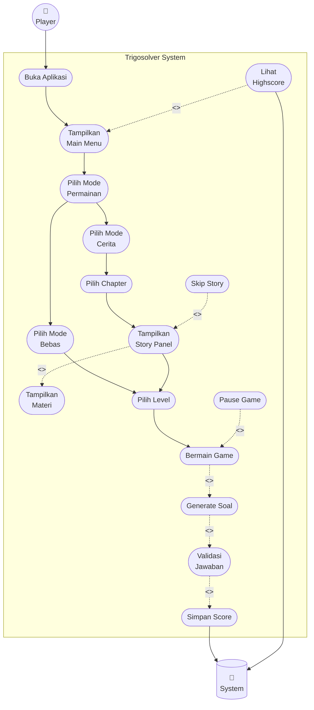

# USE CASE DIAGRAM - GAME TRIGOSOLVER

**Dokumentasi:** Use Case Diagram lengkap sesuai standar UML 2.5  
**Proyek:** Game Edukasi Trigonometri - Trigosolver  
**Tanggal:** 7 Januari 2026  

---

## 📐 ANALISIS ALUR GAME TRIGOSOLVER

### 🎮 Flow Utama Aplikasi:

```
START
  │
  ├─ 1. LAUNCH APP
  │    └─ Logo Screen → Click anywhere
  │
  ├─ 2. MAIN MENU (4 Buttons)
  │    ├─ [MULAI] → Mode Selection
  │    ├─ [MATERI] → Tutorial Panel (optional)
  │    ├─ [HIGHSCORE] → Leaderboard (optional)
  │    └─ [KELUAR] → Quit
  │
  ├─ 3. MODE SELECTION (2 Modes)
  │    ├─ [MODE CERITA] → Chapter Selection
  │    └─ [MODE BEBAS] → Level Selection (skip story)
  │
  ├─ 4. CHAPTER SELECTION (Mode Cerita only)
  │    ├─ [CHAPTER 1: Observasi Segitiga] → Story Panel
  │    └─ [CHAPTER 2: Tembakan Meriam] → Story Panel
  │
  ├─ 5. STORY PANEL (Mode Cerita only)
  │    ├─ Story slides (1-5) with typewriter effect
  │    ├─ Materi slides (6-8) - WAJIB (include)
  │    └─ [MATERI Button] → Skip story (optional extend)
  │
  ├─ 6. LEVEL SELECTION (Both modes)
  │    ├─ [LEVEL 1] → Questions 1-5
  │    ├─ [LEVEL 2] → Questions 6-10
  │    └─ [LEVEL 3] → Questions 11-15
  │
  ├─ 7. GAMEPLAY (Core gameplay loop)
  │    ├─ Generate Question (Sin/Cos/Tan)
  │    ├─ Display Triangle Visualization
  │    ├─ Player Input Answer
  │    ├─ Validate Answer (±0.01 tolerance)
  │    ├─ Update Progress (score/lives)
  │    └─ Save Score to PlayerPrefs
  │
  └─ 8. END GAME
       ├─ Chapter Complete (progres = 5)
       ├─ Game Over (lives = 0)
       └─ Return to Level Selection
```

---

## 🎯 IDENTIFIKASI USE CASES

### **Level 1: Application Launch**
- UC1: Buka Aplikasi
- UC2: Tampilkan Logo
- UC3: Masuk Main Menu

### **Level 2: Main Menu Navigation**
- UC4: Tampilkan Main Menu
- UC5: Klik Tombol Mulai
- UC6: Klik Tombol Materi (extend - optional)
- UC7: Klik Tombol Highscore (extend - optional)
- UC8: Klik Tombol Keluar

### **Level 3: Mode Selection**
- UC9: Pilih Mode Permainan
- UC10: Pilih Mode Cerita
- UC11: Pilih Mode Bebas

### **Level 4: Chapter Selection (Mode Cerita)**
- UC12: Pilih Chapter
- UC13: Pilih Chapter 1
- UC14: Pilih Chapter 2

### **Level 5: Story & Tutorial (Mode Cerita)**
- UC15: Tampilkan Story Panel
- UC16: Tampilkan Materi & Tutorial (include - wajib)
- UC17: Skip Story (extend - optional)

### **Level 6: Level Selection**
- UC18: Pilih Level
- UC19: Pilih Level 1
- UC20: Pilih Level 2
- UC21: Pilih Level 3

### **Level 7: Gameplay Core (Include Chain)**
- UC22: Bermain Game
- UC23: Generate Soal Trigonometri (include)
- UC24: Tampilkan Visualisasi Segitiga (include)
- UC25: Input Jawaban (include)
- UC26: Validasi Jawaban (include)
- UC27: Update Progress (include)
- UC28: Simpan Score (include)

### **Level 8: Extended Features**
- UC29: Pause Game (extend - optional)
- UC30: Restart Level (extend - optional)
- UC31: Atur Audio (extend - optional)

---

## 📊 USE CASE DIAGRAM



---

## 📋 DAFTAR USE CASES LENGKAP

### **Level 1: Application Launch** (3 UC)

| ID | Use Case | Deskripsi | Relasi |
|----|----------|-----------|--------|
| UC1 | Buka Aplikasi | Player launch aplikasi Trigosolver | **Aktor: Player** |
| UC2 | Tampilkan Logo | Splash screen logo Trigosolver | Flow: UC1 → UC2 |
| UC3 | Masuk Main Menu | Transisi dari logo ke main menu | Flow: UC2 → UC3 |

---

### **Level 2: Main Menu Navigation** (5 UC)

| ID | Use Case | Deskripsi | Relasi |
|----|----------|-----------|--------|
| UC4 | Tampilkan Main Menu | Tampilkan 4 tombol: Mulai, Materi, Highscore, Keluar | Flow: UC3 → UC4 |
| UC5 | Klik Tombol Mulai | Navigasi ke Mode Selection | Flow: UC4 → UC5 |
| UC6 | Klik Tombol Materi | Langsung akses materi/tutorial | **<<extend>> UC4** 🎯 |
| UC7 | Klik Tombol Highscore | Tampilkan leaderboard | **<<extend>> UC4** 🎯 |
| UC8 | Klik Tombol Keluar | Quit aplikasi | **Aktor: Player** |

**Extension Points:**
- **UC6 (Materi)**: Condition: Player klik tombol MATERI di Main Menu
- **UC7 (Highscore)**: Condition: Player klik tombol HIGHSCORE di Main Menu
- **UC31 (Audio)**: Condition: Player klik Settings/Audio

---

### **Level 3: Mode Selection** (3 UC)

| ID | Use Case | Deskripsi | Relasi |
|----|----------|-----------|--------|
| UC9 | Pilih Mode Permainan | Tampilkan Mode Cerita & Mode Bebas | Flow: UC5 → UC9 |
| UC10 | Pilih Mode Cerita | Mode dengan story & tutorial | Flow: UC9 → UC10 |
| UC11 | Pilih Mode Bebas | Mode tanpa story, langsung level | Flow: UC9 → UC11 |

---

### **Level 4: Chapter Selection** (3 UC) - **Mode Cerita Only**

| ID | Use Case | Deskripsi | Relasi |
|----|----------|-----------|--------|
| UC12 | Pilih Chapter | Tampilkan Chapter 1 & 2 | Flow: UC10 → UC12 |
| UC13 | Pilih Chapter 1 | Chapter: Observasi Segitiga (Sin, Cos, Tan) | Flow: UC12 → UC13 |
| UC14 | Pilih Chapter 2 | Chapter: Tembakan Meriam (Proyektil) | Flow: UC12 → UC14 |

---

### **Level 5: Story & Tutorial** (3 UC) - **Mode Cerita Only**

| ID | Use Case | Deskripsi | Relasi |
|----|----------|-----------|--------|
| UC15 | Tampilkan Story Panel | Tampilkan 5 story slides dengan typewriter | Flow: UC13/UC14 → UC15 |
| UC16 | Tampilkan Materi & Tutorial | Tampilkan 2 materi + 1 tutorial | **<<include>> UC15** 📌 |
| UC17 | Skip Story | Tombol MATERI untuk skip langsung ke materi | **<<extend>> UC15** 🎯 |

**Include:**
- **UC15 -.include.-> UC16**: Story panel WAJIB menampilkan materi setelah story

**Extension Point:**
- **UC17 (Skip Story)**: Condition: Player klik tombol MATERI saat Story Panel slides 1-4

---

### **Level 6: Level Selection** (4 UC)

| ID | Use Case | Deskripsi | Relasi |
|----|----------|-----------|--------|
| UC18 | Pilih Level | Tampilkan Level 1, 2, 3 + tombol Materi | Flow: UC15 → UC18 (Cerita)<br/>Flow: UC11 → UC18 (Bebas) |
| UC19 | Pilih Level 1 | Soal nomor 1-5 | Flow: UC18 → UC19 |
| UC20 | Pilih Level 2 | Soal nomor 6-10 | Flow: UC18 → UC20 |
| UC21 | Pilih Level 3 | Soal nomor 11-15 | Flow: UC18 → UC21 |

---

### **Level 7: Gameplay Core** (7 UC) - **Include Chain**

| ID | Use Case | Deskripsi | Relasi |
|----|----------|-----------|--------|
| UC22 | Bermain Game | Main gameplay Chapter 1 (lives=3, progres=0-5) | Flow: UC19/20/21 → UC22 |
| UC23 | Generate Soal Trigonometri | Generate soal Sin/Cos/Tan random | **<<include>> UC22** 📌 |
| UC24 | Tampilkan Visualisasi Segitiga | Gambar segitiga dengan nilai sisi | **<<include>> UC23** 📌 |
| UC25 | Input Jawaban | Player input jawaban (angka/pecahan) | **<<include>> UC24** 📌 |
| UC26 | Validasi Jawaban | Cek jawaban dengan tolerance ±0.01 | **<<include>> UC25** 📌 |
| UC27 | Update Progress | Update score (+10) / lives (-1) / progres (+1) | **<<include>> UC26** 📌 |
| UC28 | Simpan Score | Save score ke PlayerPrefs | **<<include>> UC27** 📌 |

**Include Chain (Wajib):**
```
UC22 -.include.-> UC23 -.include.-> UC24 -.include.-> UC25 
-.include.-> UC26 -.include.-> UC27 -.include.-> UC28 → System
```

---

### **Level 8: Extended Features** (3 UC)

| ID | Use Case | Deskripsi | Relasi |
|----|----------|-----------|--------|
| UC29 | Pause Game | Jeda gameplay, tampilkan menu pause | **<<extend>> UC22** 🎯 |
| UC30 | Restart Level | Reset level (lives=3, progres=0, score=0) | **<<extend>> UC22** 🎯 |
| UC31 | Atur Audio | Setting volume BGM & SFX | **<<extend>> UC4** 🎯 |

**Extension Points:**
- **UC29 (Pause)**: Condition: Player klik tombol Pause saat gameplay
- **UC30 (Restart)**: Condition: Player klik Restart dari Pause menu atau Game Over
- **UC31 (Audio)**: Condition: Player klik Settings di Main Menu

---

## 🔗 PENJELASAN RELASI UML

### **1. Association (Solid Arrow: →)**
Hubungan antara **Actor dengan Use Case**.

**Contoh:**
- `Player --> UC1` (Buka Aplikasi)
- `Player --> UC8` (Keluar)
- `UC28 --> System` (Simpan ke PlayerPrefs)

---

### **2. Normal Flow (Solid Arrow: →)**
Alur navigasi normal antar use case (bukan include/extend).

**Contoh:**
- `UC1 → UC2 → UC3 → UC4` (Launch flow)
- `UC9 → UC10` (Pilih Mode Cerita)
- `UC18 → UC19` (Pilih Level 1)

---

### **3. Include (Dotted Arrow: -.->|<<include>>|)**
Use case A **WAJIB** memanggil use case B sebagai bagian dari fungsionalitasnya.

**Karakteristik:**
- Arah: Dari base use case **→** ke included use case
- Sifat: **Mandatory** (wajib dipanggil)
- Use case B tidak bisa dijalankan sendiri

**Contoh dalam Trigosolver:**
- `UC15 -.include.-> UC16`: Story panel WAJIB menampilkan materi
- `UC22 -.include.-> UC23`: Gameplay WAJIB generate soal
- `UC23 -.include.-> UC24`: Generate soal WAJIB tampilkan visualisasi
- `UC27 -.include.-> UC28`: Update progress WAJIB simpan score

**Include Chain:**
```
UC22 → UC23 → UC24 → UC25 → UC26 → UC27 → UC28
(Setiap langkah WAJIB dilakukan berurutan)
```

---

### **4. Extend (Dotted Arrow: -.->|<<extend>>|)**
Use case A **OPSIONAL** memperluas fungsionalitas use case B jika kondisi terpenuhi.

**Karakteristik:**
- Arah: Dari extending use case **→** ke base use case
- Sifat: **Optional** (boleh dipanggil, boleh tidak)
- Use case A bisa dijalankan sendiri atau tidak sama sekali

**Contoh dalam Trigosolver:**
- `UC6 -.extend.-> UC4`: Tombol MATERI opsional di Main Menu
- `UC7 -.extend.-> UC4`: Tombol HIGHSCORE opsional di Main Menu
- `UC17 -.extend.-> UC15`: Skip story opsional saat Story Panel
- `UC29 -.extend.-> UC22`: Pause opsional saat gameplay
- `UC30 -.extend.-> UC22`: Restart opsional saat gameplay

**Kondisi Extend:**
- UC6: Jika player klik tombol MATERI
- UC7: Jika player klik tombol HIGHSCORE
- UC17: Jika player klik tombol MATERI saat story slide 1-4
- UC29: Jika player klik tombol Pause
- UC30: Jika player klik Restart (dari pause/game over)

---

## 🎯 SKENARIO FLOW LENGKAP

### **Skenario 1: Mode Cerita - Full Story**
```
Player → UC1 (Buka Aplikasi)
       → UC2 (Logo)
       → UC3 (Masuk Menu)
       → UC4 (Main Menu)
       → UC5 (Klik Mulai)
       → UC9 (Mode Selection)
       → UC10 (Pilih Mode Cerita)
       → UC12 (Chapter Selection)
       → UC13 (Pilih Chapter 1)
       → UC15 (Story Panel - 5 slides)
       → UC16 (Materi - INCLUDE wajib)
       → UC18 (Level Selection)
       → UC19 (Pilih Level 1)
       → UC22 (Bermain Game)
         → UC23 (Generate Soal) - INCLUDE
         → UC24 (Visualisasi) - INCLUDE
         → UC25 (Input Jawaban) - INCLUDE
         → UC26 (Validasi) - INCLUDE
         → UC27 (Update Progress) - INCLUDE
         → UC28 (Simpan Score) - INCLUDE → System
```

---

### **Skenario 2: Mode Cerita - Skip Story**
```
Player → UC1 → UC2 → UC3 → UC4 → UC5 → UC9 → UC10 
       → UC12 → UC13 → UC15 (Story slide 1-2)
       → [Player klik MATERI button]
       → UC17 (Skip Story - EXTEND) 
       → UC16 (langsung ke Materi)
       → UC18 → UC19 → UC22 → ... → UC28 → System
```

---

### **Skenario 3: Mode Bebas (Tanpa Story)**
```
Player → UC1 → UC2 → UC3 → UC4 → UC5 → UC9 
       → UC11 (Pilih Mode Bebas)
       → UC18 (Level Selection langsung)
       → UC19 (Pilih Level 1)
       → UC22 → UC23 → UC24 → UC25 → UC26 → UC27 → UC28 → System
```

---

### **Skenario 4: Akses Materi dari Main Menu**
```
Player → UC1 → UC2 → UC3 → UC4 (Main Menu)
       → [Player klik MATERI button]
       → UC6 (Klik Tombol Materi - EXTEND)
       → Tampilkan Tutorial Panel
```

---

### **Skenario 5: Lihat Highscore**
```
Player → UC1 → UC2 → UC3 → UC4 (Main Menu)
       → [Player klik HIGHSCORE button]
       → UC7 (Klik Tombol Highscore - EXTEND)
       → System (Load PlayerPrefs)
       → Tampilkan Leaderboard
```

---

### **Skenario 6: Gameplay dengan Pause**
```
UC22 (Bermain Game) → UC23 → UC24 → UC25
     → [Player klik Pause button]
     → UC29 (Pause Game - EXTEND)
     → Menu Pause (Resume / Restart / Exit)
```

---

### **Skenario 7: Restart Level**
```
UC22 (Bermain Game) → Game Over (lives = 0)
     → [Player klik Restart]
     → UC30 (Restart Level - EXTEND)
     → Reset (lives=3, progres=0, score=0)
     → UC22 (Bermain Game lagi)
```

---

## 📊 STATISTIK USE CASES

| Level | Kategori | Jumlah UC | Tipe Relasi |
|-------|----------|-----------|-------------|
| 1 | Application Launch | 3 | Flow |
| 2 | Main Menu Navigation | 5 | Flow + Extend (UC6, UC7, UC31) |
| 3 | Mode Selection | 3 | Flow |
| 4 | Chapter Selection | 3 | Flow (Mode Cerita only) |
| 5 | Story & Tutorial | 3 | Flow + Include (UC16) + Extend (UC17) |
| 6 | Level Selection | 4 | Flow |
| 7 | Gameplay Core | 7 | Include Chain (UC23-UC28) |
| 8 | Extended Features | 3 | Extend (UC29, UC30) |
| **TOTAL** | **8 Levels** | **31 Use Cases** | **1 Include Chain + 6 Extend** |

---

## ✅ VALIDASI STANDAR UML 2.5

### **1. System Boundary** ✅
- Semua use cases berada dalam boundary "Trigosolver System"
- Actor (Player & System) berada di luar boundary

### **2. Actor** ✅
- Primary Actor: Player (stick figure)
- Secondary Actor: System/PlayerPrefs (cylinder)

### **3. Association** ✅
- Solid arrow dari Actor ke Use Case
- `Player --> UC1`, `Player --> UC8`

### **4. Include Relationship** ✅
- Format: `Base -.->|<<include>>| Included`
- Arah: Base use case → Included use case
- Sifat: Mandatory (wajib)
- Contoh: `UC15 -.include.-> UC16`

### **5. Extend Relationship** ✅
- Format: `Extending -.->|<<extend>>| Base`
- Arah: Extending use case → Base use case
- Sifat: Optional (opsional)
- Contoh: `UC17 -.extend.-> UC15`

### **6. Use Case Shape** ✅
- Oval shape: `([Use Case Name])`
- Stadium/pill shape di Mermaid

### **7. Layout** ✅
- Vertical (graph TD)
- Memanjang ke bawah
- Grouped by level dengan subgraph

---

## 🎨 VISUALISASI HIERARKI

```
PLAYER
  │
  └─► UC1: Buka Aplikasi
        │
        ▼
      UC2: Logo
        │
        ▼
      UC3: Masuk Main Menu
        │
        ▼
      UC4: Main Menu ◄───┬─ UC6: Materi (extend)
        │                ├─ UC7: Highscore (extend)
        ▼                └─ UC31: Audio (extend)
      UC5: Klik Mulai
        │
        ▼
      UC9: Mode Selection
        │
        ├──► UC10: Mode Cerita
        │      │
        │      ▼
        │    UC12: Chapter Selection
        │      │
        │      ├──► UC13: Chapter 1
        │      │      │
        │      │      ▼
        │      └──► UC15: Story Panel ◄── UC17: Skip Story (extend)
        │             │ (include)
        │             ▼
        │           UC16: Materi
        │             │
        │             ▼
        └──► UC11: Mode Bebas
               │
               ▼
             UC18: Level Selection
               │
               ├──► UC19: Level 1 ──┐
               ├──► UC20: Level 2 ──┼──► UC22: Bermain Game
               └──► UC21: Level 3 ──┘      │
                                           │ (include chain)
                                           ▼
                                      UC23: Generate Soal
                                           │ (include)
                                           ▼
                                      UC24: Visualisasi
                                           │ (include)
                                           ▼
                                      UC25: Input Jawaban
                                           │ (include)
                                           ▼
                                      UC26: Validasi
                                           │ (include)
                                           ▼
                                      UC27: Update Progress
                                           │ (include)
                                           ▼
                                      UC28: Simpan Score
                                           │
                                           ▼
                                        SYSTEM

EXTEND (Optional):
  UC29: Pause ──extend──► UC22
  UC30: Restart ──extend──► UC22
```

---

## 📝 CATATAN IMPLEMENTASI

### **Include vs Extend - Kapan Menggunakan?**

**Gunakan INCLUDE jika:**
- Base use case WAJIB memanggil included use case
- Included use case adalah sub-proses yang selalu dijalankan
- Contoh: Gameplay wajib generate soal, Story wajib tampilkan materi

**Gunakan EXTEND jika:**
- Extending use case OPSIONAL (boleh dipanggil, boleh tidak)
- Ada kondisi/trigger tertentu
- Contoh: Skip story hanya jika player klik tombol MATERI

### **Flow Normal vs Include/Extend**

**Flow Normal (→):**
- Navigasi biasa antar menu/panel
- Contoh: Main Menu → Mode Selection → Chapter Selection

**Include (-.->|<<include>>|):**
- Sub-proses wajib dalam satu use case
- Contoh: Gameplay include Generate Soal

**Extend (-.->|<<extend>>|):**
- Fitur opsional yang memperluas use case
- Contoh: Pause extends Gameplay

---

## 🔍 REFERENSI

### **Standar UML:**
- UML 2.5 Specification
- Use Case Diagram Best Practices
- Association vs Generalization vs Include vs Extend

### **Project Files:**
- `MainMenuManager.cs` - Main menu navigation logic
- `LevelSelectionManager.cs` - Level selection & story panel
- `CalculationManager.cs` - Gameplay core logic
- `HighScoreManager.cs` - Score persistence with PlayerPrefs

### **Dokumentasi Terkait:**
- `BAB_4_DIAGRAM_SKRIPSI.md` - Complete thesis diagrams
- `DOKUMENTASI_MENU_ANIMASI.md` - Menu animation system
- `HIGH_SCORE_SETUP.md` - High score system setup

---

**End of Use Case Diagram Documentation**

